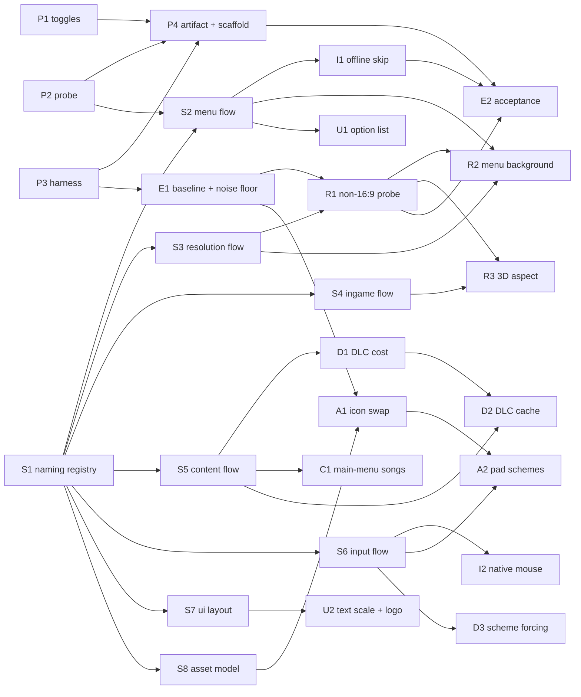

# Customization & UI enhancements — research and code-preparation plan, by prompts

**Status: scoping/planning.** No feature code in this document. Every unit of work below is
**research or preparation** — naming, flow maps, probes, harnesses, contracts, scaffolding — that
unblocks a later feature commit. Nothing here is a commitment, and nothing here gates the
release-readiness tasks in [backlog.md](../backlog.md).

This document is written as a **prompt plan**, the same shape as
[plans/launcher-plan.md](launcher-plan.md): every unit of work is a self-contained prompt you can hand
to a fresh agent session, plus the order it must run in and what can run beside what (§7).

**Relationship to the other plans.** [plans/launcher-plan.md](launcher-plan.md) owns the *launcher*
and the host-side settings surface; this plan owns the *guest-side engine research* the enhancements
need, and it feeds the launcher a list of honest toggles when the features exist. Where the two touch
(toggles, the Graphics tab, art reuse) this document defers to the launcher plan's decisions and says
so. It absorbs [backlog.md](../backlog.md) §1's naming campaign, which was always the prerequisite
for this scope.

**Evidence convention** (all three tags are used below):

- **[tree]** — read directly out of this working tree, with `file:line`.
- **[cited]** — read out of a build product (a log, a capture, a manifest).
- **[assumed]** — reasoned, not yet measured; a prompt that depends on one must verify it first.

---

## 1. The request, normalized

| # | As asked | Reading this plan plans against |
| --- | --- | --- |
| R1 | custom resolutions, non-16:9 (ultrawide, portrait, user current), everywhere: menu background, HUD, 3D, song select, power-up menu | the guest's own video mode is the lever (`video_mode_width/height` / `resolution` **[tree]** `rexglue-sdk/src/ui/window.cpp:50-62`), so the research question is *what the guest does* at a non-16:9 mode, not how to scale the host window (§4 D4, R1–R3) |
| R2 | UI accessibility: resize text, main menu logo | the guest's font/Glyph model and the menu's anchoring model, then a scale lever; the logo is a scene object, so it shares R1's scene work (§4 D5, U2, A1) |
| R3 | auto offline mode: skip the main menu dialog | **answered:** the two questions are the `server_connect_panel`'s own states, and what answers them is the panel's own file — the state move and the screen change its `BUTTON_DOWN_MSG` handler already performs — so they are written into `update_state` as two statements, paid for by eight unused state constants. Not a midasm hook: the decision is data, not a branch instruction. Offline mode is still *entered* (D10); what is skipped is being asked ([engine/main-menu-flow.md](../engine/main-menu-flow.md) §7, I1) |
| R4 | different icons: asset swapping on button schemes and controller layouts | the button sheet is a font glyph table inside `ui/resource/fonts/gen/buttons.milo_xbox`, and the pad diagrams are four 1024² images per family inside `controller_config.milo_xbox` **[tree]** [launcher-plan.md](launcher-plan.md) §10.1; needs the scene-buffer-offset research that §10.4 left open (S8, A1, A2) |
| R5 | hiding categories: hide menu options on main menu | the main menu's option list model, then a filter; data-side if the list is data, a hook if it is code (§4 D12, U1) — **answered:** it is data (a compiled DTA the panel copies into its row list), and it is hidden by a byte-neutral rewrite of that one file as it is read ([engine/main-menu-flow.md](../engine/main-menu-flow.md)) |
| R6 | different input waves (native mouse support) | staged input work, ending at a real pointer if the engine has a pointer path at all; the current mouse is a synthetic pad **[tree]** `src/input/mouse_ui.h`, `src/input/ui_nav.h` (§4 D13, I2) |
| R7 | save the DLC cache so load does not re-search; refresh button on the main menu | a host-side cache of the DLC enumeration plus a guest-side refresh affordance; the guest's own `songcache:` stays authoritative **[tree]** [dlc.md](../dlc.md) §4, [rb3-references.md](../rb3-references.md) §6 group 9 (§4 D8, D1, D2) |
| R8 | force a predefined controller scheme (default) on load | the controller layout is persisted in the guest's own options/save; force it before the guest reads it, opt-in, with a backup (§4 D9, D3) |
| R9 | change the main menu songs for DLC ones once loaded | find where the main menu's songs come from (setlist data or code); prefer a data overlay over a hook (§4 D11, C1) |

**One sentence that ties them together:** all nine are *guest* behaviour changes, and this project's
rule for reaching guest behaviour is "correct boundaries or hints → an existing SDK implementation →
a whole-function hook with the guest address recorded → a named data/code patch → a mid-ASM hook →
an SDK patch file" **[tree]** [backlog.md](../backlog.md) §6. So the preparation this plan plans is
the first two rungs: **know the flow and name it**, then pick the cheapest rung that reaches it.

**R10 (added 2026-10-06, after the plan's own R1–R9).** A follow-up request asked that the Ultimate
mod's "Mod Settings" row be drawn as "Ultimate Settings", on by default and only shown in the launcher
where the mod is installed. It is R5's sibling in every respect — the same compiled-DTA edit, the same
edit-at-read delivery, one more cvar — so it is recorded as R10 rather than folded into R5, whose
subject (hiding rows that need the network) is a different claim. Its evidence is
[engine/main-menu-flow.md](../engine/main-menu-flow.md) § "the label", and it is the one enhancement
whose default is on.

### 1.1 What "code preparation" means here, and what it does not

In scope, per prompt: symbol names in `config/functions.toml`, flow maps with recorded guest
addresses, probe builds and diagnostics, the observation harness, host-extractable decision logic
(the project's "split the pure half into a header and unit-test it" pattern **[tree]**
[rb3-references.md](../rb3-references.md) §7.3), the toggle contract, and empty-but-wired feature
modules.

Out of scope: the features themselves, any UI design for them, and any decision the launcher plan
already owns. A prompt below never ships a user-visible enhancement; it makes one cheap to ship.

---

## 2. What exists today, and what does not

### 2.1 Exists — reuse these, do not rebuild them

| Thing | Where | Why it matters here |
| --- | --- | --- |
| Every guest function is hookable and nameable today | `REX_HOOK`/`REX_EXTERN` over the weak `Name` alias, `config/functions.toml` `name =` **[tree]** [rb3-references.md](../rb3-references.md) §1–§2 | naming is a *readability* lever, never a prerequisite — research can hook first and name after |
| Mid-ASM hooks that force a branch or a return value | `[[midasm_hook]]` schema **[tree]** [rb3-references.md](../rb3-references.md) §3 | the cheap rung for R3/R5; the SDK rejects a hook that both returns and jumps |
| A symbol/analysis inventory | [symbols.md](../symbols.md) — image identity, sections, imports, function counts, the three forced entries | the address book every flow map extends |
| A working texture path | `hmx_tex.py` (DXT1/DXT5, mip-aware) and `hmx_ark.py` (index + extract) **[tree]** [assets.md](../assets.md) | R4's icons can move through the byte-length-locked ark swap or the payload overlay *today* |
| A working overlay route with no repack | `gen/patch_xbox.*` in a payload directory, merged by `src/fs/payload_overlay.*` **[tree]** [assets.md](../assets.md) | preferred asset route for R1/R4/R9 until the scene rewrite lands |
| A MILO scene reader/rewriter, partially | `scripts/hmx_milo.py`, `tools/milotex`, and the §10.4 state of the research **[tree]** [launcher-plan.md](launcher-plan.md) §10.4 | the one open detail (where a texture buffer starts in a chunk) blocks reading art *and* scene edits generally |
| Scripted UI observation | `scripts/drive_ui.ps1`, `scripts/capture_window.ps1`, `scripts/ocr_image.ps1`, `scripts/frame_diff.ps1`, `scripts/dump_guest_memory.ps1`, `scripts/sample_thread.ps1`, `scripts/scan_process_strings.ps1` **[tree]** [launcher-plan.md](launcher-plan.md) §10.3 | the raw pieces of §5's harness exist; nothing joins them or pins a baseline |
| A mouse-driven menu layer | `src/input/mouse_ui.{h,cpp}`, `src/input/ui_nav.h`, `src/input/nav_detect.h`, `tests/ui_nav_tests.cpp` **[tree]** | R6 starts from a measured, working synthetic pad, plus the aligner that already measures row pitch per screen |
| Host-side DLC layout work | `src/fs/dlc_layout.h`, `tests/dlc_layout_tests.cpp`, the enumeration facts in [dlc.md](../dlc.md) §1–§2 | R7's cache wraps a path that is already understood and tested |
| A settings surface to hang toggles on | [launcher-plan.md](launcher-plan.md) D2/D12, `rb_blitz.toml` and the flat cvar table | this plan only has to define the guest-side toggle names |
| An enhancement toggle contract (landed 2026-10-04, P1) | `[enhancements]` in `<exe name>.toml`, [src/enhancements.cpp](../../src/enhancements.cpp), [docs/engine/toggles.md](../engine/toggles.md) | every feature below already has its off-by-default switch and a boot line that reports value and source, so a feature commit only has to read it |
| A runtime probe (landed 2026-10-04, P2) | [src/diag/probe.h](../../src/diag/probe.h), [docs/engine/probe.md](../engine/probe.md) | S2–S7 measure with it: an ordered trace of guest points plus an overlay of the guest's requested video mode, window and present path |

### 2.2 Does not exist — this is the gap this plan closes

- **No name for anything.** `config/functions.toml` forces three entries and names **none** of them,
  so the tree is ~38k `sub_XXXXXXXX` symbols **[tree]** [rb3-references.md](../rb3-references.md) §2,
  `config/functions.toml`.
- **No flow maps.** There is no document saying which function sizes the background, which one builds
  the song list, or which one reads the controller layout. The bring-up log holds chronology, not
  structure. The main menu's own flow now has one —
  [engine/main-menu-flow.md](../engine/main-menu-flow.md), landed 2026-10-06 with U1 and R5 — which is
  also the template the rest should follow.
- ~~**No guest-state visibility.**~~ — **landed 2026-10-04 (P2).** The probe records an ordered trace
  of points placed in hooks and draws an ImGui overlay with the guest's requested video mode, the
  window and the present path: [docs/engine/probe.md](../engine/probe.md). The one gap it states
  rather than hides is the presenter's paint rect, which no public SDK accessor exposes.
- **No baseline set, and a measured noise floor bigger than most effects.** Two runs of the same
  build differ by **3.5–5.9 %** of the frame just after a screen is entered and ~0.14 % once settled
  **[tree]** [backlog.md](../backlog.md) §4, so any pixel-diff-based verification is meaningless until a
  same-build baseline is in the loop. **The harness landed (P3, 2026-10-04)** and measures the floor
  per state — it already found that the animated title background has no settled frame at all (two
  same-build pairs: 0.046 % and 1.978 %). What E1 still owes is the baseline *set*.
- ~~**No toggle contract**~~ — **landed 2026-10-04 (P1).** Every enhancement is one
  `[enhancements]` key in `<exe name>.toml`, default off, logged with its value and source at every
  boot: [docs/engine/toggles.md](../engine/toggles.md), [src/enhancements.cpp](../../src/enhancements.cpp)
  and D7 below.
- **No host-side DLC cache.** The guest scans; the cache is the guest's `songcache:`, whose format
  is unknown host-side.
- **No native mouse.** The engine's own pointer path is unproven; the current device synthesizes pad
  presses.

---

## 3. Research method — how a prompt below proves something

Four tools, in the order a prompt should reach for them. Every prompt's **Verify** is one of these
with the command named.

1. **Naming + disassembly reading.** Hook the function, log its arguments and its call sites, then
   name it. Names are only assigned from *runtime or disassembly evidence*, never from a guess, and
   land in `config/functions.toml` **in the same commit** as the [symbols.md](../symbols.md) table
   row **[tree]** [backlog.md](../backlog.md) §1.
2. **A probe build.** A `--probe=<area>` run (or a cvar) that logs a flow — the addresses a path
   visits, in order, with the values that decided each branch. This is the primary deliverable of
   S2–S7, and it is what makes a later hook cheap.
3. **Capture + OCR + diff.** A named state is reached by `drive_ui.ps1`, shot by
   `capture_window.ps1`, read by `ocr_image.ps1` (static text is the control) and corroborated by
   `frame_diff.ps1` **against a same-build baseline**. A pixel diff alone is never evidence.
4. **Host memory/thread dumps.** `dump_guest_memory.ps1`, `sample_thread.ps1`,
   `scan_process_strings.ps1` for the questions that neither a probe nor a capture answers — a string
   in the image, a data table's live contents, a stall.

Two rules the prompts assume:

- **Name the command you ran and the output you saw.** "It works" is not evidence.
- **A disproof edits the document that made the claim.** If a flow map is wrong, the map changes in
  the same commit as the correction.

---

## 4. Decisions

These are proposed answers to the questions that would otherwise stall wave 0. A prompt that depends
on one must treat it as a **[assumed]** until it has been measured, and say so if it disagrees.

### D1 — Where research artifacts live

**Proposal:** a new `docs/engine/` tree, one file per flow map (`main-menu-flow.md`,
`resolution-flow.md`, `content-flow.md`, `input-flow.md`, `ui-layout.md`, `asset-model.md`), each
carrying guest addresses with evidence tags. [symbols.md](../symbols.md) keeps the symbol table;
[symbols.md](../symbols.md) is extended, not forked. [known-issues.md](../known-issues.md) gets the
standing limits each map discovers; [history/bringup-log.md](../history/bringup-log.md) gets the
chronology.

**Why not put maps in this plan:** this plan is the schedule; a flow map is an enduring fact about
the image, and enduring facts live beside [symbols.md](../symbols.md).

### D2 — Names in `config/functions.toml`, table in `docs/symbols.md`

**Proposal:** names use the `Subsystem_Method` shape already used by the borrowed RB3 catalogue
(`BandSongMgr::IsDemo`, `RndMat::Load` **[tree]** [rb3-references.md](../rb3-references.md) §4.1).
Only functions with recorded evidence are named. Each batch updates both files in one commit, per
[backlog.md](../backlog.md) §1.

**Why:** a wrong name is worse than `sub_XXXXXXXX`, because it makes a false claim readable.

### D3 — Probe first, hook second, patch third

**Proposal:** every feature prompt's preparation ends at the **cheapest working rung** from
[backlog.md](../backlog.md) §6. Concretely: a `[[midasm_hook]]` when the need is a forced branch or
return value (R3, R5); a `REX_HOOK` when state must cross calls; an SDK patch only when the behaviour
is generically wrong for Xbox 360 software. A research prompt that cannot reach a rung by probing
says so and stops rather than inventing a body.

### D4 — Resolution: the guest's video mode is the lever, not the host window

**Proposal:** R1 is researched by setting the **guest video mode** (`video_mode_width/height`, or the
`resolution` preset **[tree]** `rexglue-sdk/src/ui/window.cpp:50-62`) to a non-16:9 size and
observing what the guest draws. The host presenter's letterbox/safe-area path
(`present_letterbox`, `present_safe_area_x/y`, `present_allow_overscan_cutoff` **[tree]**
`rexglue-sdk/src/ui/presenter.cpp:32-41`) is treated as an existing behaviour to keep correct, not as
the feature. Widening the guest framebuffer is what makes 3D and backgrounds wider; scaling the host
window does not.

**Consequence to verify in R1:** a wider guest mode may crop, stretch, letterbox internally, or
reflow. Which one determines whether R2/R3 are data work, one hook, or per-scene work (D5).

### D5 — Measure the anchoring model before patching layout

**Proposal:** S7 answers, for each screen, whether elements are anchored to a safe area computed from
the video mode, or placed at absolute coordinates. A safe-area anchor makes R2/U2 a single hook; an
absolute layout makes them per-scene work. No layout hook is written before S7 says which one it is.

### D6 — Asset route precedence

**Proposal:** in order — (1) **payload overlay** (`gen/patch_xbox.*` in a payload directory, no
repack, already boot-verified **[tree]** [assets.md](../assets.md)); (2) **ark swap** with the entry's
byte length preserved (`hmx_tex.py swap`); (3) **scene rewrite** once S8 derives the buffer offsets;
(4) the **`NewFile`/`assets/` overlay hook** from [rb3-references.md](../rb3-references.md) §4.1,
which is P1 there and is *not* on this plan's critical path.

**Rule (unchanged):** retail art is **derived on the user's machine, never committed, never shipped**
**[tree]** [launcher-plan.md](launcher-plan.md) D15.

### D7 — The toggle contract

**Landed 2026-10-04 (P1).** The implementation is [src/enhancements.cpp](../../src/enhancements.cpp)
and [src/enhancements.h](../../src/enhancements.h); the table is
[docs/engine/toggles.md](../engine/toggles.md).

**As built:** every enhancement is one `rb_blitz.toml` key under `[enhancements]`, default **off**
(except R10, whose default is on because its subject is the mod's own screen — see
[engine/toggles.md](../engine/toggles.md)), and the runtime's own nesting rule makes the cvar name
the table path joined with `_`
(`ApplyTomlTable`, `rexglue-sdk/src/core/cvar.cpp`): `[enhancements] skip_offline_dialog = true`
sets `enhancements_skip_offline_dialog`. **The `enh_<feature>` spelling first proposed here was
wrong** — the flat-cvar namespace of this runtime is the table path, so a name that is not the path
would be unreachable from the TOML table it is documented under. Every toggle carries
`kRequiresRestart` (what they gate is decided at load) and logs `on`/`off` with the source that set
it, so "the toggle did nothing" and "the toggle was never on" cannot be confused.

The launcher plan's tabs are where they surface later (D12 there); this plan does not build that UI.
As built on 2026-10-06 the launcher has four of them (General, Interface, Audio / Video, Controller),
and the two toggles that are implemented — R5 and R10 — are on **Interface**, the tab for edits to
the game's own screens.

### D8 — The DLC cache is host-side; the guest's cache is untouched

**Proposal:** cache the *enumeration result* (package paths, sizes, content ids, license bits) in the
user-writable tree (`paths.cache_root`, already resolved outside the game root — **[tree]**
[src/rb_blitz_app.h](../../src/rb_blitz_app.h) `OnConfigurePaths`), keyed by a fingerprint of the DLC
tree (relative path + size + mtime, upgraded to a content hash if that proves too weak). The guest's
own `songcache:` stays authoritative for the guest and is never written by the host. Invalidation:
any fingerprint change, or the refresh action.

**Open:** whether the *refresh button* is the launcher's (cheap, already designed in
[launcher-plan.md](launcher-plan.md)) or an in-game main-menu entry (R7 as asked). §11 Q7.

### D9 — A forced controller scheme is opt-in and backed up

**Proposal:** apply the forced scheme **only** when `enhancements_force_controller_scheme` (or the
launcher's row) names a scheme in `enhancements_controller_scheme`; back up the file being modified;
never silently overwrite a user's saved layout; log the before/after. Where the scheme actually
lives is D3's research question, not assumed.

### D10 — Offline skip forces the branch, it does not skip the mode

**Proposal:** the midasm hook forces the "proceed offline" outcome so the offline mode is *enabled*,
then the dialog is dismissed. A hook that merely returns past the dialog risks leaving the title in
its online-attempt state. I1 verifies both: no dialog, and `offline` reported true where the guest
already reports it.

### D11 — Prefer data over code for menu content (R5, R9)

**Proposal:** if U1/C1 find the main-menu options and the main-menu songs are built from a DTA or a
scene's data, the enhancement is a data overlay (D6 route 1), not a hook. A hook is the fallback, and
it records its guest address per [backlog.md](../backlog.md) §6.

**Answered 2026-10-06 (U1).** The options *are* data — a compiled DTA (`splash.dtb`) inside the ark —
and the edit is data too: the same bytes a patched payload entry would carry. What R5 does *not* use
is D6 route 1 as written, because the ark index fixes each entry's offset **and** size
(`patch_xbox.hdr` / `main_xbox.hdr`), so an overlay only works if the replacement is exactly as long
as the original. The rewrite that keeps the length is byte-neutral (§
[engine/main-menu-flow.md](../engine/main-menu-flow.md) §5), which makes the read that carries the
file the natural place to apply it: nothing is repacked, nothing under `game/` is written, and D14 is
untouched. The retail file's content-checksum row is corrected in the image when it is found, because
a patched file whose digest moved is a dirty-disc error.

### D12 — Hiding options must not strand navigation

**Proposal:** a hidden option is removed from the list the guest navigates, never merely made
invisible. The mouse layer already re-measures row pitch per screen
**[tree]** `src/input/ui_nav.h` (`MenuHoverAligner`), so a shorter list is safe *if* the change is in
the model and not in the drawing.

**Kept 2026-10-06 (U1).** Verified, not assumed: the panel copies the file's array into its own row
list and then navigates *that* list, and its action table (`switch {start.lst selected_sym}`) is keyed
by the same row names — so a removed row cannot be selected, and no case has to change with it. The
boot that hid the three rows OCR'd a four-row menu (Ultimate) and a three-row menu (retail) with no
fault, and the harness's stock needle (`DOWNLOAD CONTENT`) no longer matches, which is the same
statement from the other side.

### D13 — Define "native mouse" before scheduling it

**Proposal:** I2 answers one question first — **does the engine have any pointer/cursor path at
all** (a MILO mouse object, a platform mouse device, a `PlatformMgr` pointer API)? If yes, "native"
means a real guest pointer. If no, "native" is redefined as *quality*: exact hover (already
measured), click-through, no synthetic travel, and a wheel where the guest has a list. R6's waves are
then scheduled against the answer, not against the word.

### D14 — Never commit retail content

Unchanged and load-bearing for R1/R2/R4/R9: no `.xex`, no ark, no scene, no texture in the
repository; `game/` and the `assets/game/` extraction trees stay gitignored; every derived artifact stays on the user's
machine.

### D15 — A same-build baseline is part of every capture prompt

**Proposal:** E1 produces the baseline set and the measured noise floor; from then on a prompt that
claims a visual change names its baseline. This is the rule the withdrawn reskin claim earned
**[tree]** [backlog.md](../backlog.md) §4.

### D16 — Documentation is part of the change

A prompt that names a function, disproves a flow, or finds a limit edits
[symbols.md](../symbols.md), the relevant `docs/engine/` map, [known-issues.md](../known-issues.md)
or [history/bringup-log.md](../history/bringup-log.md) in the same commit.

---

## 5. Contracts

Contract 1 — **the probe/toggle surface** (P1, landed 2026-10-04): the `[enhancements]` table, the
`enhancements_*` cvar namespace (the table path, per D7), the boot line that prints them, and the
rule that a probe is a cvar not a compile define, so acceptance runs the release build.

Contract 2 — **the research artifact** (P4): the `docs/engine/<area>.md` shape — a header stating the
question, a table of addresses with evidence tags, the flow, and an "open" section. Every flow-map
prompt writes into it.

Contract 3 — **the harness interface** (P3): `scripts/observe_ui.ps1 -State <name> [-Compare <base>]`
returns a JSON report (`state`, `capture`, `ocr`, `diff vs baseline`, `pass`). Prompts call it; they
do not re-invent capture logic.

Contract 4 — **the pure-decision split** (all lanes): any hook whose decision is a function of host
data splits that decision into an SDK-free header under `src/` with a `tests/*_tests.cpp` under
`tests/check.h`, wired into the root `CMakeLists.txt` `if(BUILD_TESTING)` block, per the pattern in
[rb3-references.md](../rb3-references.md) §7.3.

Contract 5 — **the asset route record** (A1): every asset change states which D6 route it used, the
byte length it preserved (if route 2), and the evidence the title drew it.

Contract 6 — **the toggle's honest default** (P1): off, and the boot log says so; a feature that
cannot be turned off is a bug, not a feature.

---

## 6. The prompts

### 6.1 The preamble every prompt assumes

Paste this above any prompt below:

> Repository: `rb_blitz`, a ReXGlue recompilation of Rock Band Blitz (Xbox 360) for Windows. Read
> `docs/plans/customization-plan.md` first: it holds the decisions (§4) and contracts (§5) this work
> must satisfy; do not re-litigate them, and if one is wrong, say so and stop. Then read
> `docs/plans/launcher-plan.md` for anything touching the launcher. Conventions: CMake 3.25 + Ninja +
> clang-cl/MSVC, C++20/23; host tests are dependency-free (`tests/check.h`) and SDK-free; never edit
> `rexglue-sdk/` without adding a patch under `patches/rexglue-sdk/` and updating
> `patches/README.md`; never commit game data or third-party artwork; no retail content, no `.xex`,
> no mod payload in the repository; documentation is part of the change (README/docs in the same
> commit); the fingerprint gate must keep working; state for every hook or flag what the faithful
> behaviour is and why you deviated. Verification is evidence, not opinion: name the command you ran
> and the output you saw. A pixel diff is only evidence against a same-build baseline, and OCR of
> static text is the control.

### 6.2 Prompt index

| ID | Prompt | Lane | Depends on | Wave |
| --- | --- | --- | --- | --- |
| P1 | Enhancement toggle contract | P | — | 0 |
| P2 | Guest probe overlay and flow log | P | — | 0 |
| P3 | Scripted observation harness | P | — | 0 |
| S1 | Symbol naming registry + first tranche | S | — | 0 |
| E1 | Baseline capture set and noise floor | E | P3 | 0 |
| P4 | `docs/engine/` artifact shape + feature module scaffold | P | P1, P2, P3 | 1 |
| S2 | Boot/menu/main-menu flow map | S | S1, P2 | 1 |
| S3 | Resolution plumbing flow map | S | S1, P2 | 1 |
| S4 | In-song HUD/3D flow map | S | S1, P2 | 1 |
| S5 | Content/DLC/song-list flow map | S | S1, P2 | 1 |
| S6 | Input/controller-scheme flow map | S | S1, P2 | 1 |
| S7 | UI text, layout and logo model | S | S1, P2 | 1 |
| S8 | MILO scene/object model (buffer offsets) | S | S1 | 1 |
| R1 | Non-16:9 behaviour probe | R | P3, E1, S3 | 2 |
| U1 | Main-menu option list model | U | S2 | 2 |
| A1 | Icon/button-sheet swap route | A | S8, E1 | 2 |
| D1 | DLC enumeration cost + re-scan measurement | D | S5, P2 | 2 |
| I2 | Native-mouse feasibility | I | S6 | 2 |
| C1 | Main-menu song sourcing | C | S5 | 2 |
| R2 | Menu background expansion feasibility | R | R1, S2 | 3 |
| R3 | 3D aspect expansion feasibility | R | R1, S4 | 3 |
| U2 | Text-scale and logo accessibility feasibility | U | S7 | 3 |
| A2 | Pad-family / button-scheme selection | A | A1, S6 | 3 |
| D2 | DLC cache design (host-side) | D | D1, S5 | 3 |
| D3 | Controller-scheme force-on-load design | D | S6 | 3 |
| I1 | Offline-mode dialog skip | I | S2 | 3 |
| E2 | Acceptance extensions for enhancements | E | I1, R1, P4 | 4 |
| E3 | Docs, symbols, backlog, standing limits | E | all | 4 |

Lanes: **P** platform/prep, **S** symbols & flow, **R** resolution & layout, **U** UI/menu model,
**A** assets, **D** data/saves/content, **I** input, **C** content (songs), **E** evidence.

### 6.3 The prompts

#### P1 — Enhancement toggle contract

> **Goal.** Define how an enhancement is turned on and off. Add an `[enhancements]` table to the
> build-tree-local `rb_blitz.toml` (and document the user-facing `rb_blitz.toml` copy), one flat
> `enhancements_*` cvar per feature, all defaulting to **off**, and a boot log line that prints each toggle
> with its effective value and its source. Cover R1–R9 by name even though none exists yet, so the
> names are argued before the code is. State for each toggle what the faithful (off) behaviour is.
> **Deliverable.** The cvar registrations (a single `src/enhancements.cpp`/`.h` pair is enough), the
> `rb_blitz.toml` documented table, and a `docs/engine/toggles.md` listing every toggle, its default,
> its faithful behaviour and the feature it will gate.
> **Verify.** Boot the release build with no config: the log lists nine toggles as off; boot
> with one on: only that one reads on, and its cvar shows in `--help`/the cvar dump.
> **Don't.** Do not implement a feature; do not build launcher UI (that is
> [launcher-plan.md](launcher-plan.md) B2); do not default anything on.

#### P2 — Guest probe overlay and flow log

> **Landed 2026-10-04.** [src/diag/probe.{h,cpp}](../../src/diag/probe.h),
> [probe_overlay.{h,cpp}](../../src/diag/probe_overlay.h),
> [probe_trace.{h,cpp}](../../src/diag/probe_trace.h) (SDK-free, unit-tested by
> [tests/probe_trace_tests.cpp](../../tests/probe_trace_tests.cpp), run as `ctest -R probe_trace`),
> [probe_points.cpp](../../src/diag/probe_points.cpp) and
> [docs/engine/probe.md](../../docs/engine/probe.md). Four cvars (`probe_trace`,
> `probe_trace_capacity`, `probe_trace_path`, `probe_overlay`); the overlay is an SDK `ImGuiDialog`
> added through `ReXApp::OnCreateDialogs` — the SDK's own extension point, so there is still one
> ImGui context and one renderer; the MOGG path is the first wired trace.
>
> **The verify below was wrong, and is corrected here.** "Paste the trace for one transition
> (title → main menu)" cannot be P2's own acceptance: a probe point can only be placed on a function
> that is already identified, and no menu function has a name yet — finding them is S2's output, and
> S2 depends on P2. P2 therefore verifies on the one guest path that *is* proved (the MOGG path S1
> named), and the title → main menu trace becomes **S2's** acceptance. The prompt text below is kept
> as written so the correction is legible; probe.md records the measured trace.
>
> **Goal.** Make the guest's own state visible at runtime. Add a probe facility (cvar-gated, not a
> compile define) that can (a) log an ordered trace of guest addresses visited on a named path, with
> the register values passed at each point, and (b) draw a small ImGui overlay showing the guest's
> current video mode, the present-path settings, the window, and the last N probe events. This is the
> instrument S2–S7 measure with.
> **Deliverable.** `src/diag/probe.{h,cpp}` plus the overlay wiring in `RbBlitzApp` (the app already
> owns the ImGui host through the SDK's overlay — check `rex_app.h` before adding a second renderer),
> and a `docs/engine/probe.md` describing each probe area and its log format.
> **Verify.** Boot with `--probe_trace=1 --probe_trace_path=<file>`, and paste the trace for one real
> path — the points that exist, in order, with their `lr` and arguments. The overlay is visible in a
> capture and readable by OCR. A named *menu* path is S2's, not this prompt's.
> **Don't.** Do not add a second ImGui context or a second overlay renderer; do not log every
> function (a full trace is unusable) — the prompt is *named* paths with a bounded ring buffer.

#### P3 — Scripted observation harness

> **Landed 2026-10-04.** [scripts/observe_ui.ps1](../../scripts/observe_ui.ps1) (the harness),
> [scripts/ui_states.ps1](../../scripts/ui_states.ps1) (the one state table: route, needle, settle,
> per-state `MaxDiff` and optional `Crop`) and [docs/engine/observing.md](../../docs/engine/observing.md).
> It joins `drive_ui.ps1`, `capture_window.ps1`, `ocr_image.ps1` and `frame_diff.ps1` as child scripts
> rather than re-implementing any of them, reports one JSON object, and exits non-zero when the state
> was not reached or its expectation did not hold.
>
> **The verify below is only half achievable, and the harness says why.** "`-Compare` … a diff below
> the settled noise floor" assumes the state *has* a settled frame. Measured on the first real pair:
> two same-build runs of the title screen differ by **0.046 %** in one pair and **1.978 %** in another,
> because the aurora behind it animates and what varies is the distance between the two runs' phases.
> So the ceiling is per state, and **OCR is the control while the diff is corroboration**.
> `-Compare` with no baseline reports `no-baseline` and does not fail the run; `capture_size` is in the
> report because a capture at one size cannot be diffed against another. **E1 (below) then measured
> the spread the 2.5 % ceilings were drawn from and withdrew them**: the same state came back at
> 18.28 %, 10.74 % and 1.894 %, so both aurora screens carry `Settled = $false` and no run gates on
> their diff.
> **Goal.** Join the existing scripts into one harness: `scripts/observe_ui.ps1 -State <name>
> [-Compare <baseline>] [-Ocr]`, driving `drive_ui.ps1` to a named state, capturing with
> `capture_window.ps1`, reading static text with `ocr_image.ps1`, diffing with `frame_diff.ps1`, and
> returning one JSON report. Name the states once, in the script (splash, title, main menu, song
> list, options, controller config, in-song, pause). Reuse the existing scripts rather than
> re-implementing capture.
> **Deliverable.** The harness, the state table, a `--list-states` mode, and `docs/engine/observing.md`
> (how to add a state, what the JSON means).
> **Verify.** `observe_ui.ps1 -State "main menu" -Ocr` returns a capture path and OCR text containing
> a known menu label; `-Compare` reads a diff only against a same-build baseline and the state's own ceiling.
> **Don't.** Do not assert on a diff without a baseline; do not add game-data dependencies to `ctest`
> (this harness is PowerShell, outside the test suite).

#### S1 — Symbol naming registry + first tranche

**Status: done 2026-10-03.** Nine names landed — the three tail-branch thunks and the six
proved MOGG functions; the rule and the table are in
[symbols.md](../symbols.md) "Named symbols", chronology in
[history/bringup-log.md](../history/bringup-log.md), and the remaining anonymous set stays open
in [backlog.md](../backlog.md) §1. The tranche is nine names, not "the eleven MOGG rows": the
MOGG table's other two rows are import thunks codegen already names, and one is a `.data`
table, which `[functions]` cannot name.

> **Goal.** Open the naming campaign this whole scope depends on. Extend
> [symbols.md](../symbols.md) with a symbol table (`address`, `name`, `subsystem`, `evidence`,
> `confidence`), define the naming rule (evidence required, `Subsystem_Method` shape), and name the
> first tranche: the eleven MOGG rows already proved by hand, the three forced tail-branch entries,
> and anything `docs/engine/` already established. Write the names into `config/functions.toml` as
> `name =` on the same commit.
> **Deliverable.** The rule, the table, the `config/functions.toml` names, and a codegen+rebuild that
> still passes the fingerprint gate and the Validate phase.
> **Verify.** `cmake --preset win-amd64-release; cmake --build --preset win-amd64-release` clean, then
> `ctest`; grep `generated/default/` for one new name and show the call sites.
> **Don't.** Do not name a function without evidence; do not name the whole anonymous set in one pass;
> do not let a name change behaviour (the weak alias must keep resolving to the same body).

#### E1 — Baseline capture set and noise floor

> **Landed 2026-10-04, with the noise floor as the correction.** [scripts/observe_baseline.ps1](../../scripts/observe_baseline.ps1)
> produced the set — `out/observations/baseline/caa1e18c3c6c/` (`<build>` = the executable's SHA-256,
> first 12 digits), one PNG + JSON per state plus a `summary.json`, with `-Resume` so an interrupted
> fourteen-boot run does not start over — and the floors are recorded in
> [observing.md](../../docs/engine/observing.md) and [known-issues.md](../../docs/known-issues.md)
> B-015. `observe_ui.ps1` gained `-CompareScale`, and the baseline's metadata now carries the scale,
> the capture size and the OCR verdict.
>
> **The verify is the part that did not hold, and it is the useful part.** Only three of fourteen
> states came back under the 1 % default — `help-options` and `exit-confirm` at 0 %, `song-list` at
> 0.473 % — and the other eleven differ by 5–85 %, four of them because the route captured a screen
> other than the one the state names. A same-build `percent` cannot tell a change of screen from a
> change of pixels, so the harness now gates on the diff only for a state with a settled frame
> compared at the baseline's own scale (`Settled = $false` on every state whose measured pair exceeded
> the default) and otherwise reports it as corroboration with the OCR needle as the control. The
> prompt's own "say which states settle" is therefore answered with a table, and the routes' lack of a
> wait-for-a-screen step is the finding S2 inherits.
>
> **Goal.** Produce the reference set every later visual claim is measured against, on the release
> build, at the **native 1280×720 guest mode**, plus the measured noise floor per state.
> **Deliverable.** `out/observations/baseline/<build-id>/` with one capture and one OCR text per
> named state (P3's list), a JSON summary, and the noise floor (two runs of the same build,
> settled-frame percentage per state) recorded in `docs/engine/observing.md` and
> [known-issues.md](../known-issues.md).
> **Verify.** Repeat the run and reproduce the recorded numbers within their stated tolerance.
> **Don't.** Do not treat the animated background screens as stable — say which states settle and
> which do not, and use OCR as the control where they do not.

#### P4 — `docs/engine/` artifact shape + feature module scaffold

> **Goal.** Create the artifact shape (D1) and the code home for the features that will follow.
> `docs/engine/README.md` indexes the maps and states the evidence tags; a template map file exists;
> `src/enhancements/` (or the equivalent) exists with one empty, off-by-default module per feature,
> each calling into the P1 toggles and logging "not implemented". This is so a later feature commit
> has one obvious place to land, not so it has code.
> **Deliverable.** The directory, the template, the index, the modules, and a CMake wiring that builds.
> **Verify.** Build, boot, and show the boot log listing every not-implemented module as off.
> **Don't.** Do not stub a behaviour that pretends to work; a module that does nothing must say so.

#### S2 — Boot/menu/main-menu flow map

> **Goal.** The load-bearing map. Trace and name the flow from boot to a song: XEX entry → the
> offline/sign-in dialog → title screen → main menu → HELP & OPTIONS → song selection → a song →
> the pause/power-up menu. For each transition: the guest addresses involved, the function that owns
> the decision, the state variable that records it, and the string/DTA that names the screen. Use P2's
> probe to produce the ordered trace, then name the functions (S1's rule) and write the map.
> **Deliverable.** `docs/engine/main-menu-flow.md`, the new names in `config/functions.toml` +
> [symbols.md](../symbols.md), and a probe area ("flow.menu") that reproduces the trace.
> **Verify.** Re-run the probe and get the same address order; the map's addresses are all reachable
> by name in `generated/default/`.
> **Don't.** Do not guess a screen from its pixels alone — a screen is named by the function that
> builds it; do not hook anything yet (I1/U1/C1 do that).

#### S3 — Resolution plumbing flow map

> **Goal.** Trace the video mode from the cvar to what the guest draws: where `video_mode_width/height`
> and `resolution` are read, how they reach the guest's video-mode/`Vd` layer, which guest function
> consumes the mode, and where overscan/safe area and any layout scalar are computed. Include the
> presenter's paint path (scale, letterbox, safe area) as the host half.
> **Deliverable.** `docs/engine/resolution-flow.md` with `[tree]`/`[cited]` evidence per step, and the
> addresses of every consumer that matters to R1–R3.
> **Verify.** A probe that logs the guest's reported mode, its computed safe area and the presenter's
> paint rect at one boot each for 1280×720 and 1920×1080.
> **Don't.** Do not conclude "the guest will reflow" — that is R1's measurement, not this map's.

#### S4 — In-song HUD/3D flow map

> **Goal.** The same map for gameplay: where the note highway, HUD elements (score, multiplier, power
> meters), the pause/power-up menu, and the camera projection/viewport get their geometry, and which
> of them derive from the video mode versus a fixed design resolution.
> **Deliverable.** `docs/engine/ingame-layout.md` and named functions for the projection/viewport
> path and the two menu builders.
> **Verify.** A probe run that logs the values it identifies during one song; screenshot corroboration
> for the HUD anchors.
> **Don't.** Do not change geometry; this prompt exists so R3 can decide hook vs patch.

#### S5 — Content/DLC/song-list flow map

> **Goal.** Trace how the title discovers and lists songs: the content enumeration
> (`XamContentAggregateCreateEnumerator` path already in [dlc.md](../dlc.md) §1), where the results are
> stored, how the song list is built and sorted, what `songcache:` holds and when it is read/written,
> and where the main menu's own songs come from. This map is the prerequisite for R7 and R9.
> **Deliverable.** `docs/engine/content-flow.md`, names for the song-list builder and the cache
> read/write functions, and the log/string evidence for each.
> **Verify.** A run with the 21 real packages in `game/dlc` produces the enumeration count and a trace
> that shows the cache file being read; a run without it shows the empty path.
> **Don't.** Do not write the cache (D2 designs it); do not assume `songcache:` is the DLC search
> result until the map shows it.

#### S6 — Input/controller-scheme flow map

> **Goal.** Trace the input path end to end: the pad read that mouse and keyboard feed, the guest's
> action mapping (`config/joypad.dta` `button_meanings` — its absence silently maps every key to
> `kAction_None` **[tree]** [rb3-references.md](../rb3-references.md) §7.2), where the in-game
> "controller layout" is chosen and stored, and whether the engine has **any** pointer/mouse path
> (the question D13 needs answered).
> **Deliverable.** `docs/engine/input-flow.md`; names for the layout select/store functions; a
> yes/no with evidence on the pointer path.
> **Verify.** Change the layout in-game, restart, and show the value persisted; grep the guest image
> for the layout names and show the addresses that hold them.
> **Don't.** Do not build I2 on an assumption about the pointer; the answer is this prompt's headline.

#### S7 — UI text, layout and logo model

> **Goal.** Answer the layout question once for every screen: are elements anchored to a computed
> safe area or placed at absolute coordinates? Cover the font/Glyph model (how text is measured and
> drawn), the main menu's logo object, and the row geometry the mouse aligner already measures
> (27 px main menu, 40 px MOD SETTINGS, 96 px song list **[tree]** [known-issues.md](../known-issues.md)
> "Mouse navigation"). Deliverable is the model plus the addresses of the layout functions.
> **Deliverable.** `docs/engine/ui-layout.md`, named layout/text functions, and the logos' scene
> records located for A1/U2.
> **Verify.** For two screens at two guest video modes, the logged anchor values explain the captured
> positions; an element that does not move is proved absolute, one that moves is proved anchored.
> **Don't.** Do not patch a layout; D5 decides after this.

#### S8 — MILO scene/object model (buffer offsets)

> **Goal.** Finish the one open parsing detail from [launcher-plan.md](launcher-plan.md) §10.4: read
> the object records between textures — starting with the `Glyph` table, a list of `x, y, w, h`
> rectangles that must fit the 512×512 sheet — to derive where a texture's pixel buffer starts in a
> chunk. This unblocks reading *and writing* scene art (R2, R4, U2) instead of only swapping whole
> ark entries.
> **Deliverable.** `docs/engine/asset-model.md` with the record layout and a worked derivation for
> `buttons.milo_xbox`; `scripts/hmx_milo.py` gains `extract`/`import` for one texture, proven by
> replacing the glyph sheet with a solid colour and seeing the prompt band change.
> **Verify.** The glyph table's rectangles all fit the sheet and the derived offset matches the known
> last-262,144-bytes result for `buttons.milo_xbox`; a swap visibly changes the prompts (same-build
> baseline + OCR of a static label as the control).
> **Don't.** Do not retry the rejected hypotheses in §10.4 (inline `RndBitmap`, stored mip chain, DXT,
> palette); do not generalise from one scene before the record rule holds for two.

#### R1 — Non-16:9 behaviour probe

> **Goal.** With P3/E1 in hand, set the guest video mode to at least **2560×1080** (ultrawide) and
> **1080×1920** (portrait) and capture every named state. Classify, per state: crop, stretch,
> internal letterbox, or reflow. Answer the one question that sets the whole R1 strategy (D4/D5).
> **Deliverable.** A classification table in `docs/engine/resolution-flow.md` (one row per state ×
> aspect) with captures, OCR where the text is static, and the log lines.
> **Verify.** Each cell cites a capture and, where it says "reflow", the value that moved.
> **Don't.** Do not conclude from one screen; do not use a pixel diff as the classifier (use settled
> captures and OCR — the background is animated).

#### U1 — Main-menu option list model

> **Goal.** Locate where the main menu's options are built and filtered: the list's source (DTA,
> scene data, or code), the per-option identity, and the flag/filter that would let one be hidden.
> This is R5's prerequisite.
> **Deliverable.** `docs/engine/main-menu-flow.md` § "option list": the builder function names, the
> list's data shape, and a probe that dumps every option id + label + enabled state for the main menu.
> **Verify.** The probe's dumped labels match the captured main menu (OCR), in order.
> **Don't.** Do not hide anything yet (D12 covers the rule when it is done).

> **Landed 2026-10-06, with R5 — which is why it landed rather than stopped here.**
> [docs/engine/main-menu-flow.md](../engine/main-menu-flow.md) is the option-list map: the panel's
> `check_trial` statement, the array verbatim from both shipped files, the loader's conditional
> behaviour, the edit shape and the runs that prove it. The "probe that dumps every option id + label"
> this goal asked for is the boot log's own record instead: the read hook names the file it patched
> (size + digest) and the rows it removed, and `scripts/observe_ui.ps1 -State main-menu -Ocr` reads the
> resulting labels back. R5 ([src/ui/menu_options.cpp](../../src/ui/menu_options.cpp),
> [src/hooks/menu_filter.cpp](../../src/hooks/menu_filter.cpp)) is the filter, and it is off by
> default. **R10 landed with it:** the same module and the same hook also rename the mod's own
> settings label, which needed the mirror image of R5's trick — bytes taken *out* of an unused macro
> name rather than put into one.

#### A1 — Icon/button-sheet swap route

> **Goal.** Establish how to change the icons the guest actually draws: the `buttons.milo_xbox` glyph
> sheet, `blitz_icons.milo_xbox`, and the `controller_config.milo_xbox` pad diagrams (families
> `xbox_0..3` / `ps_0..3`, both shipping in both dumps **[tree]** [launcher-plan.md](launcher-plan.md)
> §10.1). Choose the D6 route per asset and prove one end to end.
> **Deliverable.** `docs/engine/asset-model.md` § "icons": a slot → scene → record → route table, plus
> one proved swap (route 2 byte length preserved, or route 1 payload overlay) photographed against a
> baseline; a mapping table other schemes can reuse.
> **Verify.** The swapped art appears in-game, the other entries are byte-identical (hash), and the
> unpainted control region is unchanged.
> **Don't.** Do not commit the art; do not rely on a whole-scene replacement where an entry swap
> suffices.

#### D1 — DLC enumeration cost + re-scan measurement

> **Goal.** Measure what "re-search on load" actually costs, so R7's cache has a budget: time the
> boot-to-song-list with 0 and with the real 21 packages, count the enumerator's items, and identify
> what is re-read every boot (the packages' headers, `songcache:`, both).
> **Deliverable.** A measurement table in `docs/engine/content-flow.md` with the harness command, the
> log lines, and the wall-clock numbers; the exact work the cache would skip stated as a function of
> the trace.
> **Verify.** Repeat the measurement and reproduce the shape (a change in package count moves the
> number in the predicted direction).
> **Don't.** Do not optimise before the number exists; do not cache anything yet.

#### I2 — Native-mouse feasibility

> **Goal.** Answer D13's question with evidence (S6 is the input) and turn R6 into waves. If a guest
> pointer path exists, specify the smallest probe that makes the guest see a real pointer. If none
> exists, redefine "native" as quality and specify the improvements against the existing driver's
> measured limits (hover vs travel fallback, click ordering, no wheel).
> **Deliverable.** `docs/engine/input-flow.md` § "mouse": the answer, the evidence, and a numbered
> wave list with one measurable acceptance per wave.
> **Verify.** Every claim cites a tree address, a log line, or a capture; a "no pointer path" answer
> shows what was searched (strings, imports, the pad-read path).
> **Don't.** Do not rewrite `mouse_ui.cpp`; do not delete the travel fallback (it is the no-presenter
> path).

#### C1 — Main-menu song sourcing

> **Goal.** Find where the main menu's songs come from once DLC is loaded — a DTA setlist, a scene's
> data, or the code that builds the list — and whether a DLC song can be injected there. This is R9's
> prerequisite.
> **Deliverable.** `docs/engine/content-flow.md` § "main menu songs": the source, the builder, and a
> probe dump of the list before and after DLC load.
> **Verify.** The probe's list matches the captured main menu and changes when packages are added or
> removed.
> **Don't.** Do not change the list yet; do not assume the song list and the main-menu songs share a
> builder before the trace shows it.

#### R2 — Menu background expansion feasibility

> **Goal.** With R1's classification and S2's menu map, decide how the menu background can fill a
> wider framebuffer: which code sizes the background (a full-screen quad, a scene object, a movie),
> whether it is anchored or absolute (S7), and which D6 route reaches it.
> **Deliverable.** `docs/engine/resolution-flow.md` § "background": the sizing function named, the
> decision (data/scene/hook), and the smallest experiment that would prove it.
> **Verify.** A capture at the non-16:9 mode showing the current behaviour, with the function's logged
> size alongside it.
> **Don't.** Do not stretch at the host (`present_*`) and call it expansion; that is the letterbox
> path, not the guest's.

#### R3 — 3D aspect expansion feasibility

> **Goal.** Decide how 3D should behave at non-16:9: does widening the guest mode widen the camera
> automatically (correct FOV from the video mode), or does the projection use a fixed aspect that
> would crop/stretch? Identify the projection/viewport owner (S4) and the smallest change that yields
> a correct wide view.
> **Deliverable.** `docs/engine/ingame-layout.md` § "aspect": the projection function named, the
> current derivation, and a recommendation (cvar, hook, or per-scene).
> **Verify.** Two captures at 1280×720 and 2560×1080 with the logged aspect/FOV values; the geometry
> on screen matches the logged values.
> **Don't.** Do not change the projection; do not confuse the Xenos viewport (guest pixels) with the
> camera's FOV — the map says which is which.

#### U2 — Text-scale and logo accessibility feasibility

> **Goal.** With S7's layout model, decide whether a global text scale and a resizable main-menu logo
> are reachable: is text measured in one place (a font/Glyph metric), is the logo one object with a
> transform, and do both respect safe-area anchoring?
> **Deliverable.** `docs/engine/ui-layout.md` § "scale": the text-metric owner, the logo object, and a
> recommendation with the smallest experiment (one scale value, one screen, before/after capture).
> **Verify.** The recommended experiment's expected outcome is stated in measurable terms (text
> bounding boxes change by the scale, nothing overlaps at 125 %).
> **Don't.** Do not build an accessibility settings UI; that is the launcher's Graphics tab later.

#### A2 — Pad-family / button-scheme selection

> **Goal.** Extend A1 to the schemes: how the game selects the icon family (Xbox vs PS) and the
> controller layout, whether that selection is data or code, and how a user-provided icon set could be
> selected through it. This is R4's second half.
> **Deliverable.** `docs/engine/asset-model.md` § "schemes": the selection function, the storage, and
> the mapping from the game's scheme identity to the assets A1 can replace.
> **Verify.** Switch the family/layout in-game and show the assets the guest reads change with it
> (trace or log).
> **Don't.** Do not add a scheme-picker UI here; D3 (force on load) and the launcher own that
> behaviour.

#### D2 — DLC cache design (host-side)

> **Goal.** Design the cache D8 describes: the fingerprint of the DLC tree, the file format and
> location in `cache_root`, the API (`load`, `validate`, `refresh`, `invalidate`), and who consumes it
> (a host-side fast path for the guest's enumeration, or purely a launcher/lookup aid — S5/D1 answer
> which). Split the decision logic into an SDK-free header so it is unit-testable (Contract 4).
> **Deliverable.** The design in `docs/engine/content-flow.md` § "cache", the header + `tests/`
> target for the pure half, and a `--refresh_dlc_cache` entry point.
> **Verify.** `ctest -R dlc_cache` covers: matching fingerprint hits, a changed file misses, a deleted
> package misses, a damaged cache file is discarded and reported, a refresh rewrites it.
> **Don't.** Do not touch the guest's `songcache:`; do not cache anything whose staleness could hide
> a package (a missed cache must never equal a missing package).

> **Landed 2026-10-06 (the host half of R7).** [src/fs/dlc_cache.h](../../src/fs/dlc_cache.h) is the
> fingerprint (every regular file's root-relative path, size and mtime, hashed in sorted order), the
> file format and the load/save/match API; [src/hooks/dlc.cpp](../../src/hooks/dlc.cpp) reads it
> before the library scan and writes it after, behind `enhancements_dlc_cache`, with
> `--refresh_dlc_cache` forcing the re-scan. `ctest -R dlc_cache` covers the prompt's list, and the
> design is recorded in [dlc.md](../dlc.md) §4.1 rather than a new `content-flow.md`, because S5 is
> still open. Measured on `D:\Games\YARG Songs` (1,402 packages): a cold boot scanned and wrote the
> cache in **14.5 s**, and the next boot's fingerprint hit in **7 ms**; a refresh re-scanned and
> rewrote the file, and the toggle off left the file untouched.
>
> **The in-game refresh affordance (Q7), landed 2026-10-06.** The main menu is compiled guest DTA
> ([main-menu-flow.md](../engine/main-menu-flow.md)), and the research found that no new row is
> needed: the *downloadable-content row itself* can be the affordance.
> `TapRefreshCache` ([src/ui/menu_options.cpp](../../src/ui/menu_options.cpp)) rewrites that switch
> case's action into `{do {file_exists "rbbz_dlc_refresh"} "zzz…"}`, byte-neutral against the action
> it replaces, and [src/hooks/dlc_refresh.cpp](../../src/hooks/dlc_refresh.cpp) hears the question at
> the kernel's file entry points and re-runs the scan
> ([main-menu-flow.md](../engine/main-menu-flow.md) §7.1). The row is exempted from R5's compiled
> default — a row that is hidden cannot ask for anything — so `enhancements_dlc_cache` both caches
> the enumeration and un-hides the row that refreshes it, and the guest's own `songcache:` is left
> alone (D8).
>
> **And the rest of the boot, the same day.** Caching the enumeration turned out to be the *smaller*
> half: on 1,402 packages the title's own discovery cost **662 s**, of which **280 s** was the SDK's
> fixed 100 ms wait inside every deferred overlapped completion — and a content mount defers the
> whole mount through that path. Patch [0011](../patches/README.md) makes the wait the cvar
> `deferred_overlapped_delay_ms` (default 100, the faithful value), and R7's toggle sets it to 0:
> the same discovery measures **379 s**. The title then writes its own 1.1 MB `songcache` at the end
> of it, after which a boot mounts **no** package and reaches the main menu in **57.5 s** — which is
> why the interrupted cold boot was the expensive one, and why both halves had to land together.
>
> **And the loop no cache can remove.** A warm boot's remaining wait is the title's own: 2,809
> `XamAppEnumerateContentAggregate` calls, one per presented frame, **54.4 s** of a **78.8 s**
> launch-to-menu against **104.7 s** with the toggle off, the host at ~3% of it ([dlc.md](../dlc.md)
> §4.3). `--vsync=false` cuts that phase to **19.7 s** and leaves the title's song clock alone
> (226 s against 225 s), and repeated warm boots land at **49.6-76.6 s**. The V-Sync-off crashes
> that first argued against mentioning it turned out to be an SDK use-after-free behind
> `KeSetEvent`, reachable in any boot and certain in a fast one: `ObDereferenceObject` created the
> object it was dereferencing and released that creation's only reference, leaving the guest's
> KEVENT carrying a handle the object table then handed to a thread
> ([bringup-log.md](../history/bringup-log.md) B-016, patch 0012, fixed 2026-10-07). R7 still
> neither sets `vsync` nor recommends it - the row belongs to the player - but nothing about the
> feature now depends on the fault being there or gone.
>
> **Its two labels, and the bar the panel already had (2026-10-07).** The refresh row kept the label
> the title ships (`DOWNLOAD CONTENT`), because the entry lives in the game's 76 KB English locale
> and the filter's rule was one read carries one whole file. The hook now joins the two reads that
> carry it, and R7 rewrites both its labels (`Refresh Song Library`, and `Loading Song Cache` in place
> of `Discovering Downloadable Content` on a boot the cache answered) — [dlc.md](../dlc.md) §4.2.
> The same panel turned out to ship a *progress bar* on both platforms, driven by the engine's own
> two properties; the total is the one value the title is never told, so
> [src/hooks/content_progress.cpp](../../src/hooks/content_progress.cpp) gives it the library's
> package count. R7's default stays **off**: the toggle is not stable enough to ship on yet.
>
> **What the scan itself costs, and the pool that answers for it (2026-10-07).** R7's cache removes
> the library walk when the tree is unchanged, but the walk it removes is not disk work: measured on
> `D:\Games\YARG Songs` and confirmed on never-touched trees, a *first* open of a file costs ~16 ms
> while the same read warmed costs ~0.03 ms — a 500x gap charged per file rather than per byte, so
> 2,170 untouched FFmpeg sources of 10-100 KB each measured the same 16.7 ms. A single-threaded cold
> scan of the library is therefore **~22 s**, and every cache miss — a first boot, a refresh, or a
> boot with the toggle off — paid all of it.
> [src/fs/dlc_library.h](../../src/fs/dlc_library.h) now walks and merges on the calling thread, in
> walk order, and reads the headers on a small pool: the production scan measured **5.6x faster per
> file cold** (16.1 ms/file on one thread against 2.9 ms/file on eight, disjoint cold trees), ~4 s for
> the library instead of ~22 s, with items, names, counters and rejections identical at any thread
> count ([tests/dlc_library_tests.cpp](../../tests/dlc_library_tests.cpp) pins that). The
> `dlc_scan_threads` cvar names the count (0 = the machine's cores, capped at 8) and is independent of
> `enhancements_dlc_cache`: the pool speeds up the scan the cache falls back to, and the cache removes
> the scan the pool would have run. [dlc.md](../dlc.md) §4.1.

#### D3 — Controller-scheme force-on-load design

> **Goal.** Design R8 against S6's finding of where the scheme lives: the write target, the timing
> (before the guest reads it), the backup, the opt-in flag (D9), and the "already correct" no-op. If
> the scheme lives in the guest's save container, say so and treat the save as user data.
> **Deliverable.** The design in `docs/engine/input-flow.md` § "forcing", with the pure half
> (which bytes/keys change for which scheme) in an SDK-free header + tests.
> **Verify.** `ctest -R controller_scheme` covers: no-op when already correct, backup created once,
> unknown scheme refused, and the mapping for the default scheme.
> **Don't.** Do not write on every boot; do not overwrite without a backup; do not force unless the
> toggle names a scheme.

#### I1 — Offline-mode dialog skip

> **Goal.** The first feature-shaped prompt, deliberately the cheapest: locate the
> **"Proceed in Offline Mode?"** decision (D10) with the S2 map and `scan_process_strings.ps1` if
> needed, then force the offline outcome with a `[[midasm_hook]]`, behind
> `enhancements_skip_offline_dialog`.
> Record the address, the observed behaviour with the toggle off, and the intended behaviour (D10).
> **Deliverable.** The hook config, the toggle, the map row in `docs/engine/main-menu-flow.md`, and a
> log line naming the decision made.
> **Verify.** Two runs, toggle off and on: the dialog is captured with OCR off, absent on; and the
> guest reports offline mode on in both the "on" run's log and a capture that shows online-only entries
> behaving as before.
> **Don't.** Do not return past the whole state machine; do not force the branch when the guest is
> already offline in a way that changes the stored state.

> **Landed 2026-10-06, without the midasm hook the goal expected — there is no branch to force.** The
> decision is *data*. The panel the title opens when a game is started is a compiled DTA
> (`ui/net/gen/server_connect.dtb`), whose `server_connect_panel` owns the whole exchange, and the two
> accepts are its own `BUTTON_DOWN_MSG` handler: a state move to `kServerConnectPanel_OfflineMode`, then
> the splash panel's state to `main_menu`. R3 writes those two statements into `update_state`, where
> the state is already known, and pays for them with eight `#define`s of connect-process states that no
> file in either ark and no string in the image refers to. §7 of
> [engine/main-menu-flow.md](../engine/main-menu-flow.md) has the file, the bytes, the two node shapes
> that faulted before it worked, and why the statement a patch writes has to be a *statement* and not
> another argument of the call beside it. **It ships on:** with no Rock Central to reach, the failure
> and both answers to it are not the player's to choose — and the launcher's row is what turns it back
> into the stock two questions.
>
> **Deliverable.** [src/ui/menu_options.cpp](../../src/ui/menu_options.cpp) (`SkipOfflinePrompts`), the
> read hook and the checksum row in [src/hooks/menu_filter.cpp](../../src/hooks/menu_filter.cpp), the
> toggle `enhancements_skip_offline_dialog` in [src/enhancements.cpp](../../src/enhancements.cpp), the
> launcher row in [launcher/config/settings.toml](../../launcher/config/settings.toml) (the *Interface*
> tab's *Startup* group), the map in §7, and the log line `menu_filter: the offline prompts are skipped
> (518 bytes of unused state constants paid for 518 bytes of transitions): a start goes straight to the
> menu in offline mode`.
>
> **Verified.** Off: one accept reaches the failed-connect dialog
> (`observe_ui.ps1 -State "offline prompt" -SkipOfflinePrompts 0`, OCR `…ANNOT CONNECT TO ROCK
> CENTRAL…`). On: the same single accept reaches the menu (`observe_ui.ps1 -State main-menu -Ocr`, its
> stock needle matches), with `content checksum row at guest 0X82804154 now holds the patched digest`
> in the log and no dirty-disc screen. The edit is proven offline against the retail file too:
> 11,646 bytes in and out, `removed = added = 518`, root arity `84 → 68`, and the patched file parses
> exactly to its end. The harness carries the pair as
> [scripts/ui_states.ps1](../../scripts/ui_states.ps1)'s `offline-prompt` state and its
> `RBBLITZ_SKIP_OFFLINE_PROMPTS` knob.
>
> **Don't.** Still holds: the edit performs the two transitions the buttons would, in the order they
> would, and writes nothing else — the mode itself is still the guest's to enter, and no state the
> guest stores is touched.

#### E2 — Acceptance extensions for enhancements

> **Goal.** Extend the existing acceptance scripts
> (`scripts/acceptance_launches.ps1`, `acceptance_screens.ps1`, `acceptance_song.ps1`,
> `acceptance_persistence.ps1`, `acceptance_ultimate.ps1`) with the enhancement assertions this plan
> produced: offline skip on/off, non-16:9 state captures, a swapped icon under OCR control, and a DLC
> cache hit/miss. Keep each new assertion opt-in so the release acceptance stays green with every
> toggle off.
> **Deliverable.** The script changes, one new acceptance doc row per assertion, and a run of the
> whole suite with all toggles off (must pass) plus one run with each enhancement on.
> **Verify.** Paste the summary line of both runs.
> **Don't.** Do not make an enhancement assert in the default acceptance path; do not add retail data
> to a script.

#### E3 — Docs, symbols, backlog, standing limits

> **Goal.** Close the campaign: [symbols.md](../symbols.md) complete and consistent with
> `config/functions.toml`; `docs/engine/` indexed and each map's "open" section honest; every new
> standing limit in [known-issues.md](../known-issues.md); the chronology in
> [history/bringup-log.md](../history/bringup-log.md); [backlog.md](../backlog.md) §1 updated (naming
> progress, the RB3DX groups 2–10 check if any were answered); [rb3-references.md](../rb3-references.md)
> §4/§6 provenance rows for anything adapted.
> **Deliverable.** The doc updates and a short "what is now known / what is still open" summary at the
> top of `docs/engine/README.md`.
> **Verify.** Every address in every map resolves to a name; every name has evidence; a fresh session
> can answer "which function builds the song list" from the docs alone.
> **Don't.** Do not delete a disproof's original entry — a disproof edits the claim, it does not
> erase the record.

---

## 7. Order and parallelization

### 7.1 Dependency graph

### 7.2 Waves

| Wave | Run in parallel | Notes |
| --- | --- | --- |
| **0** | P1, P2, P3, S1, E1 | five independent sessions. P2 is the instrument for all of wave 1; E1 needs P3 only, and can start on the default 720p state set. |
| **1** | P4, S2, S3, S4, S5, S6, S7, S8 | the widest wave: eight map sessions, all needing only S1 + P2. S2 is the bottleneck — start it first. S8 needs no probe. |
| **2** | R1, U1, A1, D1, I2, C1 | six sessions; all are "answer one question from a wave-1 map". R1 needs E1's baseline. |
| **3** | R2, R3, U2, A2, D2, D3, I1 | the decisions. I1 is the first feature-shaped prompt and can go as early as wave 2 if a session frees up, since it needs S2 only. |
| **4** | E2, E3, one manual pass | manual pass: a controller-only run, a non-16:9 session on real hardware, one DLC load with the cache cold and warm. |

### 7.3 Critical path, and the shortest useful cut

Critical path: **P3 → E1 → S2 → I1 → E2 → E3** (six steps). S1 runs beside it and is what makes S2
cheap.

**The smallest useful cut — "the offline slice".** P1 + P2 + P3 + S1 + S2 + I1 + E2 + E3. It delivers
the toggle contract, the probe instrument, the naming registry, the main-menu flow map, one real
guest-behaviour change behind a toggle (R3), and evidence. If it works, every other prompt in this
plan is a variation on it with a different map in the middle. If it does not, the scope is wrong and
it is cheaper to learn that now than after R1's and R4's asset work.

**What to run with one session at a time:** P1 → P2 → P3 → S1 → E1 → S2 → I1 → E2 → E3, then S3 → R1
→ U1 → A1 → D1 → I2 → C1 → R2 → R3 → S4 → S5 → S6 → S7 → S8 → A2 → D2 → D3 → U2 → P4.

---

## 8. Verification matrix

| Requirement | How it is proven | Where |
| --- | --- | --- |
| Every enhancement is toggleable and off by default | boot log lists nine `enhancements_*` as off; each acceptance run with all off passes | P1, E2 |
| R1 non-16:9 behaviour is known, per screen | classification table with captures + OCR at 2560×1080 and 1080×1920 | R1 |
| R1 3D and background are expanded, not host-stretched | before/after captures at the guest mode + the logged sizing/projection values | R2, R3 |
| R2 text/logo accessibility is reachable | one scaled screen captured; text boxes change by the scale; no overlap at 125 % | U2 |
| R3 the dialog is skipped and offline mode is still on | two runs, OCR off/on, offline reported | I1 |
| R4 a swapped icon is drawn by the guest and nothing else moved | hash of untouched entries + baseline diff + OCR control | A1, A2 |
| R5 hiding is a model change, not a paint change | option-list probe matches the capture before, and navigation still reaches every remaining row | U1, D12 |
| R6 input waves each have one measurable acceptance | per-wave capture/log evidence named in the wave list | I2 |
| R7 the cache is correct and never hides a package | `ctest -R dlc_cache` plus a cold/warm boot timing, plus the menu row's press in a running title (log, cache file mtime, no fault); `scripts/acceptance_song.ps1 -DlcLibrary` and `scripts/acceptance_save.ps1` both pass with the toggle on | D1, D2 |
| R8 forcing is opt-in, backed up, and idempotent | `ctest -R controller_scheme` plus two boots (forced, already-correct) | D3 |
| R9 main-menu songs follow the content | probe list before/after DLC load + capture | C1 |
| The maps are trustworthy | every address resolves to a name; a fresh session can answer "who builds the song list" from docs only | S2–S8, E3 |

Anything not in this table is not verified, and should be said out loud rather than implied.

---

## 9. Risks

| Risk | Why it is a risk | Mitigation |
| --- | --- | --- |
| 38k anonymous functions | reading the tree without names is guesswork | S1 first, and every map prompt names what it proves; hooking never depends on a name |
| The guest may not reflow at all | non-16:9 could be per-scene work, not one hook | R1 is a measurement, not a plan; D5 blocks layout hooks until S7 answers |
| The MILO offset blocker (S8) | R2/R4/U2's cheapest route is blocked on one parsing detail | the byte-length-locked ark route and the payload overlay work today (D6), so icons ship without S8 |
| Verification without a baseline | the project already proved a 3.5–5.9 % same-build diff can fake a result | E1 before any visual claim; D15 |
| Hook or patch creep | nine features × "cheapest rung" can quietly become nine shipped hacks | D3 fixes the rung per feature; every hook records its faithful behaviour; toggles default off |
| Save-data damage (R7, R8) | both touch user data | D8 never writes the guest's cache; D9 backs up and is opt-in; both have host tests for the decision half |
| Scope creep into the launcher | the toggles want a UI, and the launcher plan already owns it | this plan stops at the cvar + docs; the launcher plan's Graphics tab surfaces them |
| Two settings authorities | `rb_blitz.toml` and the launcher profile can disagree | the launcher plan's precedence (D3 there) already fixes it; toggles use the same file |
| The research outlives its usefulness | maps written for a feature that changes | each map prompt states the feature it unblocks, and E3 closes the loop with honest "still open" sections |

---

## 10. Non-goals

- Online services, leaderboards, achievements, challenges, multiplayer (project non-goals).
- A second settings UI in-game; the launcher plan owns host settings, and this plan only names
  guest toggles.
- Frame-rate unlock, custom songs (no content API enumerates them), audio backends, VR.
- Shipping any retail art, scene, archive or `.xex`.
- Rewriting the mouse driver before I2 answers whether a pointer path exists.
- Touching the launcher's own tabs and contracts.

---

## 11. Open questions

| # | Question | Blocks | Answer lives in |
| --- | --- | --- | --- |
| Q1 | Does the guest reflow, crop, stretch or letterbox at a non-16:9 mode? | R2, R3, U2 | R1 |
| Q2 | Are UI elements safe-area anchored or absolute? | R2, U2 | S7 |
| Q3 | Does the engine have any pointer/cursor path? | R6, I2 | S6, I2 |
| Q4 | Where are the main-menu options authored (data or code)? | R5 | U1 — **answered 2026-10-06:** data, a compiled DTA in the ark |
| Q5 | Is the main-menu song list the song list, or its own setlist? | R9 | C1 |
| Q6 | Is `songcache:` parseable/writable host-side, and is it the DLC search result? | R7 | ~~S5, D1~~ **Answered 2026-10-06:** it is the title's own cache *of* the DLC search — 18 KB for a handful of songs, **1.1 MB** for a 1,402-package library, written when a discovery *finishes*, and a boot that finds it mounts no package at all ([dlc.md](../dlc.md) §4.2). It is not written host-side: the enumeration cache the host owns is [src/fs/dlc_cache.h](../../src/fs/dlc_cache.h) (D2). |
| Q7 | Is the DLC refresh button the launcher's or the guest's main menu? | R7 | **Answered 2026-10-06 (by the request): the guest's main menu** — the downloadable-content row, given the job by a byte-neutral rewrite and heard by a host hook ([main-menu-flow.md](../engine/main-menu-flow.md) §7.1). The launcher keeps the toggle and `--refresh_dlc_cache`. |
| Q8 | Is the controller layout a save value, a DTA, or both? | R8 | S6, D3 |
| Q9 | Does portrait mean true rotation or a letterboxed portrait? | R1 | R1, then a decision that is not this plan's to make |
| Q10 | Do the toggles surface in the launcher's Graphics tab, and under which group? | — | [launcher-plan.md](launcher-plan.md) D12/D14 |

---

## 12. Sources

- [plans/launcher-plan.md](launcher-plan.md) — the sibling plan; owns the launcher, the settings
  surface, D15's art posture (§10), and the harness precedent (§10.3).
- [backlog.md](../backlog.md) §1 (naming), §4 (the noise floor and the withdrawn reskin claim), §6
  (the rung order and the layering rules).
- [rb3-references.md](../rb3-references.md) §1–§3 (hooking, `name =`, `[[midasm_hook]]` and the
  offline-dialog candidate), §4/§6 (the band3/RB3DX catalogue and the Blitz map), §7.2–§7.3 (the DTA
  overlay technique and the pure-decision-split method).
- [symbols.md](../symbols.md), [known-issues.md](../known-issues.md) (mouse pitches, pacing limits),
  [assets.md](../assets.md) (ark/texture routes), [dlc.md](../dlc.md) (content enumeration and root),
  [history/bringup-log.md](../history/bringup-log.md).
- `config/functions.toml`, `generated/default/rb_blitz_pch.h` (the weak-alias hook mechanism).
- `src/rb_blitz_app.h`, `src/input/mouse_ui.h`, `src/input/ui_nav.h`, `src/input/nav_detect.h`,
  `src/fs/payload_overlay.h`, `src/fs/dlc_layout.h`.
- `rexglue-sdk/src/ui/window.cpp:50-62` (guest video mode / `resolution`),
  `rexglue-sdk/src/ui/presenter.cpp:32-41` (letterbox / safe area).
- Harness: `scripts/drive_ui.ps1`, `scripts/capture_window.ps1`, `scripts/ocr_image.ps1`,
  `scripts/frame_diff.ps1`, `scripts/dump_guest_memory.ps1`, `scripts/sample_thread.ps1`,
  `scripts/scan_process_strings.ps1`, `scripts/hmx_ark.py`, `scripts/hmx_tex.py`,
  `scripts/hmx_milo.py`, `tools/milotex`.
- Acceptance: `scripts/acceptance_*.ps1`; tests: `tests/check.h` and the `tests/*_tests.cpp` set.
