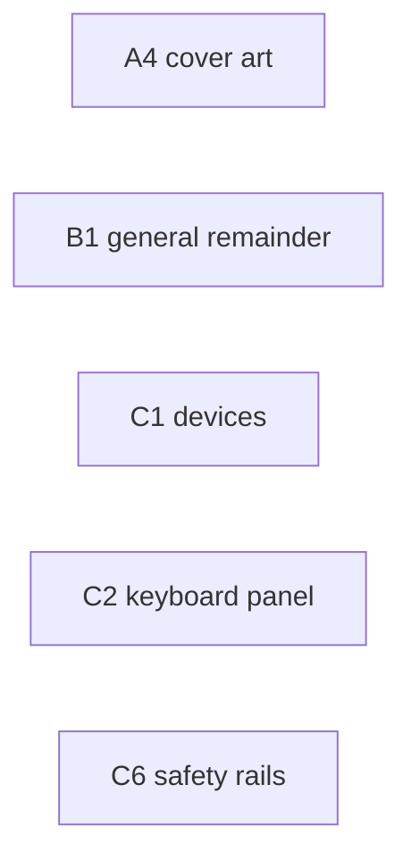

# Launcher — work plan, by prompts

**Status: scoping/planning.** No code in this document. Nothing here is a commitment, and nothing here
gates the release-readiness tasks in [backlog.md](../backlog.md).

> **Current milestone: M1 — "the launcher with the graphical settings" (§1.1), decided 2026-10-03.**
> The plan below still describes the whole launcher. M1 is the cut that is in scope *right now*:
> three tabs (General, Graphics, Controller), with the Graphics tab whole, the General tab limited to
> the launch target plus the save and DLC locations, and the Controller tab's unbuilt parts named but
> empty. Everything outside M1 is planned, not dropped.

This document is written as a **prompt plan**: every unit of work is a self-contained prompt you can
hand to a fresh agent session, plus the order it must run in and what can run beside what (§6).

**Evidence convention** (all three tags are used below):

- **[tree]** — read directly out of this working tree, with `file:line`.
- **[cited]** — read out of a build product (a log, a capture, a manifest).
- **[assumed]** — reasoned, not yet measured; a prompt that depends on one must verify it first.

> **Note on the plans this one used to lean on.** `docs/plans/av-settings-plan.md`,
> `docs/plans/button-mapping-plan.md` and `docs/plans/vr-port-plan.md` were dropped and their documents
> deleted, so this plan stands on its own: the settings rows come from the SDK and this tree (§2.1), the
> per-device remap work is specified by the C-lane prompts here (D13), and nothing below cites those
> documents. `docs/history/bringup-log.md` stays, and holds the mouse-navigation record.

---

## 1. The request, normalized

| # | As asked | Reading this plan plans against |
| --- | --- | --- |
| R1 | launcher folder in the project | `launcher/` source folder + `rb_blitz_launcher.exe` as a second target of the **existing** game build tree (D1) |
| R2 | the same cover image the installer has | the same artwork pipeline (`installer/tools/make_art.ps1`), embedded in the launcher exe (D11) |
| R3 | installer builds both game and launcher, both exes installed | launcher joins the payload allow-list and the `build.ps1` release step (D10) |
| R4 | launcher can launch the game; the game still runs standalone, using launcher settings or defaults | launcher starts the game with explicit argv; the **game reads the launcher's profile file itself**, at a priority below its own config (D3) |
| R5 | installer option: launcher on the desktop as well | a second `[Tasks]` entry and a second `[Icons]` entry, with a stated default (D9) |
| R6 | at the end, ask: open game / open launcher / do nothing | a custom finish page replacing the single `[Run]` checkbox (D8) |
| R7 | mouse **and** controller control | ImGui navigation driven by one input-agnostic focus model, fed by mouse and SDL3 gamepad (D6) |
| R8 | hover/focus shows a tooltip in a bar before the confirm button, RPCS3-style | a bottom bar that always names the hovered/focused row's tooltip and the current control hints (D7) |
| R9 | tabs: General, Graphics, Controller | three tabs, and the tab list is data, not code (§4.1). The Experimental tab is **withdrawn**; its rows are re-homed by D14 |
| R10 | General: launch target (Common / Demo / Ultimate), save dir, DLC dir | mapped onto `ultimate_mode`, `user_data_root`, `dlc_root` (D4). **This is the General tab's whole M1 scope** (§1.1) |
| R11 | "if Ultimate is installed, the Ultimate option is disabled with a tooltip to reinstall — or something friendlier" | **friendlier: never hard-disable.** Detect the payload, and when it is missing or damaged offer an inline *Install Ultimate…* that drives the already-installed `rb_blitz_setup_helper.exe` (D5) |
| R12 | Graphics: everything we can configure — API, resolution, etc. | the candidate rows §2.1 lists, each row labelled with whether it is live or needs a restart; FSR/sharpening stay hidden in this build (D12). **This tab is M1's point** (§1.1) |
| R13 | Controller: pick the input form; mouse support; list user controllers; per-button mapping; per-controller profiles never overwritten; keyboard always enabled | **two phases.** Phase C-A: input form + **mouse support** + device select + keyboard mapping + deadzone (everything that exists today). Phase C-B: per-pad remap, which does not exist yet — it is **planned work here, in this plan's lane C** (C3—C6, D13) |
| R14 | Experimental: Mouse Support toggle, plus suggestions | **withdrawn (2026-10-03).** There is no Experimental tab (D14). Mouse support becomes a real gate on the existing mouse-nav install and lives on the Controller tab (B3/B6); the suggested extra toggles are re-homed by D14 or dropped |
| R15 | all of it saved to an ini/other format, install folder or better | one TOML profile in the user's own app-data folder, with a portable override (D2) |
| R16 | (implied) nothing new is redistributed | the mod is never bundled — the launcher reuses the installer's helper and the same pin (D5) |

### 1.1 The current milestone — M1, "the launcher with the graphical settings"

Decided 2026-10-03. M1 is deliberately small: a launcher the installer ships, that is fully operable
with a controller, with **three tabs** (General, Graphics, Controller) — two of them real, the third
real only in part.

| Tab | In M1 | Named but empty / later |
| --- | --- | --- |
| **General** | launch target (**Common** / **Demo** / **Ultimate**) with filesystem availability detection (D5), save location, DLC location (D4) | game-directory override, *Verify installation*, *Install Ultimate…* (B8), first-run prefill from the manifest (D4) |
| **Graphics** | the graphical settings (D12): resolution, window size, fullscreen, monitor, V-Sync, MSAA, anisotropic, render scale, letterbox, safe area/overscan, dithering | *Audio* beyond mute/buffer (no `audio_volume` cvar yet), *Developer* group (`d3d12_readback_resolve`, `log_level`), FSR/sharpening (compiled out) |
| **Controller** | the *Input* group: input form (sdl/xinput), mouse support (B3/B6), guide button — and **full controller navigation of the launcher itself** (D6, A3) | device list + deadzone (C1), keyboard mappings (C2), per-button pad remapping (C3–C6) |

Two rules keep the "leave it blank" instruction honest:

- **A group with no rows renders as its name plus one line, or is hidden — never as a disabled widget
  that looks like a setting** (D14).
- No row is added to fill a category. If a feature does not exist (master volume) or is compiled out
  (FSR/sharpening), there is no row (P0.2, D12).

M1 keeps R7/R8 as hard requirements: the launcher is navigable end to end with a pad, mouse and
keyboard, with the bottom bar naming the focused row's tooltip and the current control hints (A2, A3).

The prompts M1 needed were the S1+S2 cut, with **B3**/**B6** building the Controller tab's input
group instead of the withdrawn Experimental tab — and all of them are built, **A3** and **A2** last;
§6.3 says so in one place.

> **Amended 2026-10-05 (D17, D18; §5.2 re-cut).** Three things in the table above are no longer true of
> the tree. (1) The Controller tab's *Input* group does **not** have an input-form row: `input_backend`
> is a real cvar but not a user-facing choice, because the remap listens to every device at once (D17).
> (2) The Graphics tab holds two rows §1.1 did not name — **Renderer** (`gpu_backend`, this project's
> own cvar) and **Anti-aliasing (post-process)** — and the free-form resolution size was dropped rather
> than built (D18). (3) "A group with no rows renders as its name plus one line" became "**is hidden,
> name and all**" (D18); the unbuilt categories are recorded in the schema and named by `--dump-layout`
> instead of drawn. Everything else in the table shipped, and §5.2 is the ledger of what did.

---

## 2. What exists today, and what does not

### 2.1 Exists (the launcher should reuse or copy these, not reinvent them)

| Thing | Where | Why it matters here |
| --- | --- | --- |
| A Windows installer that already ships the game | [installer/](../../installer), [installer/README.md](../../installer/README.md) | the launcher's payload, packaging and mod-install route are already built |
| The mod's installer, reusable from the launcher | `install-ultimate --dest <game root> (--from-pinned\|--from-zip\|--from-dir\|--from-url)` ([installer/src/commands.cpp:924-927](../../installer/src/commands.cpp)), pinned URL+hash embedded at build time | D5's "Install Ultimate…" is a `CreateProcess` of a binary the installer already put in `{app}` |
| The install's own record | `install-manifest.toml`: `[install] directory`, `game_directory`, `payload_commit`; `[game_data] source`, `directory`, `ultimate_installed` ([installer/src/install.cpp:1187-1208](../../installer/src/install.cpp)) | first-run prefill for the General tab (D4) |
| A flat cvar registry with a command line, a config file and source priorities | `--name=value` at startup, `rb_blitz.toml` next to the exe, `Source{kDefault,kConfig,kEnvironment,kCommandLine,kRuntime}` ([rexglue-sdk/src/core/cvar.cpp:83](../../rexglue-sdk/src/core/cvar.cpp), `:97`, `:538`, `:639`) | the launcher's settings *are* cvars; no new settings plane is needed |
| The launcher-relevant cvars | `game_data_root`/`user_data_root`/`update_data_root`/`cache_root` ([rexglue-sdk/include/rex/runtime.h:38-41](../../rexglue-sdk/include/rex/runtime.h)), `dlc_root` ([src/hooks/dlc.cpp:33](../../src/hooks/dlc.cpp)), `ultimate_mode`/`ultimate_payload_root`/`ultimate_patches` ([src/hooks/ultimate.cpp:100-113](../../src/hooks/ultimate.cpp)), `input_backend`/`guide_button` ([rexglue-sdk/src/input/input_system.cpp:27-30](../../rexglue-sdk/src/input/input_system.cpp)), `mnk_mode`/`mnk_mouse`/`mnk_sensitivity` and 25 `keybind_*` ([rexglue-sdk/src/input/mnk/mnk_input_driver.cpp:26-59](../../rexglue-sdk/src/input/mnk/mnk_input_driver.cpp)), display/graphics/audio rows in the SDK's own cvar registry | the three tabs are a *projection* of the registry, not a new subsystem |
| A boot-time hook where paths can still be corrected | `OnConfigurePaths` ([rexglue-sdk/include/rex/rex_app.h:113-115](../../rexglue-sdk/include/rex/rex_app.h)), overridden at [src/rb_blitz_app.h:50](../../src/rb_blitz_app.h) | the exact insertion point for "standalone uses the launcher's profile" (D3) |
| A precedent for "apply only where nothing else did" | `ApplyContentLicense()` reads `GetFlagSource("license_mask")` and writes only when it is `kDefault` ([src/rb_blitz_app.h](../../src/rb_blitz_app.h)) | same shape as the profile merge |
| The mouse-navigation feature, currently unconditional | `InstallMouseUiNavigation` in `OnPreSetup` ([src/rb_blitz_app.h:36](../../src/rb_blitz_app.h)), device in [src/input/mouse_ui.h](../../src/input/mouse_ui.h), arithmetic in [src/input/ui_nav.h](../../src/input/ui_nav.h) | the Controller tab's mouse-support toggle is a *gate*, not a new feature |
| A vendored UI stack already configured for this build | `imgui` OBJECT target ([rexglue-sdk/thirdparty/CMakeLists.txt:231-242](../../rexglue-sdk/thirdparty/CMakeLists.txt)), SDL3 static with `SDL_SHARED=OFF`/`SDL_STATIC=ON` (`:247-250`), PNG decode via stb_image ([rexglue-sdk/src/ui/image_decode.cpp:17](../../rexglue-sdk/src/ui/image_decode.cpp)) | the launcher needs no new third-party dependency (D1, D6) |
| An art pipeline with a stated licensing posture | [installer/tools/make_art.ps1](../../installer/tools/make_art.ps1) (DPI ladder, centre-crop, "not ours, not committed"), `.gitignore` `/assets/wizard-*.bmp`, committed `assets/blitz.png` + `assets/blitz.ico` | R2's cover is generated, not committed (D11) |
| A capture/verify toolkit | `scripts/capture_window.ps1`, `scripts/frame_diff.ps1`, `scripts/drive_ui.ps1`, `scripts/acceptance_*.ps1`, and the launcher's own `scripts/capture_launcher.ps1` / `scripts/acceptance_launcher.ps1` | the launcher is verified the same way the game is (E2/E3, now built) |
| A dependency-free test harness | `tests/check.h`, targets in [CMakeLists.txt:128-172](../../CMakeLists.txt) | launcher/profile/settings tests look exactly like the existing six |

### 2.2 Does not exist

| Missing | Consequence |
| --- | --- |
| Any launcher: no folder, no target, no UI | the launcher is greenfield |
| Any settings file the **game** reads other than its own `rb_blitz.toml` | D3 has to be decided and built (small, one hook) |
| Per-pad-button remapping | R13 Phase C-B is this plan's lane C (C3–C6, D13) — planned work here, not an outside dependency. **Built 2026-10-05** (D17): the SDK needs one seam it did not have (`InputSystem::SetStateFilter`), which is patch 0010 |
| A master volume cvar | `audio_volume` does not exist in the SDK; the audio row of the Graphics tab is "mute only" until it does |
| The installer's knowledge of a launcher | D1–D5 |
| Any launcher test, capture script or acceptance run | **Built 2026-10-05** (E1–E3): six CTest targets, `scripts/capture_launcher.ps1` and `scripts/acceptance_launcher.ps1` |

---

## 3. Decisions

Each decision is stated so a prompt can be executed against it. "Revisit if" is the honest escape
hatch.

### D1 — Where the launcher lives and how it is built

**Recommendation:** source in `launcher/`, target added by the **game's** build tree
(`add_subdirectory(launcher)` in [CMakeLists.txt](../../CMakeLists.txt)), producing
`rb_blitz_launcher.exe` next to `rb_blitz.exe` in `out/build/<preset>/`.

- It links the SDK's already-configured `imgui` and `SDL3::SDL3` static targets and compiles its own
  `imgui_impl_sdl3.cpp` + one renderer backend from `rexglue-sdk/thirdparty/imgui/backends`.
- It does **not** link `rex::runtime` and does not load `rexruntime.dll`. A launcher that pulls in the
  emulator runtime for a settings dialog is a coupling with no payoff.
- Renderer backend: prefer `imgui_impl_sdlgpu3` (SDL_GPU is core SDL3; no SDL_RENDER, which this build
  turns off deliberately — `thirdparty/CMakeLists.txt:253-255`); fall back to `imgui_impl_dx11` with the
  `HWND` from SDL if the SDL_GPU path fights the vendored imgui. **This is the one spike in Wave 0** (P0.4).
- The alternative — a second CMake project like `installer/`, building its own SDL3/imgui — is rejected:
  it duplicates a heavy third-party build and buys nothing, because a release always builds the game
  anyway.

**Folder convention.** `launcher/` holds everything only the launcher uses (`launcher/src/`,
`launcher/config/`, `launcher/tools/`, `launcher/CMakeLists.txt`, `launcher/tests/`). Code that **both**
exes compile — the profile path resolution, the profile reader/writer, the settings schema's generated
header if the game ever needs it — lives under the game's own `src/` (e.g. `src/launcher/profile_path.*`)
and is added to both targets, exactly the way `installer/CMakeLists.txt` reuses
`src/util/sha256.cpp` and `src/util/game_fingerprint.cpp` instead of copying them.

*Revisit if:* the launcher ever needs to run on a machine with no game build tree (e.g. a settings editor
shipped alone). Not in scope now.

### D2 — Where settings live, and in what format

**Recommendation:** one TOML file, owned by the launcher, in the user's roaming app data:

| Path | Contents |
| --- | --- |
| `%APPDATA%\rb_blitz\launcher.toml` (default) | window geometry, selected launch target, last-used folders, every setting the launcher manages (cvar key + value), launcher-only preferences |
| `%APPDATA%\rb_blitz\controllers\<device-key>.toml` | one file per physical device (Phase C-B; §D13) |
| `<exe dir>\launcher.toml` | same file, used instead when `<exe dir>\rb_blitz_launcher.portable` exists (portable install) |
| `--launcher_profile=<path>` / `RBBLITZ_LAUNCHER_PROFILE` | override, for tests and for isolating acceptance runs (`scripts/acceptance_persistence.ps1` uses the same idea with `--user_data_root`) |

- **Not** the install folder by default: the uninstaller deletes the install folder
  (`.staging`…`install-report.txt`, [installer/setup.iss:153-166](../../installer/setup.iss)), and a
  per-user install may be under `%LOCALAPPDATA%\Programs`, so "next to the exe" loses settings on
  update and breaks on a machine-wide install. Portable mode is the documented exception.
- **Not** in `rb_blitz.toml`: that file is the game's own, rewritten wholesale by the F4 overlay's
  *Save to config* (`SerializeToTOML`, [cvar.cpp:538](../../rexglue-sdk/src/core/cvar.cpp)), and the
  launcher must not fight it. Put launcher-only keys in it and the first F4 save drops them.
- Format is TOML because it is what the rest of the project uses (SDK cvars, manifests, pins). Whether
  the launcher links the SDK's vendored `tomlplusplus` or hand-parses like
  [installer/src/config.cpp](../../installer/src/config.cpp) is P0.4's call.
- **Never lose a hand-edited file:** parse failure keeps the file, shows the reason, and refuses to
  save until the user resolves it (B4).

> **Amended 2026-10-05 (built).** The file can be moved to a folder the user chooses, recorded in
> `%APPDATA%\rb_blitz\settings_dir.txt`; that pointer is step 3 of the order, above the portable marker
> and below an explicit override, and choosing a folder removes the marker so one question has one
> answer. D17 has the rules; `src/launcher/profile_path.{h,cpp}` is the whole of it. The
> `controllers\<device-key>.toml` files are still unbuilt for the reason D17 gives.

### D3 — How the game gets the launcher's settings (standalone included)

The requirement is precise: *launched by the launcher* must use the launcher's settings, and *launched
by double-click* must too, falling back to defaults when nothing was ever configured. That rules out
"pass everything on the command line" alone, and the SDK's own precedence makes the rest fall out:

| Priority | Source | Why it sits here |
| --- | --- | --- |
| 1 | command line `--flag=value` | the launcher always passes the **path** flags explicitly, so a launcher launch is deterministic and visible in the log |
| 2 | `RBBLITZ_*` environment | SDK `ApplyEnvironment` |
| 3 | `rb_blitz.toml` next to the exe | the game's own file, written by the F4 overlay; the user's in-game changes must win |
| 4 | **`launcher.toml`** | applied by the game **as a config file** (`rex::cvar::LoadConfig(profile_path)`) at the top of `OnConfigurePaths`; equal-ranked with #3 but applied first, so #3 overrides it |
| 5 | compiled defaults | — |

Two details make it work, and both are [tree] facts:

- `SetupEnvironment` reads `game_data_root`/`user_data_root`/`update_data_root`/`cache_root` **before**
  any config file is loaded ([rexglue-sdk/src/ui/rex_app.cpp:110-140](../../rexglue-sdk/src/ui/rex_app.cpp),
  `LoadConfig` at `:157`). So after loading the profile, `OnConfigurePaths` must re-derive those four
  paths from the (now profile-aware) cvars — there is no hook earlier than it that the project owns
  (`rex_app.h:98-115` lists them all).
- Because the profile is loaded with `Source::kConfig` and `rb_blitz.toml` is loaded later at the same
  rank (`Outranks` is `>=`, [cvar.cpp:83](../../rexglue-sdk/src/core/cvar.cpp)), the game's own file
  wins automatically. No manual source juggling, and `GetFlagSource` is only needed if a log line wants
  to name the winner.

The profile path is resolved by a small shared module compiled into **both** exes
(`src/launcher/profile_path.{h,cpp}`), so the launcher and the game cannot disagree; the game registers
one new cvar (`launcher_profile`) so the override is also settable as `--launcher_profile=…` and shows
up in the F4 overlay for free.

*Revisit if:* a user reports the launcher's Graphics value not applying because they also changed it
in-game — that is precedence #3 winning, working as designed; B4 surfaces it as a badge, not a bug.

### D4 — General tab: what the three launch targets actually are

M1 shows exactly these five rows and nothing else; the game-directory override, *Verify installation*
and *Install Ultimate…* are later (§1.1, B8).

| Row | cvars | Grounded meaning |
| --- | --- | --- |
| Rock Band Blitz (**Common**) | `--ultimate_mode=0` | "ultimate: off, booting the retail game data" |
| Rock Band Blitz **Demo** | `--license_mask=0` | the XBLA trial path; the project's own note is that a licence-less boot takes the trial mode that does not keep scores ([src/rb_blitz_app.h](../../src/rb_blitz_app.h), `ApplyContentLicense`) |
| Rock Band Blitz **Ultimate** | `--ultimate_mode=1` (auto) | payload at `<game root>\ultimate\gen\patch_xbox.hdr` is mounted and the mod's 12-byte edits are re-applied host-side ([src/hooks/ultimate.cpp:231-260](../../src/hooks/ultimate.cpp)) |
| Save game location | `user_data_root` | default `Documents\rb_blitz`; the title's own saves and `globaloptions` live there |
| DLC location | `dlc_root` | `<title_id>/<content_type>/<package>`, mounted in place read-only ([docs/dlc.md](../dlc.md)) |

The launcher must refuse a save/DLC directory **inside** the game root, and say why: the runtime
already redirects those to the platform user directory ([src/fs/path_policy.h](../../src/fs/path_policy.h),
used by `OnConfigurePaths`), so a launcher that offers it would be offering a setting that silently does
something else. Same rule, same wording, one implementation (B1).

### D5 — Ultimate: detection, and the friendlier answer to "disabled + tooltip"

State machine, driven by files, mirroring the runtime's own checks:

| State | Detection | UI |
| --- | --- | --- |
| Ready | `ultimate\gen\patch_xbox.hdr` **and** `patch_xbox_0.ark` exist under the game root | *Ultimate* selectable and the default |
| Also present | the same pair at the game-root top level ("merged") | *Ultimate* selectable; note that it is merged |
| Missing | neither | *Ultimate* row is selectable but **not** the default, marked "not installed", and the tooltip says what to do — with a button. No dead option: the button is *Install Ultimate…* |
| Damaged | header without archive | warning text that matches the runtime's ("the game treats that pair as a damaged disc"), plus *Repair* |

*Install Ultimate…* runs the helper the installer already placed in `{app}`:
`rb_blitz_setup_helper.exe install-ultimate --dest "<game root>" --from-pinned --summary <f> --progress <f>`
([installer/src/commands.cpp:924-927](../../installer/src/commands.cpp)), with the launcher polling the
progress file exactly as the wizard does (`--progress` is a file, not a window — installer/README,
"The helper contract"). Nothing is redistributed: the same pin, the same verify, the same refusal to
copy the mod's `default.xex`. *Verify installation* reuses `verify-payload` / `verify-game`.

*Revisit if:* the user actually wants a hard-disabled row (R11 as literally read). The state machine
above degrades to that by flipping one flag in the schema table.

### D6 — Launcher input: mouse and controller

**Recommendation:** SDL3 `GameController` + keyboard + mouse, one input-agnostic focus model.

- D-pad/left stick move focus with key-repeat; `A` confirms; `B` goes back/cancels; `LB`/`RB` switch
  tabs; `Start` launches; `Back` opens the "reload profile / quit" menu. Mouse hover sets focus.
- SDL3 is already vendored, static, and is the game's default backend (`input_backend = sdl`, and
  `hid_mappings_file = gamecontrollerdb.txt` for exotic pads), so a pad that works in the launcher
  works in the game. XInput alone would drop the DB and half the pads.
- Hover/focus state is real imagery here: unlike the *guest* menus (where a hover is a synthetic pad
  pulse worked out by frame diffing, [src/input/mouse_ui.h](../../src/input/mouse_ui.h)), the launcher
  is ImGui with real hit-testing. Do not import `ui_nav.h`.
- The launcher must be usable with **no** controller and with a **misbehaving** one: the nav bindings
  are themselves editable in the profile (A5), and a `--no-gamepad` switch exists for recovery.

> **Built 2026-10-05 (A5), for the keyboard half of the same rule.** The keys are the profile's
> `[nav]` table, which is what "the nav bindings are themselves editable" means; the *Launcher keys*
> block at the end of the General tab is the editor, `--safe-mode` starts on the defaults whatever the
> file says, and the focus ring is drawn as a shape as well as coloured. What the build settled is
> under this decision's own section below.

**Built (A3), and what the build settled.** The pad's side of this is
`launcher/src/pad_nav.{h,cpp}` (the binding table above, the deadzone, the repeat — no SDL) and
`launcher/src/pad_source.{h,cpp}` (the open pads, their names, their state). Three things the
decision did not say and the work had to:

- **`Back` has no menu to open.** D6 gave it "reload profile / quit"; no such menu exists, and the
  half of the sentence that does is *quit*, so `Back` cancels — which is also what `B` does and what
  `Esc` does. A5 built the recovery the menu was for (the *Launcher keys* block, `--safe-mode`), and
  the menu itself remains unbuilt.
- **Which pad's buttons the bar names.** With two attached there is no "the" pad, so the names
  follow the **last pad used**, and the labels themselves are the mapping database's
  (`SDL_GetGamepadButtonLabel`) with this project's short table for the shoulders and `Start`, which
  the database does not name. A pad that says nothing gets the 360's letters.
- **A pad has to be *opened* before SDL will read it at all.** `SDL_GetGamepadFromID` answers with
  nothing for a pad nobody opened, which is silence that looks exactly like a pad at rest — so one
  owner (`PadRegistry`) opens them, and the remap block's listen reads them there too. That last part
  was a real bug the prompt found: C5's capture queried SDL for itself, so it could not see a pad
  press at all.

`Start` launches the game (`NavAction::kLaunch`, the bar's *Launch Game* without the mouse) and
`--focus-log` is the evidence hook the verification needed — see §7's rows.

**Built (A5), and what the build settled.** The keyboard's half of this is
`launcher/src/nav_bindings.{h,cpp}` (the vocabulary, the defaults, the resolution rules — no ImGui),
`launcher/src/nav_keys.{h,cpp}` (the one file that knows a name is an ImGui key) and
`launcher/src/nav_ui.{h,cpp}` (the *Launcher keys* block at the end of the General tab, next to B4's).
The keys are the profile's `[nav]` table, so D6's "the nav bindings are themselves editable" is what
it says rather than what it hoped. Four things the decision did not say and the work had to:

- **A chord is not a bare key, and the chord is resolved first.** `Shift+Tab` is a different binding
  from `Tab`, and matching the held modifiers *exactly* is what keeps them different; a bare key is
  the key whatever else is held with it, so `Shift+Down` still moves the ring forward. The rule is one
  function (`nav_bindings::Resolve`) and a test, because "which of my two bindings did that press
  mean?" is the question a rebindable table makes possible and a hardcoded list did not.
- **The repeat belongs to the action, not to the key.** A1 gave Tab no repeat and the arrows one,
  which a rebindable table cannot say — the key is the user's now. So a *move* repeats while held and
  a *decision* does not, and a held Tab walks the ring like a held arrow. It is a stated change in
  behaviour, in the README and here.
- **The four mouse-only actions are bound too.** D6's list stopped at navigation, which left *Save*,
  *Copy command line*, *Launch Game* and B4's *Copy the effective value* reachable by pointer only.
  A5 binds those as well (`Ctrl+S`, `Ctrl+C`, `Ctrl+Enter`, `Ctrl+Shift+C`), because "usable without a
  mouse" is only true if the whole session is, and the hints on the bar name the keys that are
  *bound* — a rebound key is what the bar tells the user to press, and an action with no key at all
  gets no hint rather than a wrong one.
- **The pointer had to stop stealing the ring.** Hover-adopting the ring every frame (D6's "mouse hover
  sets focus", as A1 wrote it) means a pointer left resting over a row takes it back on *every* frame,
  so a keyboard walk around a tab is dragged to that row — and a row that scrolls into place under a
  stationary pointer drags it further. The walkthrough leg in `scripts/capture_launcher.ps1` is what
  found this; the ring is now adopted when the pointer **moves** onto a row (`row_ui.h`'s
  `AdoptRingOnHover`), and every focusable item in the launcher goes through that one call. A pointer
  that has not moved has not chosen anything.

**Built (A5): the recovery switches.** `--safe-mode` starts the launcher on the compiled defaults for
its *own* behaviour — the keys the ring reads and the size the window opens at, which are the only
two things a profile can set that can leave the window unusable. It deliberately still reads and still
*writes* the file: the point of the switch is to reach *Reset every launcher key*, and a launcher that
refused to save would leave that fix unrecorded. The single write it skips is A1's geometry. One case
is new and is D2's rule with a door in it: under `--safe-mode` a file that did not parse may be
*replaced* by a save rather than refused, which is the recovery for a user with no second copy, and the
bottom bar says so before the button is pressed. `--ui-scale=<f>` overrides the display's content scale
— the accessibility answer for a display whose scale the user does not want to change, and the only way
a build machine can take a picture at a scale its monitor is not, which is how E2 re-measures the ring
and the bar at four steps on one machine. `launcher/README.md`'s "If something goes wrong" section is
the recovery steps, written for someone whose window is not usable enough to change a setting in it.

### D7 — The bottom bar

One fixed strip at the bottom of the window, above the confirm/cancel row:

```
 Rock Band Blitz Ultimate · Launch target        [Enter] Launch        Esc  Quit
 Tooltip of the hovered or focused row, wrapped to two lines when long.
```

- Left half: the tooltip of the hovered (mouse) or focused (controller) row, from the schema table, so
  every row has one by construction; the empty state is an explicit "—".
- Right half: the control hints for the row under the cursor/focus, glyphs for controller or key names
  for keyboard, switching with the last input device used.
- RPCS3 is the reference: the value is the tooltip *before* the confirm, not a floating ImGui tooltip.
  Floating tooltips are allowed in addition, never instead.

**Built (A2), and what the build settled.** The help line is the row's `tooltip` — flattened to one
run of text and re-wrapped to the width the hints leave, two lines with an ellipsis where a third
would have started — and the hints are the row's verb (*Toggle*, *Adjust*, *Edit*, *Choose*,
*Browse*) followed by the two global ones, in key names or in the pad's own button names depending on
which device moved last. Three consequences worth stating:

- **No floating tooltip was added.** D7 allows one in addition; the bar's copy is the contract, and a
  tooltip that appears whenever the pointer crosses a row is noise over a panel that is read.
- **Rows that are not settings have their help beside them.** `ProfilePanel::HelpText` and
  `ControllerTab::HelpText` are the sentences for the block buttons, asked by the shell rather than
  copied into it — the alternative was a second table in the shell to fall out of step with the block.
- **The entry-to-row walk is one function.** `schema_view`'s `SettingForEntry` counts ring entries
  exactly as the ring was sized (`FocusEntriesFor`), so the bar cannot describe a different row from
  the one the ring is on — a tab's own block is the tail it reports as "not a setting".

### D8 — The installer's finish page

Replace the single `[Run]` checkbox ([installer/setup.iss:150-151](../../installer/setup.iss)) with a
three-way radio on the finish page:

- *Open Rock Band Blitz Ultimate / Rock Band Blitz* (the launcher, honouring the selected target) — default
- *Open the launcher*
- *Do nothing*

Implementation notes for the prompt: hide `WizardForm.RunList`, add the three radio buttons as children
of the finish page at `CurPageChanged(wpFinished)`, and run the chosen action with `Exec()` after the
wizard closes; the `[Run]` entries are removed. Silent installs launch nothing
(`WizardSilent()` guard), matching today's `skipifsilent`. Verification is **manual** (ISCC compile plus
a three-point checklist recorded in [installer/README.md](../../installer/README.md)) — the wizard has no
test harness, and pretending otherwise would be dishonest.

### D9 — Shortcuts

| Location | What | Default |
| --- | --- | --- |
| Start menu | Launcher **and** game (game keeps `--game_data_root="{app}\game"` so it works standalone) | both, always |
| Desktop | Launcher (new `[Tasks]` entry `launchericon`) | **checked** |
| Desktop | Game (existing `desktopicon` task) | unchecked, as today |

### D10 — Packaging

- `make_payload.ps1`'s `$wanted` allow-list ([installer/tools/make_payload.ps1:127-135](../../installer/tools/make_payload.ps1))
  gains `rb_blitz_launcher.exe`; its imports are re-derived the same way the game's DLLs are, so a
  backend that starts needing another DLL fails at snapshot time, not on the user's machine.
- The payload manifest gains a `payload-rb_blitz_launcher.exe` role; the helper verifies it like every
  other file; `[UninstallDelete]` lists it.
- `installer/build.ps1` gains a launcher step and a `-SkipLauncher` switch, and the launcher build must
  run **before** `make_payload.ps1` (the snapshot copies it).

### D11 — The cover image

Reuse the existing pipeline, do not fork it: `make_art.ps1`'s source (or the same `-SourceImage`
override), the same DPI ladder idea, the same "not ours, gitignored, absence is supported" posture
([installer/tools/make_art.ps1](../../installer/tools/make_art.ps1), [.gitignore](../../.gitignore)).

- Preferred: embed the cover at build time into a generated header (`launcher/tools/embed_art.cpp`,
  same shape as `installer/tools/embed_config.cpp` and `fingerprint_expected.h`), so the launcher is
  one file and the payload does not grow by a ladder of BMPs.
- The launcher picks the ladder step nearest its panel size rather than stretching one image, exactly
  as the wizard does.
- An absent cover is a supported configuration: the launcher falls back to a flat panel with the app
  badge (`assets/blitz.png`, committed) and the title text.
- `assets/blitz.ico` is the launcher's exe icon, compiled in with the same `rb_blitz.rc` trick the game
  uses ([CMakeLists.txt:32-36](../../CMakeLists.txt) and its comment about binding the icon by hand).

### D12 — Graphics tab contents

The display rows: resolution (`video_mode_width`/`_height`, `resolution`,
`video_mode_refresh_rate`), window size, fullscreen, monitor, V-Sync, anti-aliasing, anisotropic
filtering, render scale, letterbox, safe area/overscan, overscan cutoff, dithering, mute, audio buffer.

- Each row carries its **truth**: "needs restart" vs "live", read from the setting's own change
  callback — a lifecycle tag is not a promise that a value applies live.
- Rows whose feature is compiled out in this build (`present_effect`, CAS sharpness, FSR — `present_*`
  behind `REXGLUE_ENABLE_FIDELITYFX=OFF` in this cache) are **hidden**, not shown greyed: the build
  flag is not something a user can act on from the launcher.
- Free bonus once the SDK gains it: master volume (`audio_volume` → `SetOutputGain`), which does not exist today.
- Frame-rate unlocking is a project non-goal (the Deferred section of [docs/backlog.md](../backlog.md)).
  Do not put a frame-rate row in.

M1 ships this tab in full (§1.1); a row for a feature that does not exist yet (master volume) stays out
of the table until it does (P0.2's rule).

> **Amended 2026-10-05 (built).** The tab ships as decided, with three changes that came out of reading
> the rows against what the runtime really accepts:
>
> - **Resolution is a curated `enum`, not a free size.** The list is exactly the presets
>   `rexglue-sdk/include/rex/graphics/video_mode_util.h` parses (`720p`, `1080p`, `1440p`, `4k`), because
>   those are the sizes known to be safe; `video_mode_width`/`video_mode_height` are no longer rows, so
>   there is nothing to type a 21:9 size into. The runtime's own default is 1280×720, which is why `720p`
>   is the row's default and passes nothing.
> - **The guest refresh rate row (`video_mode_refresh_rate`) is withdrawn.** It changes how the title
>   paces itself, and nothing has established that any value other than the default is safe, so
>   offering it would be offering a change nobody can vouch for.
> - **`window_width`/`window_height` are withdrawn.** The resolution preset already sizes the startup
>   window (`window_sdl.cpp`), and two controls for one window can only disagree.
>
> Two rows the plan did not list were added, both because a widget needs them: `min`/`max` bounds on a
> numeric row (the cvar's own `.range(...)`), so a slider cannot offer a value the runtime would clamp.

> **Amended 2026-10-05 (D18).** Two more rows followed, and one of the plan's rows is gone:
> **Renderer** (`gpu_backend` — this project's own cvar, not the SDK's, with its choices taken from
> what the *build* compiled in) and **Anti-aliasing (post-process)** (`swap_post_effect`, kept separate
> from the native-MSAA row because the two mechanisms are independent). Gone: the free-form resolution
> size this decision allowed and the feedback rejected. `launcher/config/settings.toml` is the live
> list and `--dump-layout` prints it, choices included — the plan is not.

### D13 — Controller tab, honestly split in two

**Phase C-A — everything that exists today.** Input form (`input_backend`: sdl/xinput), the **mouse
support toggle** (B3/B6's `mouse_ui_nav`, default on — the gate on the guest's mouse navigation, moved
here when the Experimental tab was scrapped, D14), `guide_button` pass-through, the list of connected
controls (SDL3 enumeration + the keyboard as its own row), deadzone, `mnk_mode` (keyboard drives the
synthetic pad), `mnk_mouse` + sensitivity, and editing the 25 `keybind_*` strings with real capture.
Per-device profiles are stored per device from day one, keyed by SDL GUID (falling back to ordinal), so
nothing is overwritten when a second pad appears.

**Keyboard is always enabled** (R13): the pad merge in the SDK ORs devices, so the launcher never turns
`mnk_mode` off when a pad is selected — it keeps a pad *and* the keyboard mapped, and the Controller tab
says so in one line.

**Phase C-B — per-button pad remapping. Decided (2026-09-27): this plan owns it.** Physical pad
buttons cannot be remapped in the runtime today (**assumed** — C3 verifies it first). The work
is the remap core (headless), the grammar and its persistence, and the panel, and this plan takes
all three:

- **The launcher is the panel.** An in-game ImGui panel would build the same table twice in a worse
  place (you can only reach it after the game is running and holding the pad). The core and the
  grammar land in the game as prompts C3/C4 here; the panel is C5; C6 is the safety rails — one
  project, not two competing designs.
- Consequence for ordering: lane C is planned work here, not a dependency on another project. C3/C4 are ordinary prompts
  in this plan's wave 4, and the Controller tab's read-only state (§C1) only exists between waves 2 and 4.
- The shared contract must be a **file**, not a cvar family: cvars are registered at compile time, so a
  dynamically named `remap_<device>_a` cannot exist. The profile file (D2) is the contract; the game
  reads it where it reads the rest of the profile (D3).
- Until C5 lands, the Controller tab shows the remap group as its name plus one honest line:
  "Per-button remapping is not available in this build" — never an empty or disabled table (D14).

> **Amended 2026-10-05 (built).** The Controller tab's phase C-A is where it was left: `input_backend`
> is **withdrawn** as a row (D17 — with the remap listening to every device, the backend is not a
> user-facing choice), *Mouse support* and *Guide button pass-through* are the two rows the tab has, and
> the rest of C-A (the device list, deadzone, `mnk_mode`, the `keybind_*` editor) is unbuilt. Phase C-B
> is **built**, with the scope D17 settles: one `[remap]` table keyed by control, no per-device storage,
> and the panel in `launcher/src/controller_tab.{h,cpp}`.
>
> **The per-device storage sentence in C-A is retracted too (D17).** Nothing is keyed by SDL GUID: the
> remap is one table, the game is single-player, and nothing distinguishes two pads. §5.3's C1 no longer
> asks for per-device files — it asks for the device *list* and its identity, the deadzone and `mnk_mode`.
>
> **And C-B's two ordering sentences are spent.** C3/C4/C5 landed inside this plan, so "this plan's
> wave 4" and "the Controller tab's read-only state only exists between waves 2 and 4" describe nothing
> now. The placeholder row for an unbuilt group is gone as well — D18 hides the group instead of naming
> it, so the "not available in this build" line is not what an empty Controller tab shows any more.
> What is left of lane C is C1 (the device list), C2 (the keyboard panel) and C6 (the rails).


### D14 — The tabs: General, Graphics, Controller. Experimental is withdrawn (2026-10-03)

The launcher has **three** tabs. The planned Experimental tab (R14) is scrapped: a tab that exists
because "we were not sure where this belongs" is where settings go to be forgotten, and every row it
held has an obvious home.

| Row | cvar | New home | Status today |
| --- | --- | --- | --- |
| **Mouse support** (guest menus by mouse) | new, e.g. `mouse_ui_nav`, gating `InstallMouseUiNavigation` ([src/rb_blitz_app.h:36](../../src/rb_blitz_app.h)) | **Controller → Input** | exists unconditionally; B6 turns it into a gate, default-on, with a log line (B3 renders it) |
| Mouse look / sensitivity | `mnk_mouse`, `mnk_sensitivity` | **Controller → Mouse** | exists |
| Guide button pass-through | `guide_button` | **Controller → Input** | exists |
| Input form | `input_backend` | **Controller → Input** | exists; changing it needs a restart |
| Ultimate content device / song blacklist / disk-error latch edits | `ultimate_patches` bits 1/2/4 | **General → Ultimate (advanced)** | exists; M1 leaves the group **named but empty** |
| Frame readback for hover alignment | `d3d12_readback_resolve` | **Audio / Video → Developer**, hidden unless `--show-dev-settings` | exists, developer-only; out of M1 |
| Developer overlays (F3 / console / log level) | `bind_debug`, `log_level` | **Audio / Video → Developer** (same disclosure) | exists; out of M1 |
| Master volume | `audio_volume` | **Audio / Video → Audio** | **does not exist** in the SDK yet |
| Skip stream checksum validation | — | **not offerable**: it is a guest patch, flagged P1 in [docs/rb3-references.md](../rb3-references.md) §2.6; offer it only after that patch exists | — |
| Shader cache / readback resolver | `d3d12_readback_resolve` | **Audio / Video → Developer** (same row as above, not a second one) | dev-only, hide by default |

Two rules keep "leave the unimplemented categories blank" honest:

- **A group with no rows renders as its name plus one line, or is hidden — never as a disabled widget
  that looks like a setting.** D12's rule for compiled-out rows applies to unbuilt ones too.
- Every row that *is* shown states whether it is a real runtime behaviour or a build-time fact, in the
  repo's hook-hygiene spirit ("every hook states the faithful behaviour and the reason for deviating").

> **Amended 2026-10-05 (built).** The second half of the first rule is the one that ships: the five
> `unavailable` groups are declared in the schema and named by `--dump-layout`, and the tabs **hide them**
> rather than spending the window on a heading and a sentence that offer the user nothing. The `note`
> text stays in the schema, so nothing is lost — it just is not read out to someone who came to change a
> setting. The General tab is the one place a missing feature became an action rather than a sentence:
> when the Ultimate payload is absent, the greyed-out third target is replaced by *Install Ultimate…*
> (B8), which is what the user wanted to do anyway.
>
> **Two table rows above are out of date (2026-10-05).** *Input form / `input_backend`* is **not** a row
> anywhere (D17): with the remap listening to every device, the backend is not a user-facing choice. And
> the Ultimate advanced cell's "named but empty" is wrong in one word — the group is **empty and hidden**,
> which is the rule the amendment above settles for all five.

---

### D15 — Reusing the game's own UI art

**Recommendation:** reuse it, but only ever **derived from the user's own game data, on their
machine — never committed and never shipped.** The project already draws this line for the
wizard: [installer/tools/make_art.ps1](../../installer/tools/make_art.ps1) renders from a source
image that is not ours into `assets/wizard-*.bmp`, which `.gitignore` excludes, and absence is a
supported configuration (D11, Contract 5). Every game-derived image the launcher ever shows —
background, logo, button prompts, controller diagrams — inherits exactly that rule. Reusing the
game's art is a *look*, not a payload.

Three routes, in the order they should be attempted. None is a new subsystem:

1. **Read the art out of `game/` at runtime.** The launcher already knows the game root; nothing
   is generated, nothing is redistributed, and the art tracks the installed game. Blocked on one
   parsing detail — see §10.4 — so this is the goal, not the start.
2. **Generate it locally on the user's machine** at first run, into the launcher's own data
   directory: same posture as `make_art.ps1`, same "not ours, gitignored, absence supported"
   comment. Available today with a *capture* source (§10.3).
3. **Draw the fallback.** Flat panel, the committed `assets/blitz.png` badge, the title text.
   Already Contract 5's rule for the cover; §10.2 extends it to every slot.

So the deliverable that is unblocked now is not an extractor: it is the **slot list** — what
images the launcher wants, at what sizes, each with its fallback — because that is what makes a
later extractor a drop-in instead of a redesign. §10 is that list, the research behind it, and the
phases.

---

### D16 — The window: its name, its size, its face

Decided 2026-10-05, from reading the first running build. Amended the same day after the second
round of feedback (below).

- **The name is "Rock Band Blitz Launcher".** The window title and the ImGui window id all use it; the
  title keeps the ` — <tab>` suffix, which is the one piece of launcher state a script can read back
  (`MainWindowTitle`), and it is what makes "tab through every tab" checkable. Tab names are
  capitalized where a person reads them (`General`, not the schema's `general` key).
  > **Amended 2026-10-05 (D18).** There is no in-window heading any more: the frame's own title bar
  > carries the name, and the legend that used to sit beside it is gone with it.
- **The window opens at 1280×840 in logical points**, clamped to the display's work area less its own
  frame, and its **minimum size is 720×520 points** — a minimum, not a fixed size, so the window is
  draggable, maximizable from the frame's own maximize box, and restorable. A size the profile already
  holds is used as it is, so a user's own resize is respected.
- **A tab taller than the window scrolls, under a fixed strip.** The strip and the bottom bar stay put
  and the rows live in a scrolling child, so the wheel and the ring's `SetScrollHereY` both move the
  rows and never the chrome. The Audio / Video and Controller tabs are both taller than a small window,
  which is what this is for.
  > **Amended 2026-10-05 (D18).** The unsaved-changes marker is not in the strip any more: it is the
  > left half of the bottom bar, beside Save, and the window opens maximized.
- **Spacing is set once, in the style**, before `ScaleAllSizes` multiplies it by the display's scale:
  a settings dialog read at a glance gets air between rows and buttons rather than ImGui's dense
  defaults.
- **No label carries an ellipsis.** A button says what it does and stops; `…` on a button that opens a
  dialog rather than continuing a sentence is a habit, not information.
- **The geometry is stored in points, not pixels, and multiplied by the display's content scale when
  the window is created.** SDL sizes a window in the same units ImGui measures the UI in, so without
  that multiplication a 300% display would get a window a third the size with physically tiny text —
  which is exactly what the first build did. `--dump-display` prints the work area, the content scale,
  the size the window would open at and the face it loaded, so this is checkable without a screenshot.
- **The UI face is the machine's, loaded at runtime** (`segoeui.ttf`, then `tahoma.ttf`, then
  `arial.ttf`, from `%SystemRoot%\Fonts`), with ImGui's built-in face as the fallback. Nothing is
  redistributed and no font file is added to the repository — the same posture as the cover art (D11),
  and for the same reason.

### D17 — Quiet text, one way to move the settings, and a real remap

Decided 2026-10-05, from the third round of feedback, and it settles the parts of C3–C6 that the
feedback changed. Where a prompt below still describes something else, this is the newer instruction.

- **A panel that is fine says nothing.** The profile block prints no file path and no "Saved": it
  prints the two things worth printing, a file it could not read and changes that are not written yet
  (in warning colour). A category with nothing in it is hidden (D14 already allowed that), a row whose
  rule the machine does not satisfy is not in the layout at all, and a rule repeated seventeen times is
  one sentence and a `?` instead of seventeen lines.
- **Portable mode is replaced by *Change settings location*.** Where the settings live is a folder the
  user picks, recorded in `%APPDATA%\rb_blitz\settings_dir.txt` — a pointer file in the default folder,
  because that is the one location that is always there. Choosing a folder carries the settings over,
  keeps the file it came from, and rolls the pointer back if the new folder cannot be written; choosing
  the default removes the pointer. The older `rb_blitz_launcher.portable` marker still resolves, and a
  chosen folder supersedes it, because two answers to one question is one too many.
- **A path row shows the path the game will use.** An empty profile value means the game's own default,
  and a blank field would hide where the saves are about to go; the defaults are the game's own
  arithmetic, repeated rather than reinvented. Only an actual edit writes an explicit value.
- **The remap is a `[remap]` table in the profile, keyed by pad *control*, not by device.**
  - *One table, not one per device.* C4 asked for per-device profiles keyed by SDL GUID with an "any
    pad" fallback. This game is single-player, the feedback asked for every device to be accepted
    without an input-source choice, and nothing in the guest distinguishes two pads — so a second axis
    of state would be a setting whose other values do nothing. If a user genuinely runs two pads with
    different layouts, that is when the GUID key comes back.
  - *Sources are `pad:`, `key:` and `mouse:`.* The pad half reuses the control vocabulary as both
    target and source (the SDK's mapping is one physical control per bit, and the pad's buttons are
    labelled that way anyway), so there is one set of names to learn. The keyboard half is not the
    game's own `keybind_*` cvars (C4's constraint): the SDK's SDL driver maps no keys to pad buttons at
    all, so a `key:` source is what makes a keyboard press a pad button, and it is read beside the pad
    rather than out of the game's own configuration.
  - *Assign adds; Reset removes.* C5 asked for a conflict Replace/Swap/Cancel flow. "Several inputs,
    one button" is the feedback's own requirement, and adding is what expresses it: press Assign, press
    the input; press Assign again for another. A control with no row is the pad's own, so there is no
    conflict to resolve — the row says exactly what the control answers to.
  - *No hysteresis.* Hysteresis is for a layer that reports edges; this one rewrites a state the guest
    polls, so a trigger source uses the same threshold the SDK uses for its own digital view of it.
  - *An empty row is expressible and not offered.* `left_trigger = ""` means nothing presses it; the
    grammar accepts it, the panel shows it in warning colour, and the game honours it — but the panel
    does not offer it, because "wait three seconds" is not a thing a user should have to discover.
  - *Byte-identical pass-through, as C3 requires.* With no `[remap]` rows the filter is not installed
    at all, and with a row for a control the pad does not report, `Apply` copies the state before it
    rewrites it. `tests/launcher_remap_tests.cpp` pins both.
- **The seam is the SDK's, and it is one patch.** A driver cannot subtract — `InputSystem::GetState`
  merges every assigned device, and merging only ever adds — so the remap needs a hook over the merged
  state. `patches/rexglue-sdk/0010-input-system-state-filter.patch` adds
  `InputSystem::SetStateFilter`, ten lines, and everything above it is this project's. C3's "the choke
  point §2.5 identifies" is this one.
- **`input_backend` is not a row.** With the audible outcome "every device is accepted", selecting a
  backend is not a user-facing choice (D13's Controller tab keeps its two real settings).

### D18 — The window's own chrome, a Renderer row, and launching the game

Decided 2026-10-05, from the fourth round of feedback. Amends D16 (the window), D4/D5 (the General
tab), D14 (empty groups), D12 (the Graphics rows) and §4.3 (which B7 now implements), and supersedes
their older wording where they disagree.

- **The window is the launcher's chrome, and nothing else is.** The in-window heading and the key
  legend are gone: the frame's own title bar says "Rock Band Blitz Launcher — <tab>", which is where a
  user looks for a window's name, and the bottom bar's controls say what they do. A strip of
  instructions above the content is text a user reads once and scrolls past for the rest of the
  launcher's life; the keyboard table stays in `launcher/README.md`, where it is looked up on purpose.
- **It opens expanded.** `SDL_MaximizeWindow` runs after `SDL_ShowWindow` — maximizing a *hidden*
  window is a request Windows answers when the window appears, and it did not, leaving the window
  merely clamped to the work area with the maximize box already spent. Because a maximized window
  reports the work area rather than the size the user chose, the exit-time geometry write is skipped
  while it is: what the profile remembers is what to restore to, not "as big as this display".
- **The bottom bar is the session's, and it is the only place a session ends.** *Close* (leave), *Save*
  (write the profile), *Launch Game* (B7). The state of the settings file is on its left: "Unsaved
  changes" in warning colour, a file that could not be parsed in error colour, the last action's
  outcome otherwise, and nothing at all when there is nothing to say. **Save moves out of the
  settings-file block** and onto the bar — it is not a property of one tab's rows, and a Save button
  at the end of a list is both easy to miss and easy to mistake for "save this tab". The block keeps
  *Reset to defaults*, *Import*, *Export* and *Change settings location*. A2's other half — the focused
  row's tooltip and its hints — sits under the same line, and is built: see D7.
  > **Amended 2026-10-05 (B7).** The bar also carries *Copy command line*, §4.3's affordance: the
  > exact command a launch would run, on the clipboard, whether or not the command is ok. It is not
  > a session-ending action, so the enumeration above is unchanged in meaning; a failed start adds a
  > modal *beside* the bar's one-line reason, because the command line and the log path do not fit
  > on one line.
- **The Graphics tab is renamed Audio / Video.** Its schema key stays `graphics` — the `.toml`'s
  business, not the user's — and `DisplayTabName` is the one place that turns a tab key into a label.
  "Audio / Video" is also what the tab actually is: it has held the audio rows since B2.
- **A category with nothing to show is hidden outright, name and note included.** D14 allowed either;
  this settles it. The General tab's *Ultimate (advanced)*, the Graphics tab's *Developer* and the
  Controller tab's *Devices*/*Keyboard*/*Manual* are declared in the schema, counted and named by
  `--dump-layout`, and drawn nowhere. The one "this is missing" message that earns its space is the
  Ultimate *install* action, which is a button rather than a sentence.
- **The game is looked for up the tree.** The installer's layout is `<launcher>\game`; a development
  tree puts the same folder at the checkout root, three levels above `out\build\<preset>`. Before the
  search walked up, a launcher run from the build folder reported "Ultimate is not installed" however
  complete the payload was — the bug this decision was written from. Six levels, nearest match wins,
  an explicit `--game_data_root` still overrides everything.
- **The renderer is a row, and its choices come from the build.** `gpu_backend` is this project's cvar
  (`src/main.cpp`), acted on by `RbBlitzApp::SelectGpuBackend`, which loads the GPU plugin with the
  named backend and gets out of the way for the empty/"any" value the SDK itself uses. The Renderer
  row takes its `choices` from **what CMake compiled in** (`choices_from = "gpu_backends"`, fed by
  `--backends=`), because offering a backend the plugin does not have would be offering a renderer that
  cannot run. This replaces D12's "there is no row for it: a setting nobody can act on would be a lie" —
  with the cvar, the app-side load and the build-fed choices, somebody can act on it.
  > **Amended 2026-10-05 (Vulkan enabled).** The five submodules the Windows Vulkan path needs were
  > initialised and the tree is configured with `REXGLUE_USE_D3D12=ON` **and** `REXGLUE_USE_VULKAN=ON`,
  > so the row really offers both — verified by booting the game on each backend and by a capture of the
  > Vulkan-rendered title screen. That made a second failure mode reachable, so `SelectGpuBackend` now
  > also probes the Vulkan *loader* before committing: the SDK loads `vulkan-1.dll` at run time, so on a
  > machine with no Vulkan driver the plugin loads fine and only fails inside presentation setup, where
  > there is nothing left to fall back to. With the probe the promise above holds for both cases — the
  > payload not having the backend, and the machine not being able to run it — and both are logged.
  > `--dump-layout` now prints every enum's `choices`, so "does this payload offer Vulkan?" is
  > answerable headlessly.
- **Anti-aliasing is two rows, not one.** `native_2x_msaa` (resolve the title's own MSAA natively) and
  `swap_post_effect` (`none`/`fxaa`/`fxaa_extreme`, a post-process pass) are independent mechanisms;
  one "quality" enum that quietly set both would misdescribe what it does.
- **B7 is implemented**: `BuildLaunchCommand` (pure, contract 3), `GameProcess`
  (`CreateProcessW`, the install folder as the working directory, the handle kept so a second launch is
  refused while the game runs), `--print-command` as the dry run, and the launcher saving first when
  something is unsaved. What B7 still owed — the "Copy command line" affordance, the game's log path in
  a failure message and the pre-spawn profile check — is built 2026-10-05; E3's end-to-end assertion
  against a real boot remains.

---

## 4. Contracts that must exist before parallel work

These were Wave 0 and are all built: every contract below is a file in the tree, so a session can
work against it by reading only this section. Where a contract's shipped shape differs from the sketch
below — Contract 2's `[window]`/`[remap]` tables, Contract 1's `choices_from` — the decision record
(D17, D18) says why, and `launcher/README.md` is the description of what exists.

### 4.1 `launcher/config/settings.toml` — the settings schema (Contract 1)

One entry per row the launcher shows, compiled at build time into a generated header
(`launcher/tools/embed_settings.cpp`, same pattern as `installer/tools/embed_config.cpp`). The launcher
builds its widgets, its tooltips **and** the game's command line from this table, so a row cannot exist
in the UI without a tooltip, and cannot be saved without being launchable.

```toml
schema_version = 1

[[setting]]
key      = "video_mode_width"   # cvar name: also the profile key and the argv flag
tab      = "graphics"
group    = "Display"
label    = "Resolution width"
kind     = "int"                # bool | int | float | enum | string | path_dir | path_file
default  = 1280
applies  = "restart"            # restart | live
tooltip  = "Width of the guest's video mode. Restart required."
```

Rules: `enum` entries carry `choices`; a numeric entry may carry `min`/`max` (both or neither, the
default inside); `path_dir` entries carry `validate` (`exists|dlc_layout|inside_game_root:forbid`);
`applies = "live"` is only allowed with an evidence comment naming the change callback; and an entry may
carry `visible` — a rule the *machine* has to satisfy for the row to exist at all (`multi_monitor` is
the only one), applied when the layout is built so the ring and the drawing cannot disagree about it
(D17).

> **Amended 2026-10-05 (built).** The example above (`video_mode_width`, `Resolution width`) is the row
> this build withdrew: resolution is one `enum` over the runtime's preset list, and a numeric row that
> remains carries the cvar's own range so its widget is a bounded slider. See D12's amendment.

**Tabs and groups.** `tab` is one of `general | graphics | controller` — there is no `experimental`
(D14). M1's row set (§1.1) is every `general` row (`launch.target`, `user_data_root`, `dlc_root`), every
`graphics` row (D12), and the `controller` rows in the *Input* group (B3); the rest of Controller arrives
with C1/C2/C5. A group with no rows yet is declared with `status = "unavailable"` and a one-line
`tooltip`, so a tab can name the category without inventing a widget (D14's empty-group rule).

### 4.2 `launcher.toml` — the profile (Contract 2)

```toml
schema_version = 1

[launcher]
version      = 1
portable     = false

[window]
width  = 1280
height = 840

[launch]
target       = "ultimate"        # common | demo | ultimate
game_dir     = "C:\\Games\\Rock Band Blitz\\game"
user_data_dir = ""               # empty = game default
dlc_dir      = ""

[settings]
ultimate_mode  = 1               # only values that differ from the schema default are written

[remap]                          # one row per pad control the user rebound; nothing for the rest
y = "pad:x, key:Space"           # sources are `pad:`, `key:` and `mouse:` (D17)

[devices."030000005e0400008e02000000007801"]
name    = "Xbox Wireless Controller"
enabled = true
deadzone = 0.2
keyboard = true                  # keyboard stays on with a pad selected
[[devices."030000005e0400008e02000000007801".bindings]]
from = "PadA"
to   = "PadA"
```

Resolution order for the file's own path is in D2. Unknown keys survive a save (round-trip), so a newer
launcher's file is not destroyed by an older one.

> **Amended 2026-10-05 (built).** `[window]` holds 1280×840, `[remap]` is real and is one table keyed by
> control rather than the per-device `[devices."<GUID>"]` blocks sketched below, and where the file lives
> can be moved by the pointer file D2 describes. D17 has the reasoning; the `[devices]` shape waits for
> the case that needs it. D18 adds `[settings] gpu_backend` and `[settings] swap_post_effect`, the two
> rows the fourth round of feedback asked for.

### 4.3 The launch contract (Contract 3)

```
rb_blitz.exe
  --game_data_root="<install>\game"
  [--user_data_root="<profile save dir>"]        # only when overridden
  [--dlc_root="<profile dlc dir>"]               # only when overridden
  --ultimate_mode=0|1
  [--license_mask=0]                             # demo target only
  --launcher_profile="<resolved profile path>"   # so the game reads the same file
  + every schema entry whose value differs from the compiled default
```

Rules: quote every path; never pass an empty flag; log the exact argv in the launcher's own log and in a
"Copy command line" affordance, because that is the first thing a bug report needs.

> **Implemented 2026-10-05 (B7, D18).** `BuildLaunchCommand` (`launcher/src/game_launch.cpp`) builds
> exactly this and `--print-command` prints it, so the contract is a unit test
> (`tests/launcher_launch_tests.cpp`) as well as a launch. Two additions the launcher makes: the
> executable is the command line's first token as well as `CreateProcessW`'s `lpApplicationName`
> (the C runtime reads `argv` from the one string), and *Launch Game* saves first when something is
> unsaved. **Completed 2026-10-05:** *Copy command line* on the bottom bar and in the failed-start
> modal, the game's log folder in that message, and `LaunchReadiness` (the profile must be readable
> and its folder writable) before anything is spawned.

### 4.4 The packaging contract (Contract 4)

Exe name `rb_blitz_launcher.exe`; payload role `payload-rb_blitz_launcher.exe`; start-menu entries
`{autoprograms}\Rock Band Blitz` (launcher) and `… Rock Band Blitz (game)`; desktop task
`launchericon` (checked) and `desktopicon` (unchecked); silent parameters `/LAUNCHERICON=1` and
`/RUNATEND=launcher|game|none`; uninstall deletes the launcher exe and leaves `launcher.toml` alone
(it is user settings, like the game data).

### 4.5 The art contract (Contract 5)

Source URL/override and the "absence is supported" rule come from `make_art.ps1`; the launcher consumes
either the generated embedded header or, if it is missing, a flat panel. No art file is committed; the
`assets/wizard-*.bmp` ignore rule is extended to whatever the launcher's build writes.

### 4.6 The helper-reuse contract (Contract 6)

The launcher may only ever call the helper with: `install-ultimate`, `verify-payload`, `verify-game` —
read-only checks plus the mod install that never takes admin rights and never bundles the mod. Anything
else (importing game data, re-installing the payload) is the wizard's job; the launcher points at the
installer instead.

---

## 5. The prompts

### 5.1 The preamble every prompt assumes

Paste this above any prompt below (it is the shared context the plan does not repeat seventeen times):

> Repository: `rb_blitz`, a ReXGlue recompilation of Rock Band Blitz (Xbox 360) for Windows. Read
> `docs/plans/launcher-plan.md` first: it holds the decisions (§3) and the contracts (§4) this work
> must satisfy; do not re-litigate them, and if one is wrong, say so and stop.
> Conventions: CMake 3.25 + Ninja + clang-cl/MSVC, C++20/23; host tests are dependency-free
> (`tests/check.h`) and SDK-free; never edit `rexglue-sdk/` without adding a patch under
> `patches/rexglue-sdk/` and updating `patches/README.md`; never commit game data or third-party
> artwork; no retail content, no `.xex`, no mod payload in the repository; documentation is part of the
> change (README/docs in the same commit); the fingerprint gate must keep working; state for every hook
> or flag what the faithful behaviour is and why you deviated. Verification is evidence, not opinion:
> name the command you ran and the output you saw.

### 5.2 The prompt ledger

**Built.** Twenty-seven prompts are done, and this table is the record of them: what shipped, and which
decision changed the answer. Their original bodies are in this file's history (`git log -p
docs/plans/launcher-plan.md`) rather than below — a prompt whose work is finished is not something a
session should read as instructions, and every deviation it would have described is now a row in §3.

| ID | Shipped as | Amended by |
| --- | --- | --- |
| P0.2 | `launcher/config/settings.toml`, `tools/embed_settings.cpp`, the generated table, its CMake target and `launcher/README.md` | D18 (`choices_from`, so one row's choices come from the build) |
| P0.3 | `src/launcher/profile.{h,cpp}`, `profile_path.{h,cpp}`, `tests/launcher_profile_tests.cpp` | D17/D2: the settings *folder* is chosen and recorded in a pointer file, so the portable marker is one input to a larger order |
| P0.4 | `launcher/CMakeLists.txt`, `main.cpp`, SDL_GPU + ImGui backends, the exe icon, the README's backend note | D16 (size, font, DPI), D18 (opens maximized) |
| P0.5 | `make_payload.ps1` (`-LauncherDir`, role `payload-rb_blitz_launcher.exe`), `build.ps1` (`-SkipLauncher`, `-LauncherTarget`), the installer README | — |
| B6 | `mouse_ui_nav` in `src/input/mouse_ui.cpp`, its gate in `OnPreSetup`, its Controller row | — |
| A1 | `launcher/src/{shell,schema_view,nav}.{h,cpp}`, geometry through the profile, `--dump-layout`/`--dump-display` | D16, D17 (quiet text), D18 (no header text, the bottom bar, unbuilt groups hidden) |
| B2 | every Audio / Video row editable, one widget per `kind`, `(needs restart)` badges | D18: the Renderer and post-process-AA rows; the free-form resolution size was dropped |
| B3 | Controller → Input: `mouse_ui_nav`, `guide_button` | D17: `input_backend` is deliberately not a row; D18: unbuilt groups are hidden rather than named |
| B5 | the game gets the launcher's rows as argv — every managed row the profile moved off its compiled default is passed as `--<key>=<value>` (Contract 3) — and resolves the profile itself for `[remap]` | §11.6: the "profile applied as a config file" half of D3 is not in the tree (measured 2026-10-05, E3) |
| D1 | the launcher in the payload, in `[UninstallDelete]`, and in the installer tests | — |
| B4 | the writer, the precedence badge (with *Copy the effective value*), Import/Export, *Change settings location* | D17: portable mode replaced by a chosen folder; the panel stopped narrating itself |
| B8 | *Install Ultimate* through the helper, cancellable, with the manual route on failure | — |
| C3 | `src/launcher/remap.{h,cpp}` (the vocabulary), `src/input/remap.{h,cpp}` (the game's filter), SDK patch 0010 | D17: one `[remap]` table keyed by control, not a profile per device; the seam is the SDK's state filter |
| C4 | the grammar, the serialiser, the round trip, unknown-token tolerance, `[remap]` persistence | D17: no hysteresis, no per-device keying, the game's `keybind_*` untouched |
| C5 | `launcher/src/controller_tab.{h,cpp}`: one row per control, a three-second capture, per-control and global resets | D17: capture adds rather than resolving conflicts; no per-device enable/disable. A3: the pads it reads are the launcher's open ones, because SDL reads a pad only through a handle somebody opened |
| A3 | `launcher/src/{pad_nav,pad_source,virtual_pad,focus_log}.{h,cpp}`, the real `GamepadNavSource`, `NavAction::kLaunch`, `--focus-log`, `--no-gamepad`, `--test-pad`, the README's pad table | D6: `Back`'s menu is not built (the cancel half is), and the bar's glyphs come from the pad that was last used rather than from "the" pad |
| A2 | `Shell::DrawBottomBar`'s help region, `schema_view`'s `SettingForEntry`/`RowActionVerb`/`FlattenHelpText`, `ProfilePanel::HelpText`, `ControllerTab::HelpText`, hover-adopts-the-ring on both blocks | D7: the hints follow the last device used, and the tooltip is re-wrapped to the bar's width rather than drawn as the file wrapped it |
| D2 | the `launchericon` task, the two launcher `[Icons]` rows (Start menu always, desktop by task) and `/LAUNCHERICON` in `installer/setup.iss` + `installer/README.md` | D9 (the task defaults and the silent switch) |
| D3 | the three-way finish page in `installer/setup.iss` (the `[Run]` entry removed, three radios, `/RUNATEND`) and `installer/README.md`'s finish-page section and manual checklist | D8 (the page and its three choices) |
| D4 | `launcher/src/prefill.{h,cpp}`, the first-run application in `main.cpp`, `--dump-prefill`, the fixture-manifest cases in `tests/launcher_profile_session_tests.cpp`, the README's first-run section (the run on a real install is the §6 wave-3 manual pass's) | D4 (the General tab's rows; the prefill seeds the fields behind them) |
| B7 | the *Copy command line* bar button and failed-start modal, `LaunchFailureMessage`/`GameLogDirectory`/`LaunchReadiness` in `game_launch.{h,cpp}`, and the failing-start and readiness cases in `tests/launcher_launch_tests.cpp` | D18 (the launch contract §4.3 completes) |
| D5 | the manifest/report field assertions in `installer/tests/installer_tests.cpp` and `installer/README.md`'s manifest-field list and "the helper has two callers" note | — |
| E1 | the six launcher test targets named in `docs/build-and-run.md`'s new launcher section, with what each covers and the tree that has `BUILD_TESTING` on | — |
| E2 | `scripts/capture_launcher.ps1` (the headless reports, the keyboard leg and the pad leg), `capture_window.ps1 -ClientArea`, the README's "How it is checked" section and the same `build-and-run.md` section | A2/D7: the bar's help is the *row's*, so the harness asserts on the presses that cross a row and reports the ones inside a row's choices |
| E3 | `scripts/acceptance_launcher.ps1`: the silent install, the four legs (retail, ultimate, demo, save), the argv contract, the boot-log assertions, its exit codes and `summary.json`, plus the `build-and-run.md` section and the README's "How it is checked" entry | §11's two findings: the profile is not loaded as a config file, and the General tab's path rows and the launch command use different stores. R4's row in §7 changed state because of the first |
| E4 | the root README's launcher section, `known-issues.md`'s new entries (art licensing, version skew, renderer machine-dependence, and what E3 measured), and `distributable.md`'s packaging rows | — (E3's two findings are what the new entries write up, and two of them correct claims the plan and `known-issues.md` were carrying about how settings travel) |
| A5 | the `[nav]` table and its editor (`launcher/src/nav_bindings.{h,cpp}`, `nav_keys.{h,cpp}`, `nav_ui.{h,cpp}`), `--safe-mode` and `--ui-scale`, `focus_ring.h` and the ring every focusable item now draws, `tests/launcher_keys_tests.cpp`, the harness's four legs, and the README's recovery section | D6: the keys are the profile's rather than the source's; the pointer adopts the ring only when it *moves*, which is the bug the walkthrough leg found; D2: safe mode may replace a file that did not parse, and skips the geometry write |

**Open.** Five prompts: A4, B1, C1, C2 and C6 — the art, and the Controller
tab's remaining lanes. None is gated by anything, each is one step from the documentation that owns
its evidence, and §5.3 is the only place they are described.

| ID | Prompt | Lane | Depends on | Unblocks |
| --- | --- | --- | --- | --- |
| A4 | Cover art pipeline | A | P0.4 *(built)* | — |
| B1 | General tab: the two deferred rows | B | B1 *(built)* | — |
| C1 | Device list, deadzone, `mnk_mode` | C | A1 *(built)* | — |
| C2 | Keyboard mapping panel | C | C5 *(built)* | — |
| C6 | Remap safety rails | C | C5 *(built)* | — |

The two groups those fall into, which is what §6 schedules:

- **The Controller tab's remaining lanes** — C1, C2, C6.
- **Art** — A4.
- **Finish M1** — done, and completely: A3 and A2 are built, E1's test names, E2's capture
  harness and E3's installed run are in `docs/build-and-run.md`, and the launcher they describe is
  the one §7's rows were measured on. M1 was defined (§1.1) as "navigable end to end with a pad,
  mouse and keyboard, with the bottom bar naming the focused row's tooltip and the current control
  hints", and that is what the launcher does now.
- **The evidence lane** — done: E1, E2, E3 and E4 are built, and E4's write-up is where E3's two
  measurements live (§11.6, §11.7).
- **Recovery** — done (A5): the keys are the profile's, `--safe-mode` and `--ui-scale` exist, the
  focus ring is a shape rather than only a shade, and `launcher/README.md` carries the recovery
  steps.

### 5.3 The prompts that are left

Each block now says what is already in the tree, so a session does not rebuild it.

#### A4 — Cover art pipeline

> **Goal.** Give the launcher the installer's cover image. Extend the art pipeline so a launcher build
> produces either `assets/wizard-*.bmp`-style files or an embedding tool
> (`launcher/tools/embed_art.cpp` → generated header, same shape as `installer/tools/embed_config.cpp`),
> pick the ladder step nearest the panel size instead of stretching, and draw the cover beside the tabs
> with `assets/blitz.png` as the badge. Absence of the art must be a supported configuration: a flat
> panel with the badge and the title, no error, no crash. Extend `.gitignore` for whatever the launcher
> build writes, and state the licensing posture in `launcher/README.md` in the same words
> `make_art.ps1` uses.
> **Deliverable.** `launcher/tools/make_launcher_art.ps1` (or a documented reuse of `make_art.ps1`
> with `-SourceImage`), the embedding tool, the drawing code, and the README section.
> **Verify.** Build with art present and with `-SkipArt`/no art: both must look deliberate. Screenshot
> both (`scripts/capture_window.ps1`).
> **Don't.** Do not commit any artwork; do not make the build fail when the download fails — that is
> `make_art.ps1`'s existing rule and it stays.

#### B1 — General tab: the two deferred rows

> **Goal.** The two rows §1.1 left for later, on a tab that is otherwise built (target with
> filesystem availability, save and DLC pickers with their rules, *Install Ultimate*):
>
> - the **game-directory override** — the row that says where the game is when detection got it wrong,
>   honoured exactly as `--game_data_root` is today (`DetectGameRoots` already takes an override; the
>   row is what gives it a UI);
> - ***Verify installation***, driving the helper's read-only `verify-game` / `verify-payload` per
>   §4.6, reporting what it found rather than a pass/fail.
>
> **Deliverable.** The rows, their `settings.toml` entries where they are cvars, and the General
> report (`--dump-general`) learning about the override.
> **Verify.** Point the override at a payload install, a vanilla install and an empty folder: the tab
> must say which it found, and *Verify installation* must agree with the game's own boot lines.
> **Don't.** Do not implement first-run prefill here (D4); do not make the override a second source of
> truth for the profile's own paths.

#### C1 — Device list, deadzone and `mnk_mode`

> **Goal.** The Controller tab's *Devices* group, on D13 and D17's premises rather than C1's original
> ones. Enumerate SDL controllers plus the keyboard, show live identity (name, GUID, ordinal,
> connected now) so a bug report can name a pad, expose the **deadzone**, and expose **`mnk_mode`**
> (the keyboard drives the pad) — and per R13, **never** disable the keyboard because a pad exists.
> **Not this prompt.** Per-device settings files keyed by SDL GUID. D17 removed the need for them: the
> remap is one `[remap]` table keyed by control, the game is single-player, and nothing distinguishes
> two pads. D17 says when that comes back — a user who actually runs two pads with different layouts.
> **Deliverable.** The panel rows and the README note recording, per row: cvar, default,
> live-or-restart, and the evidence for whichever `applies` value it claims.
> **Verify.** Two pads attached (a second can be SDL's virtual joystick): both appear with stable
> identity, disconnect/reconnect keeps the same row, and a keyboard-only session shows the keyboard
> with the pad rows simply absent rather than disabled.
> **Don't.** Do not add a per-device file format; do not key anything by row order.

#### C2 — Keyboard mapping panel

> **Goal.** The Controller tab's *Keyboard* group, which is the honest half of R13 and is untouched:
> edit the 25 `keybind_*` strings
> ([rexglue-sdk/src/input/mnk/mnk_input_driver.cpp:33-59](../../rexglue-sdk/src/input/mnk/mnk_input_driver.cpp))
> with real capture, the shipped comma-alternatives grammar preserved, modifiers supported
> (`Shift+Up`, `Ctrl+A` — `TakeModifiers`), conflict handling, `Esc` cancels capture, reserved keys
> (`F3`, `F4`, `F7`, backtick, `Esc`) refuse to be bound and say why, and the profile refuses to save
> a layout that leaves the guest unable to reach Start/Back. Note in the UI that these bindings are
> live without a restart, and that the guest's own Controls screen shows a *different* thing.
> **Depends on nothing open.** C1's device list is not a prerequisite. Reuse C5's capture pattern — a
> three-second listen on a rising edge — rather than inventing a second one.
> **Deliverable.** The panel plus a validator module with unit tests
> (`launcher/src/keybind_validate.{h,cpp}`), plus README text on the two layers.
> **Verify.** Unit tests for parse/serialize round-trip and the reserved/conflict rules; a real
> capture session for three actions, then a launch proving the new mapping works in the game's menus.
> **Don't.** Do not invent a new grammar for keyboard sources; do not confuse these with the remap's
> `key:` sources — those press a *pad* button for the guest, these are the keys the guest itself
> reads.

#### C6 — Remap safety rails

> **Goal.** The rails at the launcher's level, on the panel C5 built: refuse to save a profile that
> leaves Start or Back unbound (or that a menu could not be escaped from), make the reserved overlay
> hotkeys (`F3`, `F4`, `F7`, backtick, `Esc`) non-offerable rather than silently broken, keep the
> documented panic path reachable without a working controller, and add a "test the layout" screen
> showing which guest-visible buttons a push would produce.
> **Already free, and the reason the rest is worth doing.** A capture that captures nothing changes
> nothing, so a half-armed capture is never persisted; and a profile with no `[remap]` rows installs
> no filter at all, so the panic path already exists — it is *Reset all bindings* in the panel, or
> deleting `[remap]` by hand. What is missing is the refusal and the test screen.
> **Deliverable.** The validator with unit tests, the test screen, and README text stating the panic
> path as a recovery step.
> **Verify.** Attempt to save a layout with Start unbound (refused, with the reason); apply the panic
> path to a deliberately broken profile and show the game booting with shipped behaviour.
> **Don't.** Do not make the panic path require the GUI.

---

## 6. Order and parallelization

### 6.1 Dependency graph (what is left)



Five prompts, and none of them depends on another: the evidence lane that used to sit under all of
them (E1-E4) is built, A5's recovery went out with it, and what each of these still owes is its own
evidence, in its own file.

### 6.2 Waves

| Wave | Run in parallel | Notes |
| --- | --- | --- |
| **1** | B1, C1, C2, C6 | four independent sessions, none of them gated by anything open. C2 and C6 need nothing open. |
| **2** | A4 | A4 needs only the built P0.4. |
| **3** | one manual pass | The only work left that cannot be done at a keyboard, and the only part of §6 the evidence lane could not script: controller navigation on real pads pressed by hand, per-pad remap on real hardware, the three finish-page choices, and one real Ultimate install driven through the wizard. E2's pad leg and E3's helper leg cover the scripted halves of the last two. |

### 6.3 Critical path, and the shortest useful cut

Nothing is on a critical path any more: A4, B1, C1, C2 and C6 are independent, one step each, and
the evidence lane's own two-step chains (E2 → E4, E3 → E4) are finished. If you only have one session
at a time, take them in any order that respects §6.1; the harnesses they will be re-measured with are
already in the tree — `scripts/capture_launcher.ps1` for the ring, the bar and a tab's body,
`scripts/acceptance_launcher.ps1` for the installed launcher and the four boots it enables, and
`ctest -R launcher` for the six host targets.

**M1 (§1.1) is finished.** "Navigable end to end with a pad, mouse and keyboard, with the bottom bar
naming the focused row's tooltip and the current control hints" is what the launcher does: A3's pad
source drives the same ring the keyboard and the pointer do, and A2's bar names the focused row and
says how to operate it, in key names or in the pad's own button names. Everything else M1 named —
P0.2/P0.3/P0.4, A1, B1, B2, B3, B4, B5, B6, B7, E1 — was already built, and the M1 cut's original
"Controller tab input group" listed `input_backend`, which D17 removed: that is a shortening of M1,
not a gap in it.

**Post-M1** is unchanged in shape and now has no stale premises: art (A4), and the Controller tab's
remaining lanes (C1, C2, C6). Packaging (D3–D5), first-run prefill (D4), the whole evidence lane
(E1–E4) and recovery (A5) are built, and §11 carries the two decisions E3's evidence left open.

---

## 7. Verification matrix

State as of 2026-10-05. A row whose `Where` names only built prompts is already proven — the evidence
is the test, the headless report or the harness named beside it, and `docs/build-and-run.md` is where
the commands live. A row still marked **open** is one nothing has measured yet, and its note says
what is missing.

| Requirement | How it is proven | Where | State |
| --- | --- | --- | --- |
| R3 payload ships both exes | install folder inspection + `verify-payload` + installer tests, and now the installed launcher's own `--print-command` | D1, D5, E3 | built |
| R4 launched by the launcher uses launcher settings | the rows a profile moved off their defaults are passed as argv (asserted on `--print-command`) and read back out of the boot log: `--user_data_root` is the log's `User data:`, `--dlc_root` is the `dlc: … in <folder>` line, the target is `--ultimate_mode`, and `[remap]` is the profile's own rebinding line | B5, B7, E3 | built — the installed build, four legs, 94 checks (`scripts/acceptance_launcher.ps1`) |
| ~~R4 a double-click (no launcher) uses launcher settings~~ | **E3 measured that it does not**: D3's rank 4 — the profile applied as a config file — is not in the tree (a top-level key in a profile handed to `--launcher_profile` does not reach a cvar), so the launcher's rows reach the game only as argv | B5, E3 | **open** — §11's first finding |
| R4 defaults when never configured | boot with no profile: log shows compiled defaults | B5 | built |
| R6 finish-page choice | three interactive installs + one silent | D3 | built — `ISCC` compiles it; the three installs and the silent one are the manual pass's (§6 wave 3), and `installer/README.md` carries the checklist |
| R7 controller control | `--test-pad` + `--focus-log`: a pad arrives 1.2 s into a session, two Down presses move the ring a row each, a held D-pad repeats 6 times at 0.13 s and stops on release, a stick pushed past the deadzone changes tab while a centred one does nothing, the pad leaves (`pads count=1`) and returns (`count=2`) without disturbing anything, and `Start` launches the game (the process was running) after saving the profile first | A3 | built — a *hand* press on a real pad is the manual pass's (§6 wave 3). Two pads were open at once throughout (an XInput pad beside SDL's virtual joystick); the virtual one is what was pressed |
| R7 the bar follows the device | `device gamepad name="Virtual Pad" confirm=Cross cancel=Circle shoulders=L1/R1 start=Options` in the trace, and the capture reading `Cross Choose  Circle Quit  L1/R1 Switch tab  Options Launch`; the same bar before the pad moved read `Enter Choose  Esc Quit  Tab Switch tab`; a keyboard-only session (three Down, End, Home, Tab and Right, all in the trace) never left the key names | A3, A2 | built |
| R7 no pad is not a broken launcher | `--no-gamepad` with a pad pressing five times: the trace shows no move at all, and the bar stays on key names | A3 | built |
| R8 bottom-bar tooltip | captures of three different rows (the launch target, the save location, the resolution row) each showing that row's own tooltip wrapped to two lines, and the mapping block's own sentence on the block's rows; `--focus-log` names the row each time (`entry=3/9 row=user_data_root enter=Browse`) | A2, E2 | built — and now measured rather than read: `scripts/capture_launcher.ps1` diffs the bar's help strip, where a press that leaves a row moves 6.7-10.4% of it and the three choices of the launch target move 0% by design (the sentence is the row's) |
| R9/R10 the ring, the tabs and the body, as captured | `scripts/capture_launcher.ps1`: six presses each move the ring one `--focus-log` entry, every press moves the body crop (0.19-4.28%), `Right` changes the title to *Audio / Video* and moves 16.0-18.1% of the body, `Left` returns to a 0% body, and a session that pressed nothing moves 0% of both crops | E2 | built |
| R10/R12 settings actually take effect | game log lines; pacing rig for V-Sync claims | B2, E3 | built for the rows that exist, and now for the installed build: E3's four legs read the licence, the DLC folder and the save folder back out of the log; the two General-tab path rows are §11's second finding |
| R11 Ultimate detection/repair | four filesystem states + a real install through the helper | B1, B8, E3 | built; `tests/launcher_ultimate_state_tests.cpp`, and E3's `ultimate` leg is the installed helper adding the mod to a retail install from a folder, after the `retail` leg booted without it |
| R13 keyboard always enabled | pad + keyboard both navigate the guest's menus in one run | C1, C2 | **open** |
| ~~R13 per-device profiles survive~~ | **withdrawn with D17**: there are no per-device files to survive — one `[remap]` table keyed by control | — | removed |
| R9/R10/R12 three tabs, M1 rows live | launcher shows General/Audio / Video/Controller; the tab's rows editable; General shows target + save + DLC | A1, B2, B3, B1 | built (built rows unchanged by D18 except the additions it lists) |
| R14 no Experimental tab; mouse toggle on Controller | tab list has no Experimental; two boots with `mouse_ui_nav` off/on, log + behaviour | B3, B6, D14 | built |
| R15 settings survive an uninstall/reinstall | install, uninstall (keep game data), reinstall, profile intact | D4 *(built)*, E3 | **open** — E3 covers the install and the four boots it enables, not the uninstall/reinstall pair; the first-run prefill's "never overwrite an existing profile" is proven |

Anything not in this table is not verified, and should be said out loud rather than implied.

---

## 8. Risks

| Risk | Why it is a risk | Mitigation |
| --- | --- | --- |
| ~~The launcher's renderer backend~~ | **resolved**: P0.4 chose SDL_GPU, and D18 turned the *game's* backend into a real setting | D18; both backends are now compiled and the Renderer row picks between them |
| The renderer a user picks may not run | a payload can carry Vulkan while the machine has no Vulkan driver | D18: the app probes the loader, logs why, and boots on the other backend |
| Two settings files, one user | `rb_blitz.toml` and `launcher.toml` can disagree; the F4 overlay writes the former | precedence is fixed (D3), surfaced as a badge (B4), recorded as a standing limit |
| Machine-wide installs | `{app}` may be read-only; the launcher's own log and the game's `rb_blitz.toml` writes fail there | the profile never lives in `{app}`; the launcher degrades to a warning |
| Controller-only users | a bad mapping can make the game unreachable | C6's panic path, A5's recovery switches (built: `--safe-mode`, `--no-gamepad`, and the Launcher keys block's Reset every key), "never persist a half-armed capture" |
| Remap scope creep | lane C was a whole project folded into this one (D13) | **spent**: C3/C4/C5 shipped inside the plan, and D17 narrowed them (one table, no per-device keying). What is left is C6, whose rails are what keep a bad mapping recoverable |
| Art licensing | the cover is not ours | identical posture to the installer: the image is fetched at build time, gitignored, and absence is supported. The launcher has no cover at all until A4; both halves are recorded in `docs/known-issues.md`, and `docs/distributable.md` gains the packaging rows that say what covers them |
| Version skew | launcher and game can be different builds | the shared seam is versioned where it can be (`[remap]` rows kept verbatim, the profile's `schema_version` refused rather than reinterpreted) and an unknown `--flag` is logged; E3 asserts the shared half end to end, and the rest is a standing limit in `docs/known-issues.md` |
| Silent-install surprises | new tasks/params can change unattended behaviour | new parameter defaults are documented and tested (D5, built) |

---

## 9. Non-goals

- Auto-update, a store, a mod browser, achievements or anything online (project non-goals).
- A second installer, or the launcher growing an installer: importing game data and re-placing the
  payload stay the wizard's job (§4.6).
- Unlocking frame rate, or exposing compiled-out graphics features.
- A guest-visible settings screen: the launcher only projects cvars, it does not own the game's own UI.
- Editing the guest's own Controls presets.
- An Experimental (or "Miscellaneous") tab: a setting with no honest category is left out or re-homed,
  never parked (D14).
- Linux/macOS launchers.

---

## 10. Reusing the game's own UI art — inventory, routes, blocker

The research behind D15. Everything here was read off the dump, not guessed; the tooling it names
is [scripts/hmx_milo.py](../../scripts/hmx_milo.py) and the measurements are in
[assets.md](../assets.md).

### 10.1 What is reusable, and where it lives

Every texture in a scene carries a record naming the **builder-side source path** and the
dimensions, which is enough to say which screen owns which art. Across the dump: **706 texture
records in 151 scenes.** The ones a launcher would want:

| Slot | Scene | Source-path record | Size |
| --- | --- | --- | --- |
| Background | `ui/background/gen/background_night.milo_xbox` | `img/night_gradient.bmp`, `img/northern_lights.bmp`, `rays.tex`, `img/star.png` | 1024² and up, 8-bit |
| Logo | `ui/splash/gen/splash_logo_element.milo_xbox`, `ui/splash/gen/splash.milo_xbox` | `splash_elements.tex`, `splash_logo.tex` | — |
| Button prompts (A/B/X/Y, LB/RB) | `ui/resource/fonts/gen/buttons.milo_xbox` | `../image/icons_buttons_xbox_nomip.bmp` | 512×512, 8-bit |
| Extra button icons | `ui/resource/fonts/gen/blitz_icons.milo_xbox` | `../image/blitz_icons_xbox_nomip.bmp` | 1024×512, 8-bit |
| Controller diagrams | `ui/controller_config/gen/controller_config.milo_xbox` | `img/xbox_0..3.png`, `img/ps_0..3.png` | 1024×1024, 8-bit |
| Calibration prompts | `ui/calibration/gen/cal_auto.milo_xbox` | `button_a_calibrate_icon0001/2.bmp`, `button_press_ps30001/2.bmp` | 256×256 |
| Lane / power-up icons | `track/cached_subdirs/gen/track_shared_textures.milo_xbox` | `icon_guitar/drums/bass/keys/mic*`, `help_arrow`, `multiplier_arrow` | 64²–128×256 |

Two facts matter for the launcher. The prompts are **font glyphs**, not standalone images: the A/B
prompts on every screen come from the one 512×512 sheet in `buttons.milo_xbox`, drawn through a
`Glyph` table — which is why they never appear as separate ark entries. And the controller
diagrams are four 1024² images **per pad family** — `xbox_0..3` and `ps_0..3` — so "Controller →
Manual" can show the real pad without drawing anything. Both families ship in **both** builds (the
PS3 dump carries `img/xbox_0..3.png` as well, and the 360 one carries `img/ps_0..3.png`), so either
dump is a source for either diagram.

### 10.2 The slots, and a fallback for each

Contract 5's rule ("absence is a supported configuration") applied to every slot, not just the
cover. This table *is* the deliverable that is unblocked today: with it, a later extractor is a
drop-in, and an empty launcher is still a working one.

| Slot | Wanted | Absent → |
| --- | --- | --- |
| Window background | one 1920×1080 image, darkened | flat panel, `assets/blitz.png` badge, title text |
| App badge / logo | the Blitz wordmark, transparent | `assets/blitz.png` (committed) |
| Tab icon strip (General/Graphics/Controller) | 3 small icons | text labels only |
| Prompt icons (A, B, X, Y, LB, RB, D-pad, Start, Back) | 9 transparent sprites at 32–64 px | drawn shapes: a filled circle with the letter, a rounded rect for the shoulders |
| Controller diagram | one image per pad family | the drawn shapes above, or nothing (the binding list already names the buttons) |
| Cursor / focus ring | 1 accent sprite | a 1 px outline |

Every row must be reachable *both* filled and unfilled in a debug build (a `--no-art` switch), for
the same reason D6 has `--no-gamepad`: the fallback is the recovery path, not dead code.

### 10.3 Route 2 in practice — capture, which works today

The game's own screens are already scriptable from this repository:
[scripts/drive_ui.ps1](../../scripts/drive_ui.ps1) sends keys,
[scripts/capture_window.ps1](../../scripts/capture_window.ps1) shoots the window. Measured on a real
run: the splash, title, main-menu and options screens capture cleanly at 1360×768, and the footer
prompt glyphs are ≈40 px — usable for a prompt icon, marginal as an upscaled background. This route
needs no new file-format work at all: it is `make_art.ps1`'s posture with a `-SourceImage` that
happens to be a capture. It is also the fastest way to answer "does the look carry over", which is
worth knowing before investing in the extractor.

Caveats, measured: a capture includes whatever is composited on top (a desktop notification landed
in one of mine), the title screen is animated so a still is a choice, and the window size is the
game's, not the launcher's.

### 10.4 Route 1's blocker — the one open detail

Reading the art out of `game/` needs the scene's pixel buffer, and its offset is the only thing not
yet pinned. State of the research, so a next attempt starts where this one stopped:

- **Proven.** The container (0x810-byte chunk table, deflate chunks), the record (source path plus
  width/height/row bytes), the pixel format (8-bit, one byte per pixel), the meaning of the byte
  (`0x00` transparent, `0xFF` opaque, the material tints it — not DXT, not palettised), and
  delivery: editing a scene inside the archive demonstrably changes what the game draws.
- **Proven for one texture.** In `buttons.milo_xbox` the glyph sheet is the last 262,144 bytes of
  chunk 0 — exactly `512 × 512 × 1`, matching its record — and zeroing it removes the A/B prompts
  from the menu, while filling it with `0xFF` makes them opaque.
- **The blocker.** The rule "the buffer is the last `w × h × bpp` bytes of the chunk" does *not*
  generalise: chunks hold several textures, and the writer interleaves other objects (materials,
  and for a font its `Glyph` table) into the same section, so nothing yet says where a given buffer
  starts.
- **Rejected, do not retry.** An RB3-shaped inline `RndBitmap` header (no match anywhere); a
  power-of-two descriptor shape beyond the one already used; a **stored mip chain** (the byte counts
  line up — a 1024² chain without its base level is 349,525 and the gaps between consecutive records
  are exactly that plus the record — but the level-2 block does not correlate with the
  box-downsampled base at *any* offset, and scores worse than a control block, so the match is a
  coincidence); DXT in either byte order (a solid DXT encode comes back as a dither); and a
  256-entry palette (none exists in the scene).

**Next step, and the reason it is small:** read the *object records* that sit between one texture
and the next. The `Glyph` table is the natural first target — it is a list of `x, y, width, height`
rectangles that must fit inside the 512×512 sheet, so its values both locate the sheet and supply
the sample-to-screen mapping that the last round of experiments could not pin down. Once one scene's
buffer offset is derived from its own records rather than assumed, the same derivation applies to
every other scene, and `hmx_milo.py extract` / `import` is a small addition on top of tooling that
already exists.

### 10.5 Phases

| Phase | Work | Blocked on |
| --- | --- | --- |
| **P0** | The slot list (§10.2) in the launcher's own build, `--no-art`, and the flat-panel and drawn-shape fallbacks — every slot rendered filled and unfilled. | nothing |
| **P0** | A capture script in `make_art.ps1`'s posture (`launcher/tools/`), producing the background, the badge and the prompt crops into a gitignored directory at build or first run. | nothing (capture already works) |
| **P1** | Derive the scene buffer offset from the object records (§10.4), then read background, logo and prompts straight out of `game/` at runtime — route 1, with no generated files at all. | P0's loader |
| **P2** | The pad-family diagrams on Controller → Manual, and the game's own fonts if the launcher ever wants them. | P1 |
| **P2** | Read the PS3 dump as a second art source where it is easier (its standalone textures decode with the same codec; [assets.md](../assets.md#ps3) has the comparison). | nothing |

P0 is worth doing first regardless of P1: it is the difference between a launcher that can *use* art
and one that needs it.

### 10.6 Risks

- **Licensing is the whole reason for the rule, not a formality.** Shipping the installer or the
  launcher with retail art inside it would be redistributing the game's assets.
  Derived-on-the-user's-machine (routes 1 and 2) is the only acceptable form, and the `.gitignore`
  rule that covers `assets/wizard-*.bmp` has to cover whatever the launcher's build writes too.
- **A capture is not the game's art file.** It carries the HUD, the prompts, and whichever animation
  frame it was taken on; it is a fallback source, not a substrate for recolouring. Anything that has
  to *change* an asset — a theme, a colourway — needs route 1.
- **Fallbacks are load-bearing.** Every art slot has to look intentional when empty, or an absent
  game dump becomes a broken-looking launcher.
- **The launcher is not the game's UI.** §9 keeps it out of the guest's screens; reusing art must not
  drift into re-implementing them.

---

## 11. Open questions

**Settled 2026-09-27:** D13's fork — this plan owns the per-device remap work, and the launcher's
Controller → Manual page is its panel. Consequences are already folded into R13, §2.2, D13, the
C-lane prompts, the DAG and the waves.

**Settled 2026-10-03:** the tab set is General, Graphics, Controller — the Experimental tab is
withdrawn and its rows re-homed (D14) — and the current deliverable is **M1** (§1.1), the launcher
with the graphical settings; everything else is planned, not dropped.

**Settled 2026-10-05:** where the settings live (D17 replaced portable mode with a chosen folder, so
question 2 below is answered — the default stays `%APPDATA%`, and moving it is a button rather than a
mode); the whole controller lane's shape (D17: one `[remap]` table, no per-device files, no
input-source choice); and the window's own chrome plus the renderer row (D18). Question 5's ordering
concern is answered by B7 as built: the launcher holds the child's handle but does not hold the pad,
and the game is started *after* the launcher's own SDL session, which has no controller open of its
own outside a listen.

Still open, for you before or during Wave 1:

1. ~~**Should the launcher be the primary entry point** (Start menu and desktop), with the game's own
   shortcut as the standalone option?~~ **Answered 2026-10-05 (D2):** yes, as D9 recommended — the
   launcher is in the Start menu and on the desktop (checked), and the game keeps its own shortcut,
   still pointed at the game so it runs standalone.
2. ~~**Portable mode**: worth it, or is `%APPDATA%` always right?~~ **Answered 2026-10-05 (D17):**
   `%APPDATA%` is the default and a *Change settings location* button moves it; the marker file still
   resolves, so no install is broken by the change.

For the running artifacts (answer with a boot, not an opinion):

3. Does `--license_mask=0` actually produce a *playable* trial (menus, one song) rather than a refusal?
   D4's Demo target depends on the answer. **Partly answered 2026-10-05 (E3):** the demo route boots
   with the mask on the command line and `content licence: license_mask = 0 (configured)` in the log,
   with no `[FATAL]`, and closes cleanly (`scripts/acceptance_launcher.ps1`). Whether the *guest* then
   offers a playable trial rather than a refusal is still open — E3 stops at the boot, and the route
   that would answer it is `scripts/acceptance_song.ps1 -UltimateMode 0` plus `--license_mask=0`.
4. Is the F4 overlay's `SaveConfig` the only writer of `rb_blitz.toml` in practice, or does a normal
   boot write it too? (It should not: `SaveConfig` runs from the overlay only.)
5. ~~Does a second `SDL_GameController` in a different process see the pad while the game has it open?~~
   **Answered 2026-10-05 (A3).** Yes, on Windows through SDL's XInput path: with the launcher holding
   every attached pad open — which A3 made it do for its whole life, not just during a listen — and the
   game started from it (B7 keeps the launcher alive), the game's own log shows
   `SDL OnControllerDeviceAdded: "XInput Controller #1", JoystickType(1), GameControllerType(2),
   VendorID(0x0B05), ProductID(0x1B4C)` and `connection order 0`. The same log lists one pad, not two:
   the launcher's virtual joystick (`--test-pad`) is process-local, which is what that hook is for.

**Two things E3 measured that the plan had wrong, and the decision they need** (both from
`scripts/acceptance_launcher.ps1`'s run, and neither fixed by it — they are design, not evidence):

6. **D3's rank 4 is not in the tree.** The table above says `launcher.toml` is applied by the game
   *as a config file* (`rex::cvar::LoadConfig(profile_path)`) at the top of `OnConfigurePaths`. It is
   not: `rex::cvar::LoadConfig` is called once, on `<exe folder>\<name>.toml`
   (`rexglue-sdk/src/ui/rex_app.cpp:158`), and nothing in `src/` loads the profile. Measured
   2026-10-05: a profile with a top-level `license_mask = 0`, handed to `--launcher_profile`, still
   boots as `license_mask = 1 (default; the title is treated as purchased)`. What *does* work is rank
   1 — the launcher passes every row it has moved off its default as `--<key>=<value>`, and E3's legs
   read three of those back out of the boot log. So the launcher's own "Launch Game" is covered and a
   double-click is not: the game started without the launcher (the Start-menu shortcut, or the exe
   itself) sees `rb_blitz.toml` and the compiled defaults, and none of the launcher's rows. Decision
   needed, and the options are not equivalent: implement rank 4 (apply the profile's `[settings]` at
   `Source::kConfig` before the game's own file, which is what D3 describes and what R4's standalone
   half needs), or accept it and drop rank 4 from D3 and from R4's row in §7. Until then R4's
   standalone half is **open** and the standing limit in `docs/known-issues.md` is wrong about the
   mechanism (its conclusion, "the game's file wins for a row the launcher does not pass", holds
   either way).
7. **The General tab's two path rows and the launch command read different stores.** `Save game
   location` and `DLC location` are written by the panel into `[launch] user_data_dir` / `dlc_dir`
   (`launcher/src/general_tab.cpp`, `ProfilePathValue`/`SetProfilePath`), which is also what
   `--dump-general` reports; `BuildLaunchCommand` builds `--user_data_root` / `--dlc_root` from
   `[settings] user_data_root` / `dlc_root` (`launcher/src/game_launch.cpp`, `RowValue`). Measured
   2026-10-05 with a profile whose two halves disagree: `--dump-general` printed
   `row dlc_root = (empty)` while the printed command line carried
   `--dlc_root="D:\...\game\dlc"` — so a folder a user picks in the panel is shown by the panel and
   never reaches the game. E3's legs therefore write the `[settings]` spelling the contract reads.
   The fix is small and belongs with whoever owns the row's storage (B1/B4): one store, not two, and a
   test that the panel's own value is what `--print-command` carries. It is not E3's to choose, so it
   is recorded here rather than changed quietly.
8. **The mouse row's log line is not evidence of the row.** `mouse_ui: the mouse navigates the menus`
   is printed when the driver is *installed*, which happens whatever the cvar says — the driver reads
   `mouse_ui_nav` per event (`MouseUiInputDriver::IsEnabled`). The prompt for E3 asked for the
   mouse-nav mode out of the boot log; measured 2026-10-05, `--no-mouse_ui_nav` and
   `--mouse_ui_nav=false` both leave that line in place, so E3 asserts the row on the command line
   and says why. If the mode wants to be visible in the log, the line has to carry the value.

---

### 11.1 Also open, for the art (D15, §10)

9. **Is a capture good enough to ship as the look**, or does the launcher wait for route 1 (runtime
   read)? Answer by building P0's slot list and looking at a filled launcher next to a filled game.
   The capture route is unblocked today, so this is a cheap answer.
10. **Does the launcher need the game's fonts?** The prompts are glyphs from `buttons.tex`; the rest
   of the launcher's text is ImGui's. Reusing the game's font means carrying the `Glyph` table too
   (§10.4's next step), which is only worth it if the answer to 9 is "the look matters a lot".

---
## 12. Sources

- [installer/README.md](../../installer/README.md) — what the installer contains, the helper contract,
  the payload allow-list, silent parameters, uninstall.
- [installer/setup.iss](../../installer/setup.iss) — tasks, files, icons, the finish page, uninstall list.
- [installer/tools/make_payload.ps1](../../installer/tools/make_payload.ps1),
  `installer/src/install.{h,cpp}`, `installer/src/commands.cpp` — payload, manifest, helper commands.
- [src/rb_blitz_app.h](../../src/rb_blitz_app.h), [src/hooks/ultimate.cpp](../../src/hooks/ultimate.cpp),
  [src/hooks/dlc.cpp](../../src/hooks/dlc.cpp), [src/fs/path_policy.h](../../src/fs/path_policy.h),
  [src/input/mouse_ui.h](../../src/input/mouse_ui.h) — the app hooks this plan hangs off.
- `rexglue-sdk/src/core/cvar.cpp` (sources and priority, config load/save, unknown-key warning),
  `rexglue-sdk/src/ui/rex_app.cpp:106-158` (path setup before config load),
  `rexglue-sdk/include/rex/rex_app.h:98-115` (the hooks),
  `rexglue-sdk/thirdparty/CMakeLists.txt:231-255` (imgui + SDL3 configuration).
- [docs/dlc.md](../dlc.md) — DLC layout and the save containers under `Documents\rb_blitz`.
- [docs/known-issues.md](../known-issues.md), [docs/backlog.md](../backlog.md) — the standing limits and
  the deferred features this plan must not quietly un-defer.
- **The art research (§10):** [scripts/hmx_milo.py](../../scripts/hmx_milo.py) — the scene reader whose
  `records` command produces the texture inventory; [docs/assets.md](../assets.md) — the container and
  texture formats, the delivery experiments and the rejected hypotheses; [scripts/drive_ui.ps1](../../scripts/drive_ui.ps1)
  and `scripts/capture_window.ps1` — the capture route the acceptance scripts already use.
