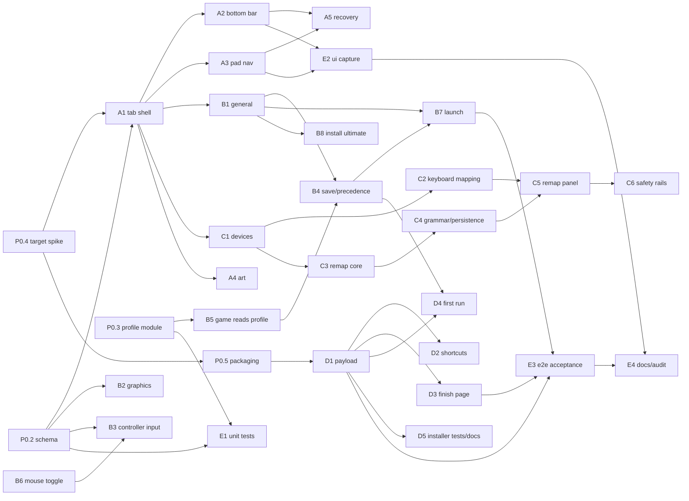

# Launcher — work plan, by prompts

**Status: scoping/planning.** No code in this document. Nothing here is a commitment, and nothing here
gates the release-readiness tasks in [backlog.md](../backlog.md).

> **Current milestone: M1 — "the launcher with the graphical settings" (§1.1), decided 2026-10-03.**
> The plan below still describes the whole launcher. M1 is the cut that is in scope *right now*:
> three tabs (General, Graphics, Controller), with the Graphics tab whole, the General tab limited to
> the launch target plus the save and DLC locations, and the Controller tab's unbuilt parts named but
> empty. Everything outside M1 is planned, not dropped.

This document is written as a **prompt plan**: every unit of work is a self-contained prompt you can
hand to a fresh agent session, plus the order it must run in and what can run beside what (§6).

**Evidence convention** (all three tags are used below):

- **[tree]** — read directly out of this working tree, with `file:line`.
- **[cited]** — read out of a build product (a log, a capture, a manifest).
- **[assumed]** — reasoned, not yet measured; a prompt that depends on one must verify it first.

> **Note on the plans this one used to lean on.** `docs/plans/av-settings-plan.md`,
> `docs/plans/button-mapping-plan.md` and `docs/plans/vr-port-plan.md` were dropped and their documents
> deleted, so this plan stands on its own: the settings rows come from the SDK and this tree (§2.1), the
> per-device remap work is specified by the C-lane prompts here (D13), and nothing below cites those
> documents. `docs/history/bringup-log.md` stays, and holds the mouse-navigation record.

---

## 1. The request, normalized

| # | As asked | Reading this plan plans against |
| --- | --- | --- |
| R1 | launcher folder in the project | `launcher/` source folder + `rb_blitz_launcher.exe` as a second target of the **existing** game build tree (D1) |
| R2 | the same cover image the installer has | the same artwork pipeline (`installer/tools/make_art.ps1`), embedded in the launcher exe (D11) |
| R3 | installer builds both game and launcher, both exes installed | launcher joins the payload allow-list and the `build.ps1` release step (D10) |
| R4 | launcher can launch the game; the game still runs standalone, using launcher settings or defaults | launcher starts the game with explicit argv; the **game reads the launcher's profile file itself**, at a priority below its own config (D3) |
| R5 | installer option: launcher on the desktop as well | a second `[Tasks]` entry and a second `[Icons]` entry, with a stated default (D9) |
| R6 | at the end, ask: open game / open launcher / do nothing | a custom finish page replacing the single `[Run]` checkbox (D8) |
| R7 | mouse **and** controller control | ImGui navigation driven by one input-agnostic focus model, fed by mouse and SDL3 gamepad (D6) |
| R8 | hover/focus shows a tooltip in a bar before the confirm button, RPCS3-style | a bottom bar that always names the hovered/focused row's tooltip and the current control hints (D7) |
| R9 | tabs: General, Graphics, Controller | three tabs, and the tab list is data, not code (§4.1). The Experimental tab is **withdrawn**; its rows are re-homed by D14 |
| R10 | General: launch target (Common / Demo / Ultimate), save dir, DLC dir | mapped onto `ultimate_mode`, `user_data_root`, `dlc_root` (D4). **This is the General tab's whole M1 scope** (§1.1) |
| R11 | "if Ultimate is installed, the Ultimate option is disabled with a tooltip to reinstall — or something friendlier" | **friendlier: never hard-disable.** Detect the payload, and when it is missing or damaged offer an inline *Install Ultimate…* that drives the already-installed `rb_blitz_setup_helper.exe` (D5) |
| R12 | Graphics: everything we can configure — API, resolution, etc. | the candidate rows §2.1 lists, each row labelled with whether it is live or needs a restart; FSR/sharpening stay hidden in this build (D12). **This tab is M1's point** (§1.1) |
| R13 | Controller: pick the input form; mouse support; list user controllers; per-button mapping; per-controller profiles never overwritten; keyboard always enabled | **two phases.** Phase C-A: input form + **mouse support** + device select + keyboard mapping + deadzone (everything that exists today). Phase C-B: per-pad remap, which does not exist yet — it is **planned work here, in this plan's lane C** (C3—C6, D13) |
| R14 | Experimental: Mouse Support toggle, plus suggestions | **withdrawn (2026-10-03).** There is no Experimental tab (D14). Mouse support becomes a real gate on the existing mouse-nav install and lives on the Controller tab (B3/B6); the suggested extra toggles are re-homed by D14 or dropped |
| R15 | all of it saved to an ini/other format, install folder or better | one TOML profile in the user's own app-data folder, with a portable override (D2) |
| R16 | (implied) nothing new is redistributed | the mod is never bundled — the launcher reuses the installer's helper and the same pin (D5) |

### 1.1 The current milestone — M1, "the launcher with the graphical settings"

Decided 2026-10-03. M1 is deliberately small: a launcher the installer ships, that is fully operable
with a controller, with **three tabs** (General, Graphics, Controller) — two of them real, the third
real only in part.

| Tab | In M1 | Named but empty / later |
| --- | --- | --- |
| **General** | launch target (**Common** / **Demo** / **Ultimate**) with filesystem availability detection (D5), save location, DLC location (D4) | game-directory override, *Verify installation*, *Install Ultimate…* (B8), first-run prefill from the manifest (D4) |
| **Graphics** | the graphical settings (D12): resolution, window size, fullscreen, monitor, V-Sync, MSAA, anisotropic, render scale, letterbox, safe area/overscan, dithering | *Audio* beyond mute/buffer (no `audio_volume` cvar yet), *Developer* group (`d3d12_readback_resolve`, `log_level`), FSR/sharpening (compiled out) |
| **Controller** | the *Input* group: input form (sdl/xinput), mouse support (B3/B6), guide button — and **full controller navigation of the launcher itself** (D6, A3) | device list + deadzone (C1), keyboard mappings (C2), per-button pad remapping (C3–C6) |

Two rules keep the "leave it blank" instruction honest:

- **A group with no rows renders as its name plus one line, or is hidden — never as a disabled widget
  that looks like a setting** (D14).
- No row is added to fill a category. If a feature does not exist (master volume) or is compiled out
  (FSR/sharpening), there is no row (P0.2, D12).

M1 keeps R7/R8 as hard requirements: the launcher is navigable end to end with a pad, mouse and
keyboard, with the bottom bar naming the focused row's tooltip and the current control hints (A2, A3).

The prompts M1 needs are the S1+S2 cut in §6.3, with **B3**/**B6** building the Controller tab's input
group instead of the withdrawn Experimental tab.

---

## 2. What exists today, and what does not

### 2.1 Exists (the launcher should reuse or copy these, not reinvent them)

| Thing | Where | Why it matters here |
| --- | --- | --- |
| A Windows installer that already ships the game | [installer/](../../installer), [installer/README.md](../../installer/README.md) | the launcher's payload, packaging and mod-install route are already built |
| The mod's installer, reusable from the launcher | `install-ultimate --dest <game root> (--from-pinned\|--from-zip\|--from-dir\|--from-url)` ([installer/src/commands.cpp:924-927](../../installer/src/commands.cpp)), pinned URL+hash embedded at build time | D5's "Install Ultimate…" is a `CreateProcess` of a binary the installer already put in `{app}` |
| The install's own record | `install-manifest.toml`: `[install] directory`, `game_directory`, `payload_commit`; `[game_data] source`, `directory`, `ultimate_installed` ([installer/src/install.cpp:1187-1208](../../installer/src/install.cpp)) | first-run prefill for the General tab (D4) |
| A flat cvar registry with a command line, a config file and source priorities | `--name=value` at startup, `rb_blitz.toml` next to the exe, `Source{kDefault,kConfig,kEnvironment,kCommandLine,kRuntime}` ([rexglue-sdk/src/core/cvar.cpp:83](../../rexglue-sdk/src/core/cvar.cpp), `:97`, `:538`, `:639`) | the launcher's settings *are* cvars; no new settings plane is needed |
| The launcher-relevant cvars | `game_data_root`/`user_data_root`/`update_data_root`/`cache_root` ([rexglue-sdk/include/rex/runtime.h:38-41](../../rexglue-sdk/include/rex/runtime.h)), `dlc_root` ([src/hooks/dlc.cpp:33](../../src/hooks/dlc.cpp)), `ultimate_mode`/`ultimate_payload_root`/`ultimate_patches` ([src/hooks/ultimate.cpp:100-113](../../src/hooks/ultimate.cpp)), `input_backend`/`guide_button` ([rexglue-sdk/src/input/input_system.cpp:27-30](../../rexglue-sdk/src/input/input_system.cpp)), `mnk_mode`/`mnk_mouse`/`mnk_sensitivity` and 25 `keybind_*` ([rexglue-sdk/src/input/mnk/mnk_input_driver.cpp:26-59](../../rexglue-sdk/src/input/mnk/mnk_input_driver.cpp)), display/graphics/audio rows in the SDK's own cvar registry | the three tabs are a *projection* of the registry, not a new subsystem |
| A boot-time hook where paths can still be corrected | `OnConfigurePaths` ([rexglue-sdk/include/rex/rex_app.h:113-115](../../rexglue-sdk/include/rex/rex_app.h)), overridden at [src/rb_blitz_app.h:50](../../src/rb_blitz_app.h) | the exact insertion point for "standalone uses the launcher's profile" (D3) |
| A precedent for "apply only where nothing else did" | `ApplyContentLicense()` reads `GetFlagSource("license_mask")` and writes only when it is `kDefault` ([src/rb_blitz_app.h](../../src/rb_blitz_app.h)) | same shape as the profile merge |
| The mouse-navigation feature, currently unconditional | `InstallMouseUiNavigation` in `OnPreSetup` ([src/rb_blitz_app.h:36](../../src/rb_blitz_app.h)), device in [src/input/mouse_ui.h](../../src/input/mouse_ui.h), arithmetic in [src/input/ui_nav.h](../../src/input/ui_nav.h) | the Controller tab's mouse-support toggle is a *gate*, not a new feature |
| A vendored UI stack already configured for this build | `imgui` OBJECT target ([rexglue-sdk/thirdparty/CMakeLists.txt:231-242](../../rexglue-sdk/thirdparty/CMakeLists.txt)), SDL3 static with `SDL_SHARED=OFF`/`SDL_STATIC=ON` (`:247-250`), PNG decode via stb_image ([rexglue-sdk/src/ui/image_decode.cpp:17](../../rexglue-sdk/src/ui/image_decode.cpp)) | the launcher needs no new third-party dependency (D1, D6) |
| An art pipeline with a stated licensing posture | [installer/tools/make_art.ps1](../../installer/tools/make_art.ps1) (DPI ladder, centre-crop, "not ours, not committed"), `.gitignore` `/assets/wizard-*.bmp`, committed `assets/blitz.png` + `assets/blitz.ico` | R2's cover is generated, not committed (D11) |
| A capture/verify toolkit | `scripts/capture_window.ps1`, `scripts/frame_diff.ps1`, `scripts/drive_ui.ps1`, `scripts/acceptance_*.ps1` | E2/E3 verify the launcher the same way the game is verified |
| A dependency-free test harness | `tests/check.h`, targets in [CMakeLists.txt:128-172](../../CMakeLists.txt) | launcher/profile/settings tests look exactly like the existing six |

### 2.2 Does not exist

| Missing | Consequence |
| --- | --- |
| Any launcher: no folder, no target, no UI | the launcher is greenfield |
| Any settings file the **game** reads other than its own `rb_blitz.toml` | D3 has to be decided and built (small, one hook) |
| Per-pad-button remapping | R13 Phase C-B is this plan's lane C (C3–C6, D13) — planned work here, not an outside dependency. **Built 2026-10-05** (D17): the SDK needs one seam it did not have (`InputSystem::SetStateFilter`), which is patch 0010 |
| A master volume cvar | `audio_volume` does not exist in the SDK; the audio row of the Graphics tab is "mute only" until it does |
| The installer's knowledge of a launcher | D1–D5 |
| Any launcher test, capture script or acceptance run | E1–E3 |

---

## 3. Decisions

Each decision is stated so a prompt can be executed against it. "Revisit if" is the honest escape
hatch.

### D1 — Where the launcher lives and how it is built

**Recommendation:** source in `launcher/`, target added by the **game's** build tree
(`add_subdirectory(launcher)` in [CMakeLists.txt](../../CMakeLists.txt)), producing
`rb_blitz_launcher.exe` next to `rb_blitz.exe` in `out/build/<preset>/`.

- It links the SDK's already-configured `imgui` and `SDL3::SDL3` static targets and compiles its own
  `imgui_impl_sdl3.cpp` + one renderer backend from `rexglue-sdk/thirdparty/imgui/backends`.
- It does **not** link `rex::runtime` and does not load `rexruntime.dll`. A launcher that pulls in the
  emulator runtime for a settings dialog is a coupling with no payoff.
- Renderer backend: prefer `imgui_impl_sdlgpu3` (SDL_GPU is core SDL3; no SDL_RENDER, which this build
  turns off deliberately — `thirdparty/CMakeLists.txt:253-255`); fall back to `imgui_impl_dx11` with the
  `HWND` from SDL if the SDL_GPU path fights the vendored imgui. **This is the one spike in Wave 0** (P0.4).
- The alternative — a second CMake project like `installer/`, building its own SDL3/imgui — is rejected:
  it duplicates a heavy third-party build and buys nothing, because a release always builds the game
  anyway.

**Folder convention.** `launcher/` holds everything only the launcher uses (`launcher/src/`,
`launcher/config/`, `launcher/tools/`, `launcher/CMakeLists.txt`, `launcher/tests/`). Code that **both**
exes compile — the profile path resolution, the profile reader/writer, the settings schema's generated
header if the game ever needs it — lives under the game's own `src/` (e.g. `src/launcher/profile_path.*`)
and is added to both targets, exactly the way `installer/CMakeLists.txt` reuses
`src/util/sha256.cpp` and `src/util/game_fingerprint.cpp` instead of copying them.

*Revisit if:* the launcher ever needs to run on a machine with no game build tree (e.g. a settings editor
shipped alone). Not in scope now.

### D2 — Where settings live, and in what format

**Recommendation:** one TOML file, owned by the launcher, in the user's roaming app data:

| Path | Contents |
| --- | --- |
| `%APPDATA%\rb_blitz\launcher.toml` (default) | window geometry, selected launch target, last-used folders, every setting the launcher manages (cvar key + value), launcher-only preferences |
| `%APPDATA%\rb_blitz\controllers\<device-key>.toml` | one file per physical device (Phase C-B; §D13) |
| `<exe dir>\launcher.toml` | same file, used instead when `<exe dir>\rb_blitz_launcher.portable` exists (portable install) |
| `--launcher_profile=<path>` / `RBBLITZ_LAUNCHER_PROFILE` | override, for tests and for isolating acceptance runs (`scripts/acceptance_persistence.ps1` uses the same idea with `--user_data_root`) |

- **Not** the install folder by default: the uninstaller deletes the install folder
  (`.staging`…`install-report.txt`, [installer/setup.iss:153-166](../../installer/setup.iss)), and a
  per-user install may be under `%LOCALAPPDATA%\Programs`, so "next to the exe" loses settings on
  update and breaks on a machine-wide install. Portable mode is the documented exception.
- **Not** in `rb_blitz.toml`: that file is the game's own, rewritten wholesale by the F4 overlay's
  *Save to config* (`SerializeToTOML`, [cvar.cpp:538](../../rexglue-sdk/src/core/cvar.cpp)), and the
  launcher must not fight it. Put launcher-only keys in it and the first F4 save drops them.
- Format is TOML because it is what the rest of the project uses (SDK cvars, manifests, pins). Whether
  the launcher links the SDK's vendored `tomlplusplus` or hand-parses like
  [installer/src/config.cpp](../../installer/src/config.cpp) is P0.4's call.
- **Never lose a hand-edited file:** parse failure keeps the file, shows the reason, and refuses to
  save until the user resolves it (B4).

> **Amended 2026-10-05 (built).** The file can be moved to a folder the user chooses, recorded in
> `%APPDATA%\rb_blitz\settings_dir.txt`; that pointer is step 3 of the order, above the portable marker
> and below an explicit override, and choosing a folder removes the marker so one question has one
> answer. D17 has the rules; `src/launcher/profile_path.{h,cpp}` is the whole of it. The
> `controllers\<device-key>.toml` files are still unbuilt for the reason D17 gives.

### D3 — How the game gets the launcher's settings (standalone included)

The requirement is precise: *launched by the launcher* must use the launcher's settings, and *launched
by double-click* must too, falling back to defaults when nothing was ever configured. That rules out
"pass everything on the command line" alone, and the SDK's own precedence makes the rest fall out:

| Priority | Source | Why it sits here |
| --- | --- | --- |
| 1 | command line `--flag=value` | the launcher always passes the **path** flags explicitly, so a launcher launch is deterministic and visible in the log |
| 2 | `RBBLITZ_*` environment | SDK `ApplyEnvironment` |
| 3 | `rb_blitz.toml` next to the exe | the game's own file, written by the F4 overlay; the user's in-game changes must win |
| 4 | **`launcher.toml`** | applied by the game **as a config file** (`rex::cvar::LoadConfig(profile_path)`) at the top of `OnConfigurePaths`; equal-ranked with #3 but applied first, so #3 overrides it |
| 5 | compiled defaults | — |

Two details make it work, and both are [tree] facts:

- `SetupEnvironment` reads `game_data_root`/`user_data_root`/`update_data_root`/`cache_root` **before**
  any config file is loaded ([rexglue-sdk/src/ui/rex_app.cpp:110-140](../../rexglue-sdk/src/ui/rex_app.cpp),
  `LoadConfig` at `:157`). So after loading the profile, `OnConfigurePaths` must re-derive those four
  paths from the (now profile-aware) cvars — there is no hook earlier than it that the project owns
  (`rex_app.h:98-115` lists them all).
- Because the profile is loaded with `Source::kConfig` and `rb_blitz.toml` is loaded later at the same
  rank (`Outranks` is `>=`, [cvar.cpp:83](../../rexglue-sdk/src/core/cvar.cpp)), the game's own file
  wins automatically. No manual source juggling, and `GetFlagSource` is only needed if a log line wants
  to name the winner.

The profile path is resolved by a small shared module compiled into **both** exes
(`src/launcher/profile_path.{h,cpp}`), so the launcher and the game cannot disagree; the game registers
one new cvar (`launcher_profile`) so the override is also settable as `--launcher_profile=…` and shows
up in the F4 overlay for free.

*Revisit if:* a user reports the launcher's Graphics value not applying because they also changed it
in-game — that is precedence #3 winning, working as designed; B4 surfaces it as a badge, not a bug.

### D4 — General tab: what the three launch targets actually are

M1 shows exactly these five rows and nothing else; the game-directory override, *Verify installation*
and *Install Ultimate…* are later (§1.1, B8).

| Row | cvars | Grounded meaning |
| --- | --- | --- |
| Rock Band Blitz (**Common**) | `--ultimate_mode=0` | "ultimate: off, booting the retail game data" |
| Rock Band Blitz **Demo** | `--license_mask=0` | the XBLA trial path; the project's own note is that a licence-less boot takes the trial mode that does not keep scores ([src/rb_blitz_app.h](../../src/rb_blitz_app.h), `ApplyContentLicense`) |
| Rock Band Blitz **Ultimate** | `--ultimate_mode=1` (auto) | payload at `<game root>\ultimate\gen\patch_xbox.hdr` is mounted and the mod's 12-byte edits are re-applied host-side ([src/hooks/ultimate.cpp:231-260](../../src/hooks/ultimate.cpp)) |
| Save game location | `user_data_root` | default `Documents\rb_blitz`; the title's own saves and `globaloptions` live there |
| DLC location | `dlc_root` | `<title_id>/<content_type>/<package>`, mounted in place read-only ([docs/dlc.md](../dlc.md)) |

The launcher must refuse a save/DLC directory **inside** the game root, and say why: the runtime
already redirects those to the platform user directory ([src/fs/path_policy.h](../../src/fs/path_policy.h),
used by `OnConfigurePaths`), so a launcher that offers it would be offering a setting that silently does
something else. Same rule, same wording, one implementation (B1).

### D5 — Ultimate: detection, and the friendlier answer to "disabled + tooltip"

State machine, driven by files, mirroring the runtime's own checks:

| State | Detection | UI |
| --- | --- | --- |
| Ready | `ultimate\gen\patch_xbox.hdr` **and** `patch_xbox_0.ark` exist under the game root | *Ultimate* selectable and the default |
| Also present | the same pair at the game-root top level ("merged") | *Ultimate* selectable; note that it is merged |
| Missing | neither | *Ultimate* row is selectable but **not** the default, marked "not installed", and the tooltip says what to do — with a button. No dead option: the button is *Install Ultimate…* |
| Damaged | header without archive | warning text that matches the runtime's ("the game treats that pair as a damaged disc"), plus *Repair* |

*Install Ultimate…* runs the helper the installer already placed in `{app}`:
`rb_blitz_setup_helper.exe install-ultimate --dest "<game root>" --from-pinned --summary <f> --progress <f>`
([installer/src/commands.cpp:924-927](../../installer/src/commands.cpp)), with the launcher polling the
progress file exactly as the wizard does (`--progress` is a file, not a window — installer/README,
"The helper contract"). Nothing is redistributed: the same pin, the same verify, the same refusal to
copy the mod's `default.xex`. *Verify installation* reuses `verify-payload` / `verify-game`.

*Revisit if:* the user actually wants a hard-disabled row (R11 as literally read). The state machine
above degrades to that by flipping one flag in the schema table.

### D6 — Launcher input: mouse and controller

**Recommendation:** SDL3 `GameController` + keyboard + mouse, one input-agnostic focus model.

- D-pad/left stick move focus with key-repeat; `A` confirms; `B` goes back/cancels; `LB`/`RB` switch
  tabs; `Start` launches; `Back` opens the "reload profile / quit" menu. Mouse hover sets focus.
- SDL3 is already vendored, static, and is the game's default backend (`input_backend = sdl`, and
  `hid_mappings_file = gamecontrollerdb.txt` for exotic pads), so a pad that works in the launcher
  works in the game. XInput alone would drop the DB and half the pads.
- Hover/focus state is real imagery here: unlike the *guest* menus (where a hover is a synthetic pad
  pulse worked out by frame diffing, [src/input/mouse_ui.h](../../src/input/mouse_ui.h)), the launcher
  is ImGui with real hit-testing. Do not import `ui_nav.h`.
- The launcher must be usable with **no** controller and with a **misbehaving** one: the nav bindings
  are themselves editable in the profile (A5), and a `--no-gamepad` switch exists for recovery.

### D7 — The bottom bar

One fixed strip at the bottom of the window, above the confirm/cancel row:

```
 Rock Band Blitz Ultimate · Launch target        [Enter] Launch        Esc  Quit
 Tooltip of the hovered or focused row, wrapped to two lines when long.
```

- Left half: the tooltip of the hovered (mouse) or focused (controller) row, from the schema table, so
  every row has one by construction; the empty state is an explicit "—".
- Right half: the control hints for the row under the cursor/focus, glyphs for controller or key names
  for keyboard, switching with the last input device used.
- RPCS3 is the reference: the value is the tooltip *before* the confirm, not a floating ImGui tooltip.
  Floating tooltips are allowed in addition, never instead.

### D8 — The installer's finish page

Replace the single `[Run]` checkbox ([installer/setup.iss:150-151](../../installer/setup.iss)) with a
three-way radio on the finish page:

- *Open Rock Band Blitz Ultimate / Rock Band Blitz* (the launcher, honouring the selected target) — default
- *Open the launcher*
- *Do nothing*

Implementation notes for the prompt: hide `WizardForm.RunList`, add the three radio buttons as children
of the finish page at `CurPageChanged(wpFinished)`, and run the chosen action with `Exec()` after the
wizard closes; the `[Run]` entries are removed. Silent installs launch nothing
(`WizardSilent()` guard), matching today's `skipifsilent`. Verification is **manual** (ISCC compile plus
a three-point checklist recorded in [installer/README.md](../../installer/README.md)) — the wizard has no
test harness, and pretending otherwise would be dishonest.

### D9 — Shortcuts

| Location | What | Default |
| --- | --- | --- |
| Start menu | Launcher **and** game (game keeps `--game_data_root="{app}\game"` so it works standalone) | both, always |
| Desktop | Launcher (new `[Tasks]` entry `launchericon`) | **checked** |
| Desktop | Game (existing `desktopicon` task) | unchecked, as today |

### D10 — Packaging

- `make_payload.ps1`'s `$wanted` allow-list ([installer/tools/make_payload.ps1:127-135](../../installer/tools/make_payload.ps1))
  gains `rb_blitz_launcher.exe`; its imports are re-derived the same way the game's DLLs are, so a
  backend that starts needing another DLL fails at snapshot time, not on the user's machine.
- The payload manifest gains a `payload-rb_blitz_launcher.exe` role; the helper verifies it like every
  other file; `[UninstallDelete]` lists it.
- `installer/build.ps1` gains a launcher step and a `-SkipLauncher` switch, and the launcher build must
  run **before** `make_payload.ps1` (the snapshot copies it).

### D11 — The cover image

Reuse the existing pipeline, do not fork it: `make_art.ps1`'s source (or the same `-SourceImage`
override), the same DPI ladder idea, the same "not ours, gitignored, absence is supported" posture
([installer/tools/make_art.ps1](../../installer/tools/make_art.ps1), [.gitignore](../../.gitignore)).

- Preferred: embed the cover at build time into a generated header (`launcher/tools/embed_art.cpp`,
  same shape as `installer/tools/embed_config.cpp` and `fingerprint_expected.h`), so the launcher is
  one file and the payload does not grow by a ladder of BMPs.
- The launcher picks the ladder step nearest its panel size rather than stretching one image, exactly
  as the wizard does.
- An absent cover is a supported configuration: the launcher falls back to a flat panel with the app
  badge (`assets/blitz.png`, committed) and the title text.
- `assets/blitz.ico` is the launcher's exe icon, compiled in with the same `rb_blitz.rc` trick the game
  uses ([CMakeLists.txt:32-36](../../CMakeLists.txt) and its comment about binding the icon by hand).

### D12 — Graphics tab contents

The display rows: resolution (`video_mode_width`/`_height`, `resolution`,
`video_mode_refresh_rate`), window size, fullscreen, monitor, V-Sync, anti-aliasing, anisotropic
filtering, render scale, letterbox, safe area/overscan, overscan cutoff, dithering, mute, audio buffer.

- Each row carries its **truth**: "needs restart" vs "live", read from the setting's own change
  callback — a lifecycle tag is not a promise that a value applies live.
- Rows whose feature is compiled out in this build (`present_effect`, CAS sharpness, FSR — `present_*`
  behind `REXGLUE_ENABLE_FIDELITYFX=OFF` in this cache) are **hidden**, not shown greyed: the build
  flag is not something a user can act on from the launcher.
- Free bonus once the SDK gains it: master volume (`audio_volume` → `SetOutputGain`), which does not exist today.
- Frame-rate unlocking is a project non-goal (the Deferred section of [docs/backlog.md](../backlog.md)).
  Do not put a frame-rate row in.

M1 ships this tab in full (§1.1); a row for a feature that does not exist yet (master volume) stays out
of the table until it does (P0.2's rule).

> **Amended 2026-10-05 (built).** The tab ships as decided, with three changes that came out of reading
> the rows against what the runtime really accepts:
>
> - **Resolution is a curated `enum`, not a free size.** The list is exactly the presets
>   `rexglue-sdk/include/rex/graphics/video_mode_util.h` parses (`720p`, `1080p`, `1440p`, `4k`), because
>   those are the sizes known to be safe; `video_mode_width`/`video_mode_height` are no longer rows, so
>   there is nothing to type a 21:9 size into. The runtime's own default is 1280×720, which is why `720p`
>   is the row's default and passes nothing.
> - **The guest refresh rate row (`video_mode_refresh_rate`) is withdrawn.** It changes how the title
>   paces itself, and nothing has established that any value other than the default is safe, so
>   offering it would be offering a change nobody can vouch for.
> - **`window_width`/`window_height` are withdrawn.** The resolution preset already sizes the startup
>   window (`window_sdl.cpp`), and two controls for one window can only disagree.
>
> Two rows the plan did not list were added, both because a widget needs them: `min`/`max` bounds on a
> numeric row (the cvar's own `.range(...)`), so a slider cannot offer a value the runtime would clamp.

### D13 — Controller tab, honestly split in two

**Phase C-A — everything that exists today.** Input form (`input_backend`: sdl/xinput), the **mouse
support toggle** (B3/B6's `mouse_ui_nav`, default on — the gate on the guest's mouse navigation, moved
here when the Experimental tab was scrapped, D14), `guide_button` pass-through, the list of connected
controls (SDL3 enumeration + the keyboard as its own row), deadzone, `mnk_mode` (keyboard drives the
synthetic pad), `mnk_mouse` + sensitivity, and editing the 25 `keybind_*` strings with real capture.
Per-device profiles are stored per device from day one, keyed by SDL GUID (falling back to ordinal), so
nothing is overwritten when a second pad appears.

**Keyboard is always enabled** (R13): the pad merge in the SDK ORs devices, so the launcher never turns
`mnk_mode` off when a pad is selected — it keeps a pad *and* the keyboard mapped, and the Controller tab
says so in one line.

**Phase C-B — per-button pad remapping. Decided (2026-09-27): this plan owns it.** Physical pad
buttons cannot be remapped in the runtime today (**assumed** — C3 verifies it first). The work
is the remap core (headless), the grammar and its persistence, and the panel, and this plan takes
all three:

- **The launcher is the panel.** An in-game ImGui panel would build the same table twice in a worse
  place (you can only reach it after the game is running and holding the pad). The core and the
  grammar land in the game as prompts C3/C4 here; the panel is C5; C6 is the safety rails — one
  project, not two competing designs.
- Consequence for ordering: lane C is planned work here, not a dependency on another project. C3/C4 are ordinary prompts
  in this plan's wave 4, and the Controller tab's read-only state (§C1) only exists between waves 2 and 4.
- The shared contract must be a **file**, not a cvar family: cvars are registered at compile time, so a
  dynamically named `remap_<device>_a` cannot exist. The profile file (D2) is the contract; the game
  reads it where it reads the rest of the profile (D3).
- Until C5 lands, the Controller tab shows the remap group as its name plus one honest line:
  "Per-button remapping is not available in this build" — never an empty or disabled table (D14).

> **Amended 2026-10-05 (built).** The Controller tab's phase C-A is where it was left: `input_backend`
> is **withdrawn** as a row (D17 — with the remap listening to every device, the backend is not a
> user-facing choice), *Mouse support* and *Guide button pass-through* are the two rows the tab has, and
> the rest of C-A (the device list, deadzone, `mnk_mode`, the `keybind_*` editor) is unbuilt. Phase C-B
> is **built**, with the scope D17 settles: one `[remap]` table keyed by control, no per-device storage,
> and the panel in `launcher/src/controller_tab.{h,cpp}`.

### D14 — The tabs: General, Graphics, Controller. Experimental is withdrawn (2026-10-03)

The launcher has **three** tabs. The planned Experimental tab (R14) is scrapped: a tab that exists
because "we were not sure where this belongs" is where settings go to be forgotten, and every row it
held has an obvious home.

| Row | cvar | New home | Status today |
| --- | --- | --- | --- |
| **Mouse support** (guest menus by mouse) | new, e.g. `mouse_ui_nav`, gating `InstallMouseUiNavigation` ([src/rb_blitz_app.h:36](../../src/rb_blitz_app.h)) | **Controller → Input** | exists unconditionally; B6 turns it into a gate, default-on, with a log line (B3 renders it) |
| Mouse look / sensitivity | `mnk_mouse`, `mnk_sensitivity` | **Controller → Mouse** | exists |
| Guide button pass-through | `guide_button` | **Controller → Input** | exists |
| Input form | `input_backend` | **Controller → Input** | exists; changing it needs a restart |
| Ultimate content device / song blacklist / disk-error latch edits | `ultimate_patches` bits 1/2/4 | **General → Ultimate (advanced)** | exists; M1 leaves the group **named but empty** |
| Frame readback for hover alignment | `d3d12_readback_resolve` | **Graphics → Developer**, hidden unless `--show-dev-settings` | exists, developer-only; out of M1 |
| Developer overlays (F3 / console / log level) | `bind_debug`, `log_level` | **Graphics → Developer** (same disclosure) | exists; out of M1 |
| Master volume | `audio_volume` | **Graphics → Audio** | **does not exist** in the SDK yet |
| Skip stream checksum validation | — | **not offerable**: it is a guest patch, flagged P1 in [docs/rb3-references.md](../rb3-references.md) §2.6; offer it only after that patch exists | — |
| Shader cache / readback resolver | `d3d12_readback_resolve` | **Graphics → Developer** (same row as above, not a second one) | dev-only, hide by default |

Two rules keep "leave the unimplemented categories blank" honest:

- **A group with no rows renders as its name plus one line, or is hidden — never as a disabled widget
  that looks like a setting.** D12's rule for compiled-out rows applies to unbuilt ones too.
- Every row that *is* shown states whether it is a real runtime behaviour or a build-time fact, in the
  repo's hook-hygiene spirit ("every hook states the faithful behaviour and the reason for deviating").

> **Amended 2026-10-05 (built).** The second half of the first rule is the one that ships: the five
> `unavailable` groups are declared in the schema and named by `--dump-layout`, and the tabs **hide them**
> rather than spending the window on a heading and a sentence that offer the user nothing. The `note`
> text stays in the schema, so nothing is lost — it just is not read out to someone who came to change a
> setting. The General tab is the one place a missing feature became an action rather than a sentence:
> when the Ultimate payload is absent, the greyed-out third target is replaced by *Install Ultimate…*
> (B8), which is what the user wanted to do anyway.

---

### D15 — Reusing the game's own UI art

**Recommendation:** reuse it, but only ever **derived from the user's own game data, on their
machine — never committed and never shipped.** The project already draws this line for the
wizard: [installer/tools/make_art.ps1](../../installer/tools/make_art.ps1) renders from a source
image that is not ours into `assets/wizard-*.bmp`, which `.gitignore` excludes, and absence is a
supported configuration (D11, Contract 5). Every game-derived image the launcher ever shows —
background, logo, button prompts, controller diagrams — inherits exactly that rule. Reusing the
game's art is a *look*, not a payload.

Three routes, in the order they should be attempted. None is a new subsystem:

1. **Read the art out of `game/` at runtime.** The launcher already knows the game root; nothing
   is generated, nothing is redistributed, and the art tracks the installed game. Blocked on one
   parsing detail — see §10.4 — so this is the goal, not the start.
2. **Generate it locally on the user's machine** at first run, into the launcher's own data
   directory: same posture as `make_art.ps1`, same "not ours, gitignored, absence supported"
   comment. Available today with a *capture* source (§10.3).
3. **Draw the fallback.** Flat panel, the committed `assets/blitz.png` badge, the title text.
   Already Contract 5's rule for the cover; §10.2 extends it to every slot.

So the deliverable that is unblocked now is not an extractor: it is the **slot list** — what
images the launcher wants, at what sizes, each with its fallback — because that is what makes a
later extractor a drop-in instead of a redesign. §10 is that list, the research behind it, and the
phases.

---

### D16 — The window: its name, its size, its face

Decided 2026-10-05, from reading the first running build. Amended the same day after the second
round of feedback (below).

- **The name is "Rock Band Blitz Launcher".** The window title, the in-window heading and the ImGui
  window id all use it; the title keeps the ` — <tab>` suffix, which is the one piece of launcher state
  a script can read back (`MainWindowTitle`), and it is what makes "tab through every tab" checkable.
  Tab names are capitalized where a person reads them (`General`, not the schema's `general` key).
- **The window opens at 1280×840 in logical points**, clamped to the display's work area less its own
  frame, and its **minimum size is 720×520 points** — a minimum, not a fixed size, so the window is
  draggable, maximizable from the frame's own maximize box, and restorable. A size the profile already
  holds is used as it is, so a user's own resize is respected.
- **A tab taller than the window scrolls, under a fixed strip.** The strip and the unsaved-changes
  marker stay put and the rows live in a scrolling child, so the wheel and the ring's
  `SetScrollHereY` both move the rows and never the strip. The Graphics and Controller tabs are both
  taller than a small window, which is what this is for.
- **Spacing is set once, in the style**, before `ScaleAllSizes` multiplies it by the display's scale:
  a settings dialog read at a glance gets air between rows and buttons rather than ImGui's dense
  defaults.
- **No label carries an ellipsis.** A button says what it does and stops; `…` on a button that opens a
  dialog rather than continuing a sentence is a habit, not information.
- **The geometry is stored in points, not pixels, and multiplied by the display's content scale when
  the window is created.** SDL sizes a window in the same units ImGui measures the UI in, so without
  that multiplication a 300% display would get a window a third the size with physically tiny text —
  which is exactly what the first build did. `--dump-display` prints the work area, the content scale,
  the size the window would open at and the face it loaded, so this is checkable without a screenshot.
- **The UI face is the machine's, loaded at runtime** (`segoeui.ttf`, then `tahoma.ttf`, then
  `arial.ttf`, from `%SystemRoot%\Fonts`), with ImGui's built-in face as the fallback. Nothing is
  redistributed and no font file is added to the repository — the same posture as the cover art (D11),
  and for the same reason.

### D17 — Quiet text, one way to move the settings, and a real remap

Decided 2026-10-05, from the third round of feedback, and it settles the parts of C3–C6 that the
feedback changed. Where a prompt below still describes something else, this is the newer instruction.

- **A panel that is fine says nothing.** The profile block prints no file path and no "Saved": it
  prints the two things worth printing, a file it could not read and changes that are not written yet
  (in warning colour). A category with nothing in it is hidden (D14 already allowed that), a row whose
  rule the machine does not satisfy is not in the layout at all, and a rule repeated seventeen times is
  one sentence and a `?` instead of seventeen lines.
- **Portable mode is replaced by *Change settings location*.** Where the settings live is a folder the
  user picks, recorded in `%APPDATA%\rb_blitz\settings_dir.txt` — a pointer file in the default folder,
  because that is the one location that is always there. Choosing a folder carries the settings over,
  keeps the file it came from, and rolls the pointer back if the new folder cannot be written; choosing
  the default removes the pointer. The older `rb_blitz_launcher.portable` marker still resolves, and a
  chosen folder supersedes it, because two answers to one question is one too many.
- **A path row shows the path the game will use.** An empty profile value means the game's own default,
  and a blank field would hide where the saves are about to go; the defaults are the game's own
  arithmetic, repeated rather than reinvented. Only an actual edit writes an explicit value.
- **The remap is a `[remap]` table in the profile, keyed by pad *control*, not by device.**
  - *One table, not one per device.* C4 asked for per-device profiles keyed by SDL GUID with an "any
    pad" fallback. This game is single-player, the feedback asked for every device to be accepted
    without an input-source choice, and nothing in the guest distinguishes two pads — so a second axis
    of state would be a setting whose other values do nothing. If a user genuinely runs two pads with
    different layouts, that is when the GUID key comes back.
  - *Sources are `pad:`, `key:` and `mouse:`.* The pad half reuses the control vocabulary as both
    target and source (the SDK's mapping is one physical control per bit, and the pad's buttons are
    labelled that way anyway), so there is one set of names to learn. The keyboard half is not the
    game's own `keybind_*` cvars (C4's constraint): the SDK's SDL driver maps no keys to pad buttons at
    all, so a `key:` source is what makes a keyboard press a pad button, and it is read beside the pad
    rather than out of the game's own configuration.
  - *Assign adds; Reset removes.* C5 asked for a conflict Replace/Swap/Cancel flow. "Several inputs,
    one button" is the feedback's own requirement, and adding is what expresses it: press Assign, press
    the input; press Assign again for another. A control with no row is the pad's own, so there is no
    conflict to resolve — the row says exactly what the control answers to.
  - *No hysteresis.* Hysteresis is for a layer that reports edges; this one rewrites a state the guest
    polls, so a trigger source uses the same threshold the SDK uses for its own digital view of it.
  - *An empty row is expressible and not offered.* `left_trigger = ""` means nothing presses it; the
    grammar accepts it, the panel shows it in warning colour, and the game honours it — but the panel
    does not offer it, because "wait three seconds" is not a thing a user should have to discover.
  - *Byte-identical pass-through, as C3 requires.* With no `[remap]` rows the filter is not installed
    at all, and with a row for a control the pad does not report, `Apply` copies the state before it
    rewrites it. `tests/launcher_remap_tests.cpp` pins both.
- **The seam is the SDK's, and it is one patch.** A driver cannot subtract — `InputSystem::GetState`
  merges every assigned device, and merging only ever adds — so the remap needs a hook over the merged
  state. `patches/rexglue-sdk/0010-input-system-state-filter.patch` adds
  `InputSystem::SetStateFilter`, ten lines, and everything above it is this project's. C3's "the choke
  point §2.5 identifies" is this one.
- **`input_backend` is not a row.** With the audible outcome "every device is accepted", selecting a
  backend is not a user-facing choice (D13's Controller tab keeps its two real settings).

---

## 4. Contracts that must exist before parallel work

These are Wave 0. Everything else can be built against them by someone who has read only this section.

### 4.1 `launcher/config/settings.toml` — the settings schema (Contract 1)

One entry per row the launcher shows, compiled at build time into a generated header
(`launcher/tools/embed_settings.cpp`, same pattern as `installer/tools/embed_config.cpp`). The launcher
builds its widgets, its tooltips **and** the game's command line from this table, so a row cannot exist
in the UI without a tooltip, and cannot be saved without being launchable.

```toml
schema_version = 1

[[setting]]
key      = "video_mode_width"   # cvar name: also the profile key and the argv flag
tab      = "graphics"
group    = "Display"
label    = "Resolution width"
kind     = "int"                # bool | int | float | enum | string | path_dir | path_file
default  = 1280
applies  = "restart"            # restart | live
tooltip  = "Width of the guest's video mode. Restart required."
```

Rules: `enum` entries carry `choices`; a numeric entry may carry `min`/`max` (both or neither, the
default inside); `path_dir` entries carry `validate` (`exists|dlc_layout|inside_game_root:forbid`);
`applies = "live"` is only allowed with an evidence comment naming the change callback; and an entry may
carry `visible` — a rule the *machine* has to satisfy for the row to exist at all (`multi_monitor` is
the only one), applied when the layout is built so the ring and the drawing cannot disagree about it
(D17).

> **Amended 2026-10-05 (built).** The example above (`video_mode_width`, `Resolution width`) is the row
> this build withdrew: resolution is one `enum` over the runtime's preset list, and a numeric row that
> remains carries the cvar's own range so its widget is a bounded slider. See D12's amendment.

**Tabs and groups.** `tab` is one of `general | graphics | controller` — there is no `experimental`
(D14). M1's row set (§1.1) is every `general` row (`launch.target`, `user_data_root`, `dlc_root`), every
`graphics` row (D12), and the `controller` rows in the *Input* group (B3); the rest of Controller arrives
with C1/C2/C5. A group with no rows yet is declared with `status = "unavailable"` and a one-line
`tooltip`, so a tab can name the category without inventing a widget (D14's empty-group rule).

### 4.2 `launcher.toml` — the profile (Contract 2)

```toml
schema_version = 1

[launcher]
version      = 1
portable     = false

[window]
width  = 1280
height = 840

[launch]
target       = "ultimate"        # common | demo | ultimate
game_dir     = "C:\\Games\\Rock Band Blitz\\game"
user_data_dir = ""               # empty = game default
dlc_dir      = ""

[settings]
ultimate_mode  = 1               # only values that differ from the schema default are written

[remap]                          # one row per pad control the user rebound; nothing for the rest
y = "pad:x, key:Space"           # sources are `pad:`, `key:` and `mouse:` (D17)

[devices."030000005e0400008e02000000007801"]
name    = "Xbox Wireless Controller"
enabled = true
deadzone = 0.2
keyboard = true                  # keyboard stays on with a pad selected
[[devices."030000005e0400008e02000000007801".bindings]]
from = "PadA"
to   = "PadA"
```

Resolution order for the file's own path is in D2. Unknown keys survive a save (round-trip), so a newer
launcher's file is not destroyed by an older one.

> **Amended 2026-10-05 (built).** `[window]` holds 1280×840, `[remap]` is real and is one table keyed by
> control rather than the per-device `[devices."<GUID>"]` blocks sketched below, and where the file lives
> can be moved by the pointer file D2 describes. D17 has the reasoning; the `[devices]` shape waits for
> the case that needs it.

### 4.3 The launch contract (Contract 3)

```
rb_blitz.exe
  --game_data_root="<install>\game"
  [--user_data_root="<profile save dir>"]        # only when overridden
  [--dlc_root="<profile dlc dir>"]               # only when overridden
  --ultimate_mode=0|1
  [--license_mask=0]                             # demo target only
  --launcher_profile="<resolved profile path>"   # so the game reads the same file
  + every schema entry whose value differs from the compiled default
```

Rules: quote every path; never pass an empty flag; log the exact argv in the launcher's own log and in a
"Copy command line" affordance, because that is the first thing a bug report needs.

### 4.4 The packaging contract (Contract 4)

Exe name `rb_blitz_launcher.exe`; payload role `payload-rb_blitz_launcher.exe`; start-menu entries
`{autoprograms}\Rock Band Blitz` (launcher) and `… Rock Band Blitz (game)`; desktop task
`launchericon` (checked) and `desktopicon` (unchecked); silent parameters `/LAUNCHERICON=1` and
`/RUNATEND=launcher|game|none`; uninstall deletes the launcher exe and leaves `launcher.toml` alone
(it is user settings, like the game data).

### 4.5 The art contract (Contract 5)

Source URL/override and the "absence is supported" rule come from `make_art.ps1`; the launcher consumes
either the generated embedded header or, if it is missing, a flat panel. No art file is committed; the
`assets/wizard-*.bmp` ignore rule is extended to whatever the launcher's build writes.

### 4.6 The helper-reuse contract (Contract 6)

The launcher may only ever call the helper with: `install-ultimate`, `verify-payload`, `verify-game` —
read-only checks plus the mod install that never takes admin rights and never bundles the mod. Anything
else (importing game data, re-installing the payload) is the wizard's job; the launcher points at the
installer instead.

---

## 5. The prompts

### 5.1 The preamble every prompt assumes

Paste this above any prompt below (it is the shared context the plan does not repeat 26 times):

> Repository: `rb_blitz`, a ReXGlue recompilation of Rock Band Blitz (Xbox 360) for Windows. Read
> `docs/plans/launcher-plan.md` first: it holds the decisions (§3) and the contracts (§4) this work
> must satisfy; do not re-litigate them, and if one is wrong, say so and stop.
> Conventions: CMake 3.25 + Ninja + clang-cl/MSVC, C++20/23; host tests are dependency-free
> (`tests/check.h`) and SDK-free; never edit `rexglue-sdk/` without adding a patch under
> `patches/rexglue-sdk/` and updating `patches/README.md`; never commit game data or third-party
> artwork; no retail content, no `.xex`, no mod payload in the repository; documentation is part of the
> change (README/docs in the same commit); the fingerprint gate must keep working; state for every hook
> or flag what the faithful behaviour is and why you deviated. Verification is evidence, not opinion:
> name the command you ran and the output you saw.

### 5.2 Prompt index

| ID | Prompt | Lane | Depends on | Stage |
| --- | --- | --- | --- | --- |
| P0.2 | Settings schema + projector | P | — | S1 |
| P0.3 | Profile module + path resolution | P | — | S1 |
| P0.4 | Launcher target spike (window, backend choice) | P | — | S1 |
| P0.5 | Packaging contract (payload/build script) | P | D1 | S1 |
| B6 | Game-side mouse-support toggle | B | — | S2 |
| A1 | Tab shell + focus model | A | P0.4 | S1 |
| A4 | Cover art pipeline | A | P0.4 | S3 |
| B2 | Graphics tab | B | A1, P0.2 | S2 |
| B3 | Controller tab: input group + empty-group rule | B | A1, P0.2, B6 | S2 |
| B5 | Game-side profile loading | B | P0.3 | S2 |
| E1 | Launcher unit tests in CTest | E | P0.2, P0.3 | S1 |
| D1 | Launcher in the payload | D | P0.5 | S1 |
| A2 | Bottom bar (tooltip + hints) | A | A1 | S2 |
| A3 | Controller navigation | A | A1 | S3 |
| B1 | General tab | B | A1, P0.2, P0.3 | S2 |
| B4 | Profile save, precedence surfacing, portable mode | B | P0.2, P0.3, B5 | S2 |
| B7 | Launch the game | B | B1, B4 | S1/S2 |
| C1 | Device list + per-device profiles | C | A1, P0.3 | S3 |
| D2 | Shortcuts and tasks | D | D1 | S1 |
| D3 | Finish-page three-way choice | D | D1 | S1 |
| A5 | Accessibility + nav-binding recovery | A | A2, A3 | S4 |
| B8 | *Install Ultimate…* via the helper | B | B1 | S4 |
| C2 | Keyboard mapping panel | C | C1 | S4 |
| D4 | First-run prefill from `install-manifest.toml` | D | D1, B4 | S4 |
| E2 | UI capture harness | E | A1, A2, A3 | S4 |
| C3 | Remap core, headless | C | C1 | S5 |
| C4 | Remap grammar + persistence | C | C3 | S5 |
| C5 | Pad remap panel (the launcher is the panel) | C | C4, C2 | S5 |
| C6 | Remap safety rails | C | C5 | S5 |
| D5 | Installer tests + README tables | D | D1–D4 | S4 |
| E3 | End-to-end acceptance script | E | B7, D1, D3 | S5 |
| E4 | Docs, backlog, standing limits, audit | E | all | S5 |

Stages: **S1** walking skeleton (a launcher that launches the game, and an installer that ships it),
**S2** settings surface, **S3** input + art, **S4** installer polish + verification, **S5** the absorbed
remap work (C3–C6) and release-quality evidence. **M1 (§1.1) is the S1+S2 cut**, minus the pieces it
defers — §6.3 names them.

### 5.3 The prompts

#### P0.2 — Settings schema and its projector

> **Goal.** Create `launcher/config/settings.toml` (Contract 1 in
> `docs/plans/launcher-plan.md` §4.1) and `launcher/tools/embed_settings.cpp`, which compiles it into
> `launcher/out/generated/settings_table.h`. Cover the **M1 row set (§1.1)** — every row of the General
> and Graphics tabs, plus the Controller tab's *Input* group — with `key`, `tab`, `group`, `label`,
> `kind`, `default`, `applies` and a real `tooltip`; no placeholders, and no row for a feature that does
> not exist (D14). Declare groups that have no rows yet with `status = "unavailable"` so the tab can
> name them. Source the rows
> from: `rexglue-sdk/src/ui/window.cpp`, `graphics/flags.cpp`, `graphics/cache.cpp`, `ui/presenter.cpp`
> (display/graphics), `src/audio/*` and `sdl_audio_driver.cpp` (audio), `src/input/input_system.cpp`,
> `mnk/mnk_input_driver.cpp` (input), `src/hooks/ultimate.cpp`, `src/hooks/dlc.cpp`,
> `rexglue-sdk/include/rex/runtime.h` and `rex_app.h:98-115` (paths/input). Cross-check the
> "live vs restart" column against each setting's own change callback and keep its honesty; hide
> the `present_*` rows that `REXGLUE_ENABLE_FIDELITYFX=OFF` compiles out.
> **Deliverable.** The toml, the tool, the generated header, a CMake target for the generator (build
> tree, like `installer/CMakeLists.txt` does for `rb_blitz_embed_config`), and `launcher/README.md`
> describing the table and how to add a row.
> **Verify.** Build the generator; assert it fails on a duplicate `key`, on a missing `tooltip`, and on
> `applies = "live"` without an evidence comment; print the row count per tab.
> **Don't.** Do not invent cvars that do not exist; if a row needs one (e.g. master volume), mark it
> `status = "unavailable"` and leave it out of the table with a one-line note in the README.

#### P0.3 — Profile module and path resolution

> **Goal.** `src/launcher/profile_path.{h,cpp}` + `src/launcher/profile.{h,cpp}`: resolve and
> read/write the profile described in `docs/plans/launcher-plan.md` §4.2 and D2, with **no SDK
> dependency** so both `rb_blitz.exe` and `rb_blitz_launcher.exe` can compile it and the tests can run
> without booting anything. Implement: the resolution order (`--launcher_profile` / env /
> portable marker / `%APPDATA%\rb_blitz\launcher.toml`), a lossless round-trip (unknown keys and
> comments preserved as far as the format allows), and a "parse failure keeps the file and reports the
> reason" path.
> **Deliverable.** The module plus `tests/launcher_profile_tests.cpp` (harness `tests/check.h`, wired in
> the root `CMakeLists.txt` `if(BUILD_TESTING)` block, like `rb_blitz_path_policy_tests`) covering:
> default path, portable override, damaged file, unknown-key preservation, and a profile with zero
> settings.
> **Verify.** `cmake --build out/build/<preset> --target rb_blitz_launcher_profile_tests; ctest -R launcher_profile`.
> **Don't.** Do not add a second settings file format; do not write into the install folder unless the
> portable marker exists.

#### P0.4 — Launcher target spike

> **Goal.** Make `rb_blitz_launcher.exe` build and open a window, and pin down the renderer backend
> decision recorded in D1. Create `launcher/CMakeLists.txt` (+ `add_subdirectory(launcher)` at the end
> of the root `CMakeLists.txt`), a `main.cpp` that creates an SDL3 window, initialises ImGui with
> `imgui_impl_sdl3.cpp` + your chosen renderer backend, draws a placeholder, and exits on Esc, `B`, or
> window close. Link `imgui` (OBJECT target, `rexglue-sdk/thirdparty/CMakeLists.txt:231-242`) and
> `SDL3::SDL3` static; do **not** link `rex::runtime`.
> **Deliverable.** The target plus a short "why this backend" note in `launcher/README.md`, and the
> launcher's exe icon from `assets/blitz.ico` (same `.rc` mechanism as the game, `CMakeLists.txt:32-36`).
> **Verify.** Build, run, close cleanly (exit code 0, no leaked handles), and confirm the exe imports
> only OS DLLs and the static SDL3/CRT you linked (`llvm-readobj --coff-imports`), because D10 depends
> on that list.
> **Don't.** No settings, no tabs, no game launch yet; this prompt is only allowed to answer "does the
> stack work here".

#### P0.5 — Packaging contract

> **Goal.** Make the payload able to carry the launcher, without touching the wizard yet.
> In `installer/tools/make_payload.ps1`, add `rb_blitz_launcher.exe` to `$wanted` (from the game build
> dir), include it in the import-derived DLL check the script performs, and give it its own manifest
> role (`payload-rb_blitz_launcher.exe`) in `payload-manifest.toml`. In `installer/build.ps1`, add the
> launcher build step (before the payload step) and a `-SkipLauncher` switch, plus `-LauncherTarget`
> if the exe lives somewhere other than the game build dir. Document both in
> `installer/README.md` ("Layout", "Building it", the payload allow-list table).
> **Verify.** Run `installer\tools\make_payload.ps1 -Clean` against a build tree that has the launcher
> and against one that does not (must fail with a clear message, not a missing file); run the installer
> test suite (`ctest --preset installer-release`) and keep it green.
> **Don't.** Do not change the wizard, the helper or the pins; the file list is the game plus one exe.

#### B6 — Game-side mouse-support toggle

> **Goal.** Turn the unconditional mouse navigation into a flag. Add a cvar named `mouse_ui_nav`
> (category `Input` — the Experimental tab no longer exists, D14), default **on** so today's behaviour
> is unchanged when the file says nothing, and gate the `InstallMouseUiNavigation(...)` call in
> `RbBlitzApp::OnPreSetup` (`src/rb_blitz_app.h:36`) on it.
> Log one line either way, in the style of the existing `content licence:` / `dlc:` lines, so a capture
> proves which mode booted. Register it with `.lifecycle(kRequiresRestart)` unless you can show it
> installs and uninstalls cleanly at runtime — say which and why in a comment.
> **Deliverable.** The cvar, the gate, the log line, a row in `launcher/config/settings.toml`'s
> Controller → Input group (coordinate with P0.2; if that file does not exist yet, leave a TODO naming
> it), and a `docs/known-issues.md` line only if a limit exists.
> **Verify.** Two runs of the existing acceptance route (`scripts/acceptance_launches.ps1`) or a short
> `scripts/drive_ui.ps1` run with `--mouse_ui_nav=0` and with `1`: the boot log must show the
> line and the mouse must be inert in the off case, with the pad still working.
> **Don't.** Do not touch `src/input/ui_nav.h` arithmetic or its tests; this is a gate, not a rewrite.

#### A1 — Tab shell and focus model

> **Goal.** Build the launcher's shell in `launcher/`: three tabs from the schema table's `tab` values
> (General, Graphics, Controller — there is no Experimental, D14),
> groups per `group`, and one widget per `kind` (`bool`, `int`, `float`, `enum`, `string`, `path_dir`,
> `path_file`). Implement a single input-agnostic focus model — a flat, ordered list of rows per tab
> with a focused index — with `Tab`/`Shift+Tab`, arrows, `Home`/`End`, `Enter`/`Space`, and the
> controller path stubbed behind one interface so A3 can fill it in without touching widget code.
> Persist and restore window geometry through `src/launcher/profile.{h,cpp}` (P0.3). DPI-aware layout:
> the UI must be legible at 100% and 200%; use ImGui's font scaling rather than fixed pixel maths.
> **Deliverable.** Working shell with all three tabs rendering the schema rows read-only, a group with
> no rows rendered as its name plus one line (never a dead widget, D14), plus
> `launcher/README.md` notes on adding a row.
> **Verify.** Run it; tab through every row of every tab; screenshot at 100% and 200% DPI
> (`scripts/capture_window.ps1`).
> **Don't.** Do not implement saving yet (B4), the bottom bar (A2), gamepad input (A3), or the General
> tab's availability logic (B1).

#### A4 — Cover art pipeline

> **Goal.** Give the launcher the installer's cover image. Extend the art pipeline so a launcher build
> produces either `assets/wizard-*.bmp`-style files or (preferred) an embedded blob
> (`launcher/tools/embed_art.cpp` → generated header, same shape as `installer/tools/embed_config.cpp`),
> pick the ladder step nearest the panel size instead of stretching, and draw the cover beside the tabs
> with `assets/blitz.png` as the badge. Absence of the art must be a supported configuration: a flat
> panel with the badge and the title, no error, no crash. Extend `.gitignore` for whatever the launcher
> build writes, and state the licensing posture in `launcher/README.md` in the same words
> `make_art.ps1` uses.
> **Deliverable.** `launcher/tools/make_launcher_art.ps1` (or a documented reuse of `make_art.ps1`
> with `-SourceImage`), the embedding tool, the drawing code, and the README section.
> **Verify.** Build with art present and with `-SkipArt`/no art: both must look deliberate. Screenshot
> both (`scripts/capture_window.ps1`).
> **Don't.** Do not commit any artwork; do not make the build fail when the download fails — that is
> `make_art.ps1`'s existing rule and it stays.

#### B2 — Graphics tab

> **Goal.** Make every Graphics row from `launcher/config/settings.toml` (P0.2) editable, with a
> "needs restart" badge on `applies = "restart"` rows, with the live/restart truth read from each
> setting's own change callback. Resolution is a curated list plus a custom size; fullscreen,
> monitor, V-Sync, MSAA, anisotropic, render scale, letterbox, safe area, overscan cutoff, dither,
> mute, audio buffer. Write values into the profile (B4 supplies the writer; until then, in-memory plus
> a TODO naming B4). Where a value is read-only at runtime, render it read-only rather than silently
> ignoring the click.
> **Deliverable.** The tab, with the schema's tooltip on every row and a value preview.
> **Verify.** Set resolution/fullscreen/safe-area to non-defaults, save (or dump the profile), launch
> the game through B7, and show the values in the game's own log or in `rb_blitz.toml`'s effective
> output; for V-Sync, the pacing rig (`scripts/measure_pacing_input.ps1`) is the evidence
> standard if you claim it took effect.
> **Don't.** Do not add rows for compiled-out features; do not claim a setting is live without a
> change-callback citation.

#### B3 — Controller tab: the input group, and the empty-group rule

> **Goal.** Build the Controller tab's *Input* group — the part of the tab that exists today and is in
> M1 (§1.1): the `input_backend` selector (sdl/xinput) with its "needs restart" badge, the
> **mouse-support toggle** (B6's `mouse_ui_nav`, default on, tooltip explaining that it drives the
> guest's menus by mouse), and `guide_button` pass-through. Render the groups M1 does not build (device
> list/deadzone → C1, keyboard mappings → C2, per-pad remap → C3–C6) as their **name plus one honest
> line** — "Per-button remapping is not available in this build" — never as a disabled control or an
> empty table (D14).
> **Deliverable.** The tab's Input group, its rows in `launcher/config/settings.toml`, and a
> `launcher/README.md` note recording, per toggle: cvar, default, live-or-restart, evidence.
> **Verify.** Toggle mouse support off and on: two runs of the existing acceptance route
> (`scripts/acceptance_launches.ps1`) or a short `scripts/drive_ui.ps1` run with `--mouse_ui_nav=0` and
> `1` — the boot log must show the line, and the mouse must be inert in the off case with the pad still
> working. Confirm the unbuilt groups render as text, not widgets, in both DPI steps.
> **Don't.** Do not implement per-button remapping here (C3–C6); do not expose anything the project
> deliberately deferred (frame-rate unlock); do not invent a guest patch (stream checksum) that does not
> exist.

#### B5 — Game-side profile loading

> **Goal.** Implement D3 in the game: a shared profile-path module call plus `rex::cvar::LoadConfig`-based
> application of the launcher profile at the top of `RbBlitzApp::OnConfigurePaths`, then re-derive the
> four path cvars into `paths.*` (they are read before any config file loads —
> `rexglue-sdk/src/ui/rex_app.cpp:110-158`), then keep the existing "writable roots must not be inside
> the game root" redirection (`src/fs/path_policy.h`) working on the launcher's values. Register
> `launcher_profile` as a cvar so `--launcher_profile=` works and the F4 overlay can show it. Log the
> resolved profile path and the paths it changed, so a bug report is diagnosable from the boot log.
> **Deliverable.** The change in `src/rb_blitz_app.h` (+ `src/launcher/*`), tests for the path
> precedence (`tests/path_policy_tests.cpp` neighbours, dependency-free), and a README paragraph
> stating the precedence order from D3.
> **Verify.** Four boots: no profile; profile only; profile + `rb_blitz.toml` disagreeing (toml must
> win); profile + `--flag` disagreeing (command line must win). Assert each on the log lines and on the
> actual directories used (the game logs its roots/saves; `--user_data_root` isolation is already used
> by `scripts/acceptance_persistence.ps1`).
> **Don't.** Do not change the SDK; do not add a new settings source that outranks the command line;
> do not touch `rb_blitz.toml` from the game side.

#### E1 — Launcher unit tests in CTest

> **Goal.** Wire the launcher's host tests into the existing CTest set: the schema projector (P0.2),
> the profile round-trip (P0.3), and the argv builder (B7, added when it exists, at least as a
> placeholder file now). Follow the repo convention exactly: `tests/check.h`, no external deps, SDK-free,
> one `add_test` per binary, named like the existing ones.
> **Deliverable.** CMake wiring plus at least one test per module, and a `docs/build-and-run.md` line
> naming the new test names in the test-run section.
> **Verify.** `ctest` from the game build tree runs them all green; deliberately break one assertion and
> show it failing (evidence that the tests run, not just exist).

#### D1 — Launcher in the payload

> **Goal.** Now that `make_payload.ps1` can carry the launcher (P0.5), make the wizard and helper treat
> it as a first-class payload file: extend the helper's role expectations if they are enumerated, add
> `{app}\rb_blitz_launcher.exe` to `[UninstallDelete]` (`installer/setup.iss:153-166`), and make sure
> `verify-payload` fails loudly if the launcher is missing from an install that claims to have it. Do
> **not** create a shortcut here (that is D2).
> **Deliverable.** The setup script and helper changes plus manifest/report mentions
> (`install-manifest.toml`, `install-report.txt`), and `installer/tests/installer_tests.cpp` coverage
> of the new payload entry.
> **Verify.** `installer\build.ps1` end to end (embed mode), then inspect the produced install folder:
> both exes, hashes verified, `install-manifest.toml` naming the launcher; run the helper's suite.
> **Don't.** Do not change the pins or introduce a download for the launcher; it travels with the
> payload.

#### A2 — Bottom bar

> **Goal.** Implement D7: a fixed bottom strip showing (a) the tooltip of the hovered/focused row from
> the schema table, (b) the control hints for that row, switching between keyboard names and controller
> glyphs based on the last input device used, and (c) the confirm/cancel affordances for the current
> context. Long tooltips wrap to two lines and never resize the window. Rows without a tooltip are a
> bug in the schema, not a UI case: assert on it in debug builds.
> **Deliverable.** The bar plus a `launcher/README.md` note on the tooltip contract.
> **Verify.** Screenshots with the mouse on three different rows, including one with a long tooltip;
> `scripts/frame_diff.ps1` between "hover nothing" and "hover the row" must show the bar's text region
> changing.
> **Don't.** Do not use floating tooltips as the only surface; the bar is the requirement.

#### A3 — Controller navigation

> **Goal.** Implement D6 on top of A1's focus model: SDL3 `GameController` open/hotplug, D-pad and left
> stick navigation with repeat and a deadzone, `A`/`B`/`LB`/`RB`/`Start`/`Back` as specified, glyph
> rendering that matches the connected device's family where the DB tells us, and graceful degradation
> when a pad disconnects mid-navigation or when two pads are connected (first takes focus, the other
> can take over on input). Mouse and controller must interleave without fighting: the last device to
> move owns the focus ring.
> **Deliverable.** Navigation code behind the interface A1 stubbed, plus `launcher/README.md`'s input
> table.
> **Verify.** Two pads, hotplug during navigation, and a keyboard-only session; screenshot the focus
> ring and the bottom bar's glyphs for each; record the pad models used in the plan's §7 evidence
> column.
> **Don't.** Do not implement remapping here (C5); do not add a second input library.

#### B1 — General tab

> **Goal.** Implement D4/D5 for M1's five General rows (§1.1): the launch-target radio (Common / Demo /
> Ultimate) with availability
> detection from the filesystem, the tooltips from D5, the DLC directory picker (validating
> `<title_id>/<content_type>/<package>` with the same rules `src/fs/dlc_layout.h` encodes), the save
> directory picker (validating against `src/fs/path_policy.h`: never inside the game root — and say so
> in the tooltip), the game directory (detected next to the launcher, overridable), and a
> *Verify installation* action driving `verify-game`/`verify-payload` from D6/§4.6.
> **Deliverable.** The tab plus the D5 state machine in a testable, dependency-free module
> (`launcher/src/ultimate_state.{h,cpp}` + unit test: four states from directory fixtures).
> **Verify.** Unit test for the four states; manual run against (1) a vanilla install, (2) a payload
> install, (3) a payload with the `.ark` deleted (must warn, not crash), (4) a save dir inside the game
> root (must refuse with the reason).
> **Don't.** Do not implement the download here (B8); do not silently accept an invalid DLC layout.

#### B4 — Profile save, precedence surfacing, portable mode

> **Goal.** Implement D2's write path and the parts of D3 a user can see: save only what changed into
> `launcher.toml`; keep a hand-edited file's unknown keys; a *Reset to defaults* that names exactly what
> it will remove; Import/Export of the profile; portable mode (marker file) with a one-line explanation
> that settings then live next to the exe; and a badge for rows that `rb_blitz.toml` overrides, with a
> "copy the effective value" action instead of silently rewriting the game's file.
> **Deliverable.** The writer, the badge, the import/export, the portable switch, plus a
> `docs/known-issues.md` entry documenting the precedence as a standing limit (it is one).
> **Verify.** Round-trip a profile with unknown keys and comments intact; save with no changes (must
> not touch the mtime); attempt to save with a read-only file (must report, not crash); portable mode
> with the install folder read-only.
> **Don't.** Do not write `rb_blitz.toml`; do not delete a file you failed to parse.

> **Superseded in part, 2026-10-05.** Built, with the portable switch replaced by *Change settings
> location* — a folder the user picks, recorded in a pointer file (D17, D2's amendment). The panel also
> stopped saying the settings file's path out loud: it prints the two things worth printing (a file it
> could not read, and changes not yet written) and nothing else.

#### B7 — Launch the game

> **Goal.** Implement §4.3: build the argv from the schema (paths always; other flags only where they
> differ from the compiled default), validate before spawning (game exe present, game data present,
> profile dir writable), `CreateProcessW` with the install folder as working directory and the right
> quoting, then exit the launcher (or hide it) with a code that a script can assert on. Refuse a second
> instance while the game runs; surface a start failure with the exact command line and the game's log
> path (the game writes a log next to its exe by default).
> **Deliverable.** The launcher plus `--print-command` (dry run, prints argv, exits 0) so tests and the
> acceptance script can assert the contract without booting the game.
> **Verify.** `--print-command` snapshot test (E1); then a real launch asserting the game's boot log
> shows the expected roots, `ultimate:` line, `license_mask` line and the mouse-nav line.
> **Don't.** Do not pass empty flags; do not pass the whole registry, only the managed set; do not
> block on the game.

#### C1 — Device list and per-device profiles

> **Goal.** Implement Controller Phase C-A from D13: enumerate SDL controllers plus one synthetic
> "Keyboard" row; store each device's settings in its own profile file keyed by SDL GUID (falling back
> to ordinal), so a second pad never overwrites the first; `input_backend` selection (sdl/xinput) with
> the honest note that changing it needs a restart; deadzone; `mnk_mode` (keyboard drives the pad) —
> and, per R13, **never** disable the keyboard because a pad is selected. Show live device identity
> (name, GUID, ordinal, connected now) so a bug report can name the pad.
> **Deliverable.** The panel plus the profile-file-per-device write path, plus a unit test for the file
> naming and for "two devices, no overwrite".
> **Verify.** Two pads (or a pad and a fake device via SDL's virtual joystick) → two files, both intact;
> disconnect/reconnect keeps the same file; keyboard-only session shows one row.
> **Don't.** Do not implement per-button remapping (that is C3–C5); do not key profiles by row order.

#### D2 — Shortcuts and tasks

> **Goal.** Implement D9: a `launchericon` `[Tasks]` entry (checked by default) and a `[Icons]` entry
> for the launcher on the desktop and in the program group, keeping the game's own entries and their
> `--game_data_root="{app}\game"` argument so the game remains runnable standalone. Name the two
> shortcuts so they are distinguishable in a list. Add the silent-install parameter for the new task to
> the table in `installer/README.md`.
> **Deliverable.** `installer/setup.iss` changes plus README rows.
> **Verify.** Interactive install on a scratch folder: both shortcuts appear with the right targets;
> `/VERYSILENT` with and without `/LAUNCHERICON=1`; confirm the game shortcut still launches the game
> directly with data.
> **Don't.** Do not repoint the game's shortcut at the launcher; do not remove `AllowNoIcons`.

#### D3 — Finish-page three-way choice

> **Goal.** Implement D8. Remove the `[Run]` entries and put the three-way radio on the finish page:
> *Open the game* (through the launcher, honouring the profile's target), *Open the launcher*,
> *Do nothing* — with *Open the game* preselected, and nothing at all launched under `/VERYSILENT`.
> The page must behave in both embed and download installs and must not run anything when the install
> failed (`InstallSucceeded` check as today).
> **Deliverable.** `installer/setup.iss` code changes plus a three-point manual checklist recorded in
> `installer/README.md` (the wizard has no test harness — say so rather than implying coverage).
> **Verify.** `installer\build.ps1 -SkipTests -SkipPayload` compiles; three interactive installs, one per
> choice, each landing where it says; one silent install launching nothing.
> **Don't.** Do not add a download or an elevation; do not reorder the wizard's pages.

#### A5 — Accessibility and navigation recovery

> **Goal.** Make the launcher usable by someone whose first choice is wrong: rebindable launcher
> navigation (in the profile, with a reset that needs only the keyboard), `--no-gamepad` and
> `--safe-mode` switches that skip profile application and start on defaults, consistent focus rings at
> every DPI step, no colour-only signalling (badges carry text), and a keyboard-only walkthrough that
> never traps focus.
> **Deliverable.** The switches, the nav-binding editor, and a `launcher/README.md` "if something goes
> wrong" section written as recovery steps.
> **Verify.** Corrupt the profile deliberately → `--safe-mode` starts clean; bind navigation to an
> unused key and back; complete every tab with the keyboard only.
> **Don't.** Do not require a controller to recover; do not hide the recovery switches in the UI only.

#### B8 — *Install Ultimate…* via the helper

> **Goal.** Implement D5's action and §4.6's contract: locate `rb_blitz_setup_helper.exe` next to the
> game (the installer puts it in `{app}`), run
> `install-ultimate --dest "<game root>" --from-pinned --summary <file> --progress <file>` with a
> cancellable modal progress bar driven by the progress file, then re-run the availability probe and
> refresh the General tab. Handle: helper missing (point at the installer), no pinned URL in this build
> (say so, offer a zip/folder picker — `--from-zip`/`--from-dir`), and failure (show the helper's
> `error=` line verbatim).
> **Deliverable.** The action, the progress UI, and README text stating what it downloads and from
> where, plus a note that the launcher never bundles the mod.
> **Verify.** Run it on a vanilla install with network access (payload appears under
> `<game>\ultimate`, fingerprints verified) and offline (clean, actionable error, nothing half-written);
> confirm a merged-payload install and a damaged one both behave per D5.
> **Don't.** Do not shell out to anything but the helper; do not let the launcher download from a URL
> the installer's pins do not name.

#### C2 — Keyboard mapping panel

> **Goal.** Implement the keyboard half of R13 honestly on what exists today: edit the 25
> `keybind_*` strings ([rexglue-sdk/src/input/mnk/mnk_input_driver.cpp:33-59](../../rexglue-sdk/src/input/mnk/mnk_input_driver.cpp))
> with real capture, the comma-alternatives grammar preserved, modifiers supported
> (`Shift+Up`, `Ctrl+A` — `TakeModifiers`), conflict detection with Replace/Swap/Cancel, `Esc` cancels
> capture, reserved keys (`F3`, `F4`, `F7`, backtick, `Esc`) refuse to be bound and say why, and the
> profile refuses to save a layout that leaves the guest unable to reach Start/Back. Note in the UI that
> these bindings are live without a restart and that the game's own Controls screen shows a *different*
> thing (the guest's preset layer).
> **Deliverable.** The panel + a validator module with unit tests (`launcher/src/keybind_validate.*`),
> plus README text on the two layers.
> **Verify.** Unit tests for parse/serialize round-trip and the reserved/conflict rules; a real capture
> session for three actions, then a launch proving the new mapping works in the game's menus.
> **Don't.** Do not invent a new grammar for keyboard sources; reuse the shipped one.

#### D4 — First-run prefill from `install-manifest.toml`

> **Goal.** On first run (no profile), derive defaults from the machine's install instead of asking:
> find `rb_blitz.exe` next to the launcher, read `install-manifest.toml`
> (`[install] directory`/`game_directory`/`payload_commit`, `[game_data] source`/`directory`/
> `ultimate_installed`), prefill the General tab from it, and write the first profile only when the user
> confirms. Handle: no manifest (installed by hand or by an older installer) → detect folders from the
> filesystem instead; a manifest whose paths no longer exist → say which and offer to re-scan; and a
> second install of the launcher elsewhere.
> **Deliverable.** The prefill module with unit tests over fixture manifests, plus README text.
> **Verify.** Unit tests for the three cases; manual run on the install produced by D1/D3.
> **Don't.** Do not write a profile without the user's confirmation, and do not fail to start when the
> manifest is missing.

#### E2 — UI capture harness

> **Goal.** A repeatable way to prove the launcher's UI, in the spirit of the existing capture scripts:
> `scripts/capture_launcher.ps1` (start the launcher on a fixed profile and a fixed window size, capture
> the window with `scripts/capture_window.ps1` after driving it with synthetic input — keyboard first,
> gamepad via SDL virtual joystick if available) and assertions with `scripts/frame_diff.ps1`: tab
> switching changes the content region, hovering a row changes the bottom bar's tooltip region, focus
> moves one row per press. Exit non-zero on a failed assertion, like `acceptance_song.ps1` does.
> **Deliverable.** The script plus a paragraph in `launcher/README.md` and a row in
> `docs/build-and-run.md`'s verification list.
> **Verify.** Run it twice and show both runs passing; deliberately break a tooltip and show the script
> failing.
> **Don't.** Do not assert on pixel-exact screenshots (fonts and DPI differ); assert on regions and on
> the launcher's own `--dump-state` output where a text assertion is possible — add that switch if it
> helps.

#### C3 — Remap core, headless

> **Goal.** Build the remap core in this plan's lane C, on the decision recorded in D13 — do not open a
> second project. Its gates: the core must be headless-testable, must sit above the guest input
> boundary at the choke point §2.5 identifies, and must be byte-identical pass-through when a device
> has no custom profile ("the custom layer is off by default"). What this prompt adds on top: the **file**
> schema the launcher writes (per device, sources and actions, analogue thresholds and hysteresis) and a
> loader in the game that reads it where the profile is read (B5's insertion point), plus a log line
> naming the device and the profile in force.
> **Deliverable.** The core, its headless tests, and the schema documented in one place both the launcher
> and the game link to.
> **Verify.** The pass-through proof: with no profile, diff the
> input-related log lines against a run of the build without the feature — they must match.
> **Don't.** Do not put remap data in `remap_*` cvars if per-device names are needed — cvars are
> registered at compile time, so the file is the contract (D13). Do not build the panel yet (C5).

> **Superseded in part, 2026-10-05.** Built, but narrowed by D17: one `[remap]` table keyed by pad
> control rather than per device, sources `pad:`/`key:`/`mouse:`, thresholds without hysteresis, and the
> seam is the SDK's `InputSystem::SetStateFilter` (patch 0010) rather than a state machine inside the
> project. Read D17 first; the rest of this prompt is what is still open.

#### C4 — Remap grammar and persistence

> **Goal.** The second parser for the `Pad*` source class and its grammar, the serialiser, per-device
> profile storage keyed by SDL GUID with the "any pad"
> fallback, the thresholds with hysteresis for analogue sources, and the rules that keep a profile
> coherent (no half-armed capture, no unbound Start/Back — C6 turns those into UI refusals). Keep the
> keyboard half on the shipped `keybind_*` cvars untouched; the custom layer *reads* them.
> **Deliverable.** Parser/serialiser with unit tests (round-trip, unknown tokens, `,`-alternatives,
> modifiers), the profile write path, and the grammar added to the shared schema doc from C3.
> **Verify.** Unit tests for the grammar and the profile files; a hand-written profile loaded by the game
> and reported in its log; a profile written by the core re-read by the launcher (both directions).
> **Don't.** Do not extend the SDK's own `keybind_*` cvars with `Pad*` tokens; do not key profiles by
> device ordinal.

> **Superseded in part, 2026-10-05.** The parser, the serialiser, the round trip, unknown-token
> tolerance and the `,`-alternatives are built (`src/launcher/remap.{h,cpp}`,
> `tests/launcher_remap_tests.cpp`); the per-device storage, the hysteresis and the reading of the
> game's `keybind_*` cvars are not, and D17 says why. `pad:` sources are read beside the pad rather than
> out of the game's own configuration, because the SDK's SDL driver maps no keys to pad buttons at all.

#### C5 — Pad remap panel

> **Goal.** The remap panel, host-side in the launcher: one row per action
> with capture, analogue-source thresholds with hysteresis, per-device profiles plus an "any pad"
> fallback, conflict Replace/Swap/Cancel, per-device enable/disable, and the same honesty rules as C2
> (what the guest's own Controls screen shows versus what this layer does).
> **Deliverable.** The panel plus unit tests for the capture/conflict rules.
> **Verify.** Capture a full layout for a real pad, launch, and show the mapping taking effect in the
> guest's menu navigation; then disable the device and show byte-identical pass-through again.
> **Don't.** Do not present this as configuring the game's presets; do not persist a half-armed capture.

> **Superseded in part, 2026-10-05.** The panel is built (`launcher/src/controller_tab.{h,cpp}`): one row
> per control, a three-second capture that listens to every device, and per-control and global resets.
> Capture *adds* rather than resolving conflicts, and there is no per-device enable/disable — D17 has the
> reasoning. What it says about honesty stands: the panel is not the guest's Controls screen and does
> not claim to be.

#### C6 — Remap safety rails

> **Goal.** Implement the safety rails at the launcher's level: refuse to save a profile
> that leaves Start/Back or menu navigation unbound; reserved overlay hotkeys not offerable; a documented
> panic path (`--no-remap` plus a profile key that bypasses everything) reachable without a working
> controller; never persist a half-armed capture; and a "test the layout" screen that shows the
> guest-visible buttons a push would produce.
> **Deliverable.** Validators with unit tests, the test screen, and README recovery steps.
> **Verify.** Attempt to save a broken layout (refused, with the reason); apply the panic path from a
> deliberately broken profile and show the game booting with shipped behaviour.
> **Don't.** Do not make the panic path require the GUI.

> **Still open, 2026-10-05.** Only two of these are in place, and they are the two that came for free:
> a listen that captures nothing changes nothing, so a capture is never half-written; and the panic path
> is the launcher's own *Reset all bindings* plus deleting `[remap]` by hand, since a profile with no
> rows installs no filter at all. The unbound-Start/Back validator, the "not offerable" reserved keys,
> and the test screen are not built.

#### D5 — Installer tests and README tables

> **Goal.** Close the loop on the installer: extend `installer/tests/installer_tests.cpp` for the new
> payload entry (D1) and the new manifest/report fields; update `installer/README.md`'s tables (payload
> allow-list, layout, silent parameters, finish-page manual checklist); note in the README that the
> helper is now also invoked by the launcher (B8) and which three commands are allowed.
> **Deliverable.** Tests + documentation, no behaviour change.
> **Verify.** `ctest --preset installer-release` green; `installer\build.ps1` end to end.
> **Don't.** Do not add a test that needs the network or a game dump.

#### E3 — End-to-end acceptance

> **Goal.** `scripts/acceptance_launcher.ps1`: from a built installer, install silently into a scratch
> folder with a fixed profile path, write a profile with non-default values, run
> `rb_blitz_launcher.exe --print-command` and assert the argv contract, then actually launch and assert
> the game's boot log lines (roots, `ultimate:`, `license_mask`, mouse-nav mode, DLC packages) — the same
> evidence standard as `scripts/acceptance_launches.ps1`. Cover: launch target Ultimate with a payload,
> Vanilla without, Demo (`--license_mask=0`), and a save dir override isolated like
> `scripts/acceptance_persistence.ps1` does.
> **Deliverable.** The script, its exit codes, a summary file, and a `docs/build-and-run.md` section.
> **Verify.** Run it twice on the same machine (idempotent) and show it failing when the launcher exe is
> renamed away.
> **Don't.** Do not require a controller or an interactive desktop; the controller path stays manual and
> is recorded as such.

#### E4 — Docs, backlog, standing limits, audit

> **Goal.** Finish the paper trail: a launcher section in the root `README.md` (what it is, where
> settings live, how to launch the game without it), a complete `launcher/README.md`, a
> [docs/backlog.md](../backlog.md) entry for this plan in the launcher section, `docs/known-issues.md` entries for every standing limit you created
> (precedence between `rb_blitz.toml` and the profile, no pad remap before C5, art licensing, portable
> mode, launcher- and game-version skew), and a row in the distributable audit task of the backlog
> for the two new packaging decisions (embedded cover art, helper reuse).
> **Deliverable.** Documentation only, in the repo's voice (state the behaviour and why, name the
> evidence).
> **Verify.** Every link resolves; `git status` shows no art, no game files, no binaries.
> **Don't.** Do not add a new markdown file where an existing one is the right home.

---

## 6. Order and parallelization

### 6.1 Dependency graph



### 6.2 Waves

| Wave | Run in parallel | Notes |
| --- | --- | --- |
| **0** | P0.2, P0.3, P0.4, B6 | four independent sessions. P0.4 answers the renderer question (D1); P0.5 follows P0.4 immediately. Nothing here needs the launcher to exist yet except P0.4 itself. |
| **1** | A1, A4, B2′, B3′, B5, E1, D1 | A1 is the bottleneck: start it first. B2′/B3′ are "schema rows exist and render read-only" halves of B2/B3 if you want them earlier; otherwise run the full B2/B3 here. D1 needs P0.5 only. |
| **2** | A2, A3, B1, B4, C1, D2, D3, D4 | widest wave: seven independent sessions. B4 is on the critical path — give it a strong session. |
| **3** | B7, B8, C2, A5, E2, D5 | B7 unlocks E3. |
| **4** | C3, C4, E3 | C3/C4 are this plan's remap core (D13); they can start as early as wave 2 if a session is free, since they depend only on C1. C5/C6 follow in wave 5. |
| **5** | C5, C6, E4, one manual pass | manual pass: controller navigation, per-pad remap on real hardware, the three finish-page choices, one real install, one real Ultimate install. |

### 6.3 Critical path, and the shortest useful cut

Critical path: **P0.2 → A1 → B1 → B4 → B7 → E3 → E4** (7 steps).

If you only have one session at a time, run: P0.4 → P0.5 → D1 → P0.2 → P0.3 → A1 → B1 → B4 → B7 → D2
→ D3 → E3 → E4, and fold B6, A2, A3, B2, B3, C1, C2, B8, D4, D5, E1, E2, C3–C6 in afterwards in any
order that respects §6.1.

**M1 — "the launcher with the graphical settings" (§1.1).** Prompts: P0.4, P0.2, P0.3, A1, A2, A3, B2,
B3, B6, B1, B4, B5, B7, E1 — a launcher that opens on three tabs, is fully navigable with a controller,
mouse and keyboard, shows the Graphics settings (all of D12) and the General launch target + save/DLC
rows, writes them to the profile, and launches the game with them. Packaging it so the installer ships
it (P0.5, D1, and the wizard work in D2/D3) is unchanged work and is what turns "runs" into "ships".

Deferred past M1, and none of them changes an interface M1 builds: A4 (art), B8 (*Install Ultimate…*),
C1/C2 (device list, keyboard mapping — the Controller tab's remaining groups), C3–C6 (per-pad remap),
D4 (first-run prefill), D5, E2, E3, E4.

---

## 7. Verification matrix

| Requirement | How it is proven | Where |
| --- | --- | --- |
| R3 payload ships both exes | install folder inspection + `verify-payload` + installer tests | D1, D5 |
| R4 standalone uses launcher settings | four-boot precedence test (none / profile only / profile+`rb_blitz.toml` / profile+argv) | B5 |
| R4 defaults when never configured | boot with no profile: log shows compiled defaults | B5 |
| R6 finish-page choice | three interactive installs + one silent | D3 |
| R7 controller control | two pads, hotplug, keyboard-only session, screenshots | A3, A5 |
| R8 bottom-bar tooltip | capture + frame diff between hover states | A2, E2 |
| R10/R12 settings actually take effect | game log lines; pacing rig for V-Sync claims | B2, E3 |
| R11 Ultimate detection/repair | four filesystem states + a real install through the helper | B1, B8 |
| R13 keyboard always enabled | pad + keyboard both navigate the guest's menus in one run | C1, C2 |
| R13 per-device profiles survive | two devices → two files; plugin order changed → same files | C1 |
| R9/R10/R12 three tabs, M1 rows live | launcher shows General/Graphics/Controller; Graphics rows editable; General shows target + save + DLC | A1, B2, B3, B1 |
| R14 no Experimental tab; mouse toggle on Controller | tab list has no Experimental; two boots with `mouse_ui_nav` off/on, log + behaviour | B3, B6, D14 |
| R15 settings survive an uninstall/reinstall | install, uninstall (keep game data), reinstall, profile intact | D4, E3 |

Anything not in this table is not verified, and should be said out loud rather than implied.

---

## 8. Risks

| Risk | Why it is a risk | Mitigation |
| --- | --- | --- |
| The launcher's renderer backend | SDL_GPU + vendored ImGui may need a shader/back-end detour | it is P0.4, the first thing built; fallback named in D1 |
| Two settings files, one user | `rb_blitz.toml` and `launcher.toml` can disagree; the F4 overlay writes the former | precedence is fixed (D3), surfaced as a badge (B4), recorded as a standing limit |
| Machine-wide installs | `{app}` may be read-only; the launcher's own log and the game's `rb_blitz.toml` writes fail there | the profile never lives in `{app}`; the launcher degrades to a warning |
| Controller-only users | a bad mapping can make the game unreachable | C6's panic path, A5's recovery switches, "never persist a half-armed capture" |
| Remap scope creep | lane C is a whole project folded into this one (D13), so its kill gates are now this plan's risk | C3/C4 keep their headless-core and pass-through gates, and sit in their own waves; a failed gate stops C5/C6, not the launcher |
| Art licensing | the cover is not ours | identical posture to the installer; build-time fetch, gitignored, absence supported, recorded in the audit |
| Version skew | launcher and game can be different builds | the launch contract passes the profile path and the launcher prints `--version`; E3 asserts both |
| Silent-install surprises | new tasks/params can change unattended behaviour | new parameter defaults are documented and tested (D2, D3, D5) |

---

## 9. Non-goals

- Auto-update, a store, a mod browser, achievements or anything online (project non-goals).
- A second installer, or the launcher growing an installer: importing game data and re-placing the
  payload stay the wizard's job (§4.6).
- Unlocking frame rate, or exposing compiled-out graphics features.
- A guest-visible settings screen: the launcher only projects cvars, it does not own the game's own UI.
- Editing the guest's own Controls presets.
- An Experimental (or "Miscellaneous") tab: a setting with no honest category is left out or re-homed,
  never parked (D14).
- Linux/macOS launchers.

---

## 10. Reusing the game's own UI art — inventory, routes, blocker

The research behind D15. Everything here was read off the dump, not guessed; the tooling it names
is [scripts/hmx_milo.py](../../scripts/hmx_milo.py) and the measurements are in
[assets.md](../assets.md).

### 10.1 What is reusable, and where it lives

Every texture in a scene carries a record naming the **builder-side source path** and the
dimensions, which is enough to say which screen owns which art. Across the dump: **706 texture
records in 151 scenes.** The ones a launcher would want:

| Slot | Scene | Source-path record | Size |
| --- | --- | --- | --- |
| Background | `ui/background/gen/background_night.milo_xbox` | `img/night_gradient.bmp`, `img/northern_lights.bmp`, `rays.tex`, `img/star.png` | 1024² and up, 8-bit |
| Logo | `ui/splash/gen/splash_logo_element.milo_xbox`, `ui/splash/gen/splash.milo_xbox` | `splash_elements.tex`, `splash_logo.tex` | — |
| Button prompts (A/B/X/Y, LB/RB) | `ui/resource/fonts/gen/buttons.milo_xbox` | `../image/icons_buttons_xbox_nomip.bmp` | 512×512, 8-bit |
| Extra button icons | `ui/resource/fonts/gen/blitz_icons.milo_xbox` | `../image/blitz_icons_xbox_nomip.bmp` | 1024×512, 8-bit |
| Controller diagrams | `ui/controller_config/gen/controller_config.milo_xbox` | `img/xbox_0..3.png`, `img/ps_0..3.png` | 1024×1024, 8-bit |
| Calibration prompts | `ui/calibration/gen/cal_auto.milo_xbox` | `button_a_calibrate_icon0001/2.bmp`, `button_press_ps30001/2.bmp` | 256×256 |
| Lane / power-up icons | `track/cached_subdirs/gen/track_shared_textures.milo_xbox` | `icon_guitar/drums/bass/keys/mic*`, `help_arrow`, `multiplier_arrow` | 64²–128×256 |

Two facts matter for the launcher. The prompts are **font glyphs**, not standalone images: the A/B
prompts on every screen come from the one 512×512 sheet in `buttons.milo_xbox`, drawn through a
`Glyph` table — which is why they never appear as separate ark entries. And the controller
diagrams are four 1024² images **per pad family** — `xbox_0..3` and `ps_0..3` — so "Controller →
Manual" can show the real pad without drawing anything. Both families ship in **both** builds (the
PS3 dump carries `img/xbox_0..3.png` as well, and the 360 one carries `img/ps_0..3.png`), so either
dump is a source for either diagram.

### 10.2 The slots, and a fallback for each

Contract 5's rule ("absence is a supported configuration") applied to every slot, not just the
cover. This table *is* the deliverable that is unblocked today: with it, a later extractor is a
drop-in, and an empty launcher is still a working one.

| Slot | Wanted | Absent → |
| --- | --- | --- |
| Window background | one 1920×1080 image, darkened | flat panel, `assets/blitz.png` badge, title text |
| App badge / logo | the Blitz wordmark, transparent | `assets/blitz.png` (committed) |
| Tab icon strip (General/Graphics/Controller) | 3 small icons | text labels only |
| Prompt icons (A, B, X, Y, LB, RB, D-pad, Start, Back) | 9 transparent sprites at 32–64 px | drawn shapes: a filled circle with the letter, a rounded rect for the shoulders |
| Controller diagram | one image per pad family | the drawn shapes above, or nothing (the binding list already names the buttons) |
| Cursor / focus ring | 1 accent sprite | a 1 px outline |

Every row must be reachable *both* filled and unfilled in a debug build (a `--no-art` switch), for
the same reason D6 has `--no-gamepad`: the fallback is the recovery path, not dead code.

### 10.3 Route 2 in practice — capture, which works today

The game's own screens are already scriptable from this repository:
[scripts/drive_ui.ps1](../../scripts/drive_ui.ps1) sends keys,
[scripts/capture_window.ps1](../../scripts/capture_window.ps1) shoots the window. Measured on a real
run: the splash, title, main-menu and options screens capture cleanly at 1360×768, and the footer
prompt glyphs are ≈40 px — usable for a prompt icon, marginal as an upscaled background. This route
needs no new file-format work at all: it is `make_art.ps1`'s posture with a `-SourceImage` that
happens to be a capture. It is also the fastest way to answer "does the look carry over", which is
worth knowing before investing in the extractor.

Caveats, measured: a capture includes whatever is composited on top (a desktop notification landed
in one of mine), the title screen is animated so a still is a choice, and the window size is the
game's, not the launcher's.

### 10.4 Route 1's blocker — the one open detail

Reading the art out of `game/` needs the scene's pixel buffer, and its offset is the only thing not
yet pinned. State of the research, so a next attempt starts where this one stopped:

- **Proven.** The container (0x810-byte chunk table, deflate chunks), the record (source path plus
  width/height/row bytes), the pixel format (8-bit, one byte per pixel), the meaning of the byte
  (`0x00` transparent, `0xFF` opaque, the material tints it — not DXT, not palettised), and
  delivery: editing a scene inside the archive demonstrably changes what the game draws.
- **Proven for one texture.** In `buttons.milo_xbox` the glyph sheet is the last 262,144 bytes of
  chunk 0 — exactly `512 × 512 × 1`, matching its record — and zeroing it removes the A/B prompts
  from the menu, while filling it with `0xFF` makes them opaque.
- **The blocker.** The rule "the buffer is the last `w × h × bpp` bytes of the chunk" does *not*
  generalise: chunks hold several textures, and the writer interleaves other objects (materials,
  and for a font its `Glyph` table) into the same section, so nothing yet says where a given buffer
  starts.
- **Rejected, do not retry.** An RB3-shaped inline `RndBitmap` header (no match anywhere); a
  power-of-two descriptor shape beyond the one already used; a **stored mip chain** (the byte counts
  line up — a 1024² chain without its base level is 349,525 and the gaps between consecutive records
  are exactly that plus the record — but the level-2 block does not correlate with the
  box-downsampled base at *any* offset, and scores worse than a control block, so the match is a
  coincidence); DXT in either byte order (a solid DXT encode comes back as a dither); and a
  256-entry palette (none exists in the scene).

**Next step, and the reason it is small:** read the *object records* that sit between one texture
and the next. The `Glyph` table is the natural first target — it is a list of `x, y, width, height`
rectangles that must fit inside the 512×512 sheet, so its values both locate the sheet and supply
the sample-to-screen mapping that the last round of experiments could not pin down. Once one scene's
buffer offset is derived from its own records rather than assumed, the same derivation applies to
every other scene, and `hmx_milo.py extract` / `import` is a small addition on top of tooling that
already exists.

### 10.5 Phases

| Phase | Work | Blocked on |
| --- | --- | --- |
| **P0** | The slot list (§10.2) in the launcher's own build, `--no-art`, and the flat-panel and drawn-shape fallbacks — every slot rendered filled and unfilled. | nothing |
| **P0** | A capture script in `make_art.ps1`'s posture (`launcher/tools/`), producing the background, the badge and the prompt crops into a gitignored directory at build or first run. | nothing (capture already works) |
| **P1** | Derive the scene buffer offset from the object records (§10.4), then read background, logo and prompts straight out of `game/` at runtime — route 1, with no generated files at all. | P0's loader |
| **P2** | The pad-family diagrams on Controller → Manual, and the game's own fonts if the launcher ever wants them. | P1 |
| **P2** | Read the PS3 dump as a second art source where it is easier (its standalone textures decode with the same codec; [assets.md](../assets.md#ps3) has the comparison). | nothing |

P0 is worth doing first regardless of P1: it is the difference between a launcher that can *use* art
and one that needs it.

### 10.6 Risks

- **Licensing is the whole reason for the rule, not a formality.** Shipping the installer or the
  launcher with retail art inside it would be redistributing the game's assets.
  Derived-on-the-user's-machine (routes 1 and 2) is the only acceptable form, and the `.gitignore`
  rule that covers `assets/wizard-*.bmp` has to cover whatever the launcher's build writes too.
- **A capture is not the game's art file.** It carries the HUD, the prompts, and whichever animation
  frame it was taken on; it is a fallback source, not a substrate for recolouring. Anything that has
  to *change* an asset — a theme, a colourway — needs route 1.
- **Fallbacks are load-bearing.** Every art slot has to look intentional when empty, or an absent
  game dump becomes a broken-looking launcher.
- **The launcher is not the game's UI.** §9 keeps it out of the guest's screens; reusing art must not
  drift into re-implementing them.

---

## 11. Open questions

**Settled 2026-09-27:** D13's fork — this plan owns the per-device remap work, and the launcher's
Controller → Manual page is its panel. Consequences are already folded into R13, §2.2, D13, the
C-lane prompts, the DAG and the waves.

**Settled 2026-10-03:** the tab set is General, Graphics, Controller — the Experimental tab is
withdrawn and its rows re-homed (D14) — and the current deliverable is **M1** (§1.1), the launcher
with the graphical settings; everything else is planned, not dropped.

Still open, for you before or during Wave 0:

1. **Should the launcher be the primary entry point** (Start menu and desktop), with the game's own
   shortcut as the standalone option? D9 recommends yes.
2. **Portable mode**: worth it, or is `%APPDATA%` always right?

For the running artifacts (answer with a boot, not an opinion):

3. Does `--license_mask=0` actually produce a *playable* trial (menus, one song) rather than a refusal?
   D4's Demo target depends on the answer.
4. Is the F4 overlay's `SaveConfig` the only writer of `rb_blitz.toml` in practice, or does a normal
   boot write it too? (It should not: `SaveConfig` runs from the overlay only.)
5. Does a second `SDL_GameController` in a different process see the pad while the game has it open? If
   not, the launcher must be closed before the game starts — which it is, but the ordering should be
   measured, not assumed.

---

### 11.1 Also open, for the art (D15, §10)

6. **Is a capture good enough to ship as the look**, or does the launcher wait for route 1 (runtime
   read)? Answer by building P0's slot list and looking at a filled launcher next to a filled game.
   The capture route is unblocked today, so this is a cheap answer.
7. **Does the launcher need the game's fonts?** The prompts are glyphs from `buttons.tex`; the rest
   of the launcher's text is ImGui's. Reusing the game's font means carrying the `Glyph` table too
   (§10.4's next step), which is only worth it if the answer to 6 is "the look matters a lot".

---
## 12. Sources

- [installer/README.md](../../installer/README.md) — what the installer contains, the helper contract,
  the payload allow-list, silent parameters, uninstall.
- [installer/setup.iss](../../installer/setup.iss) — tasks, files, icons, run entries, uninstall list.
- [installer/tools/make_payload.ps1](../../installer/tools/make_payload.ps1),
  `installer/src/install.{h,cpp}`, `installer/src/commands.cpp` — payload, manifest, helper commands.
- [src/rb_blitz_app.h](../../src/rb_blitz_app.h), [src/hooks/ultimate.cpp](../../src/hooks/ultimate.cpp),
  [src/hooks/dlc.cpp](../../src/hooks/dlc.cpp), [src/fs/path_policy.h](../../src/fs/path_policy.h),
  [src/input/mouse_ui.h](../../src/input/mouse_ui.h) — the app hooks this plan hangs off.
- `rexglue-sdk/src/core/cvar.cpp` (sources and priority, config load/save, unknown-key warning),
  `rexglue-sdk/src/ui/rex_app.cpp:106-158` (path setup before config load),
  `rexglue-sdk/include/rex/rex_app.h:98-115` (the hooks),
  `rexglue-sdk/thirdparty/CMakeLists.txt:231-255` (imgui + SDL3 configuration).
- [docs/dlc.md](../dlc.md) — DLC layout and the save containers under `Documents\rb_blitz`.
- [docs/known-issues.md](../known-issues.md), [docs/backlog.md](../backlog.md) — the standing limits and
  the deferred features this plan must not quietly un-defer.
- **The art research (§10):** [scripts/hmx_milo.py](../../scripts/hmx_milo.py) — the scene reader whose
  `records` command produces the texture inventory; [docs/assets.md](../assets.md) — the container and
  texture formats, the delivery experiments and the rejected hypotheses; [scripts/drive_ui.ps1](../../scripts/drive_ui.ps1)
  and `scripts/capture_window.ps1` — the capture route the acceptance scripts already use.
